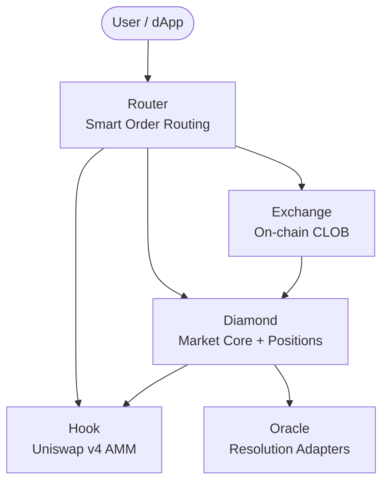

# PrediX là gì?

PrediX là một giao thức prediction market phi tập trung, nơi người dùng mua bán các token kết quả nhị phân (YES/NO) định giá bằng USDC. Mọi hoạt động — từ khớp lệnh, thanh toán, tới phân xử kết quả — đều diễn ra on-chain trên Unichain, L2 rollup của Uniswap.

## Điểm khác biệt

| Tính năng | PrediX | Các nền tảng khác |
|---------|--------|--------|
| **Thanh khoản** | Kết hợp CLOB + AMM qua Smart Router | Một venue duy nhất (chỉ CLOB hoặc chỉ AMM) |
| **Chuẩn token** | ERC-20 (LP được, composable) | ERC-1155 (không composable) |
| **Engine AMM** | Uniswap v4 với Hook tuỳ biến | AMM fork hoặc off-chain |
| **Mô hình phí** | Phí động theo thời gian (0.5% → 5%) | Phí cố định |
| **Khả năng nâng cấp** | Diamond proxy (EIP-2535) | Monolithic hoặc không thể nâng cấp |
| **Oracle** | Đa oracle, cắm-và-chạy | Phụ thuộc một oracle duy nhất |

## Kiến trúc

**Diamond** quản lý market, vị thế (split/merge) và phân xử kết quả. **Router** gộp thanh khoản từ cả **Exchange** (CLOB) lẫn **Hook** (AMM). **Oracle adapter** cung cấp kết quả.

## Tiếp theo

- [Cơ chế hoạt động](how-it-works.md) — vòng đời một market
- [Khái niệm cốt lõi](../concepts/prediction-markets.md) — kiến thức nền
- [Tổng quan contracts](../contracts/overview.md) — chi tiết kỹ thuật
