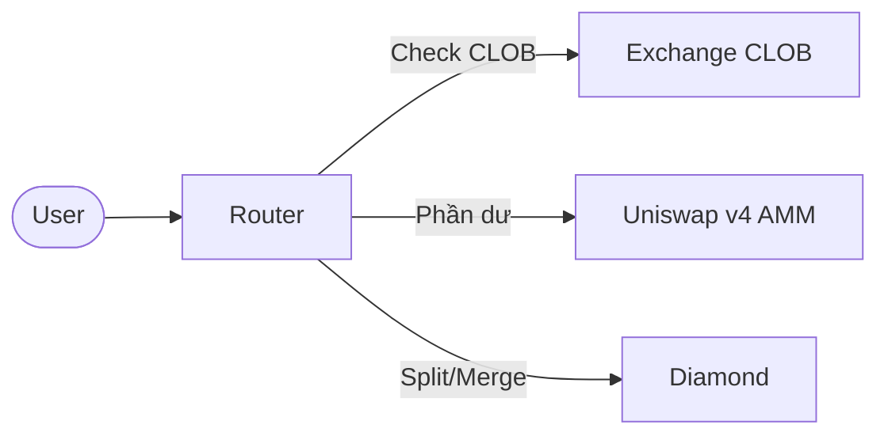

# Tổng quan giao dịch

PrediX cung cấp hai venue giao dịch, hợp nhất bởi một Smart Router.

## Hai venue

| Venue | Loại | Phù hợp khi |
|-------|------|----------|
| **Exchange (CLOB)** | Sổ lệnh giới hạn on-chain | Cần giá chính xác, lệnh lớn |
| **Hook (AMM)** | Uniswap v4 concentrated liquidity | Khớp tức thì, LP thụ động |

## Smart Router

Router là điểm vào chính cho mọi giao dịch. Nó check sổ lệnh CLOB trước xem có lệnh nào khớp được không, phần còn dư sẽ chuyển sang AMM.

## Lệnh thị trường vs lệnh giới hạn

| | Lệnh thị trường | Lệnh giới hạn |
|---|---|---|
| **Qua** | Router | Exchange |
| **Khớp** | Ngay lập tức, giá tốt nhất | Chỉ khớp tại giá bạn đặt |
| **Hàm** | `buyYes`, `sellYes`, `buyNo`, `sellNo` | `placeOrder`, `cancelOrder` |
| **Slippage** | Bảo vệ qua `minOut` | Không có (giá chính xác) |

## Định giá NO ảo (Virtual NO)

Chỉ có token YES là có pool AMM trực tiếp (YES/USDC). NO được định giá **ảo**:

- **Mua NO** = Split USDC → YES + NO, bán YES trên AMM, giữ NO
- **Bán NO** = Mua YES trên AMM, merge YES + NO → USDC

Với người dùng, mọi thứ vẫn liền mạch — Router xử lý atomically nhờ flash accounting của Uniswap v4. Quan hệ giá: **NO ≈ 1 − YES**, được giữ bằng arbitrage.

## Tiếp theo

- [Lệnh thị trường](market-orders.md) — hàm Router và ví dụ code
- [Lệnh giới hạn](limit-orders.md) — hàm CLOB và ví dụ code
- [Smart Routing](smart-routing.md) — cách Router chia lệnh
