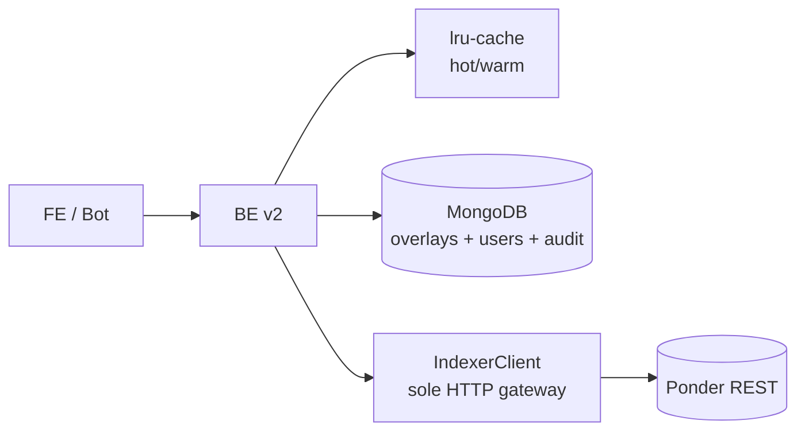

# Backend API Overview

PrediX Backend v2 là **sole HTTP gateway** giữa client (FE/bot) và Indexer (Ponder). BE overlay Mongo cho admin metadata (display title, category, event groupings), handle auth SIWE, và cache 2-tier.


FE/bot **không được phép** gọi thẳng Indexer. Luôn đi qua BE. Lý do: BE là nơi áp dụng auth, cache invalidation, envelope format, admin overlays.


## Base URL

| Environment | Base URL |
|---|---|
| Testnet (public) | `https://api-testnet.predixpro.io` |
| Localhost (self-host) | `http://localhost:3000` |
| Mainnet | TBA (pending audit) |

Mọi endpoint trong docs này là tương đối: `/api/v2/markets` = `https://api-testnet.predixpro.io/api/v2/markets`.

## Versioning

Prefix `/api/v2/*`. Phiên bản cũ `/api/v1/*` đã sunset.

## Nguyên tắc core

1. **Schema-first**: Mọi request/response derive từ zod schema → auto-generated TypeScript types + OpenAPI spec.
2. **Response envelope**: Mọi success response wrap `{ data, meta }`; error wrap `{ error, meta }`. Xem [Response Envelope](02-response-envelope.md).
3. **Primitives chuẩn**: address lowercase, price decimal string, timestamp unix seconds. Xem [Primitives](02-response-envelope.md#primitives).
4. **Cache 2 tier**: hot (2s) cho data thay đổi liên tục, warm (60s) cho data ổn định hơn. Không có tier thứ 3. Xem [Rate Limits & Caching](04-rate-limits-caching.md).
5. **Auth SIWE**: Sign-In with Ethereum challenge → signature → session token. Xem [Authentication](01-authentication.md).
6. **No default filter**: list endpoints không hide data bằng filter mặc định. Muốn filter → truyền query param explicit.

## Tech stack

| Layer | Tech |
|---|---|
| Framework | NestJS 11 + Fastify 5 |
| Validation | zod 4 + nestjs-zod |
| ORM | Mongoose 9 (MongoDB Atlas) |
| HTTP client | Native `fetch` (undici) |
| Cache | lru-cache 11 |
| Crypto | viem (SIWE verification) |
| Logger | pino |
| Test | Vitest 4 + mongodb-memory-server |
| Linter | Biome 2 |

## Kiến trúc module



Mỗi module (markets, events, trading, users, portfolio, leaderboard, social, gamification, admin, auth, faucet) có 3 file chính:

- `*.controller.ts` — endpoint + DTO
- `*.service.ts` — business logic + cache
- `*.serializer.ts` — Raw Indexer → public envelope

Source: `BE/src/modules/`.

## Endpoint group

| Group | Path prefix | Audience |
|---|---|---|
| **Markets** | `/api/v2/markets` | Public read (trading UI) |
| **Events** | `/api/v2/events` | Public read (multi-outcome) |
| **Trading** | `/api/v2/markets/:id/orderbook` / `/trades` / `/prices` / `/candles` / `/pricing/*` | Public read |
| **Users & Portfolio** | `/api/v2/users/:address/*` | Public read (portfolio, PnL, history, accuracy) |
| **Auth** | `/api/v2/auth/*` | SIWE challenge + verify |
| **Rewards** | `/api/v2/rewards/*` | Gamified rewards (boxes, challenges) |
| **Social** | `/api/v2/traders/*`, `/users/:address/follows` | Leaderboard + follow graph |
| **Notifications** | `/api/v2/notifications/*` | Per-user in-app notifications |
| **Protocol** | `/api/v2/stats`, `/api/v2/protocol/config` | Protocol-wide metrics |
| **Admin** | `/api/v2/admin/*` | Gated — SIWE + role check |

Chi tiết từng nhóm: [Markets](05-endpoints-markets.md), [Trading](06-endpoints-trading.md), [Users](07-endpoints-users.md), [Events](08-endpoints-events.md).

## OpenAPI spec

BE generate `openapi/v2.json` tự động từ zod schemas. Download:

```
GET /openapi/v2.json
```

Hoặc dùng GitBook OpenAPI block để render endpoint UI trực tiếp trong docs. Chi tiết: [OpenAPI Spec](10-openapi-spec.md).

## Health endpoints

| Endpoint | Mục đích |
|---|---|
| `GET /health` | Liveness — 200 nếu process up (dùng cho Docker/k8s liveness probe) |
| `GET /ready` | Readiness — 200 nếu Mongo + Indexer reachable; 503 + `status: degraded` nếu một trong hai fail |

Không nằm trong `/api/v2` prefix — flat `/health` và `/ready`.

## Forbidden packages (for maintainers)

BE không dùng: `class-validator`, `class-transformer`, `axios`, `node-cache`, `ethers`, `jest`, `supertest`, `eslint`, `prettier`, `ts-node`. Chi tiết lý do: `BE/CLAUDE.md` §2.
