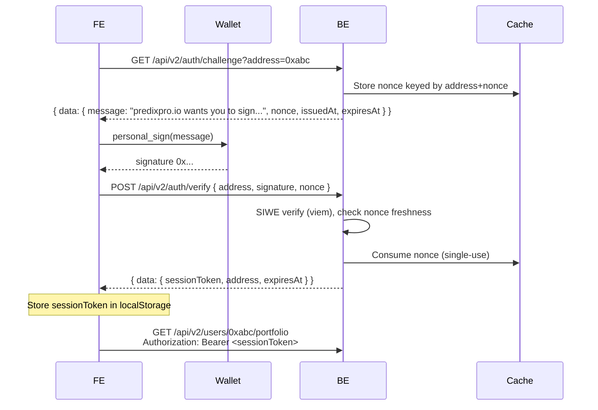

# Authentication (SIWE)

PrediX dùng [SIWE (EIP-4361)](https://eips.ethereum.org/EIPS/eip-4361) để xác thực user bằng signature từ wallet. Không có password, không có email.

## Flow tổng quát



## Endpoints

### `GET /api/v2/auth/challenge`

Request:

```
GET /api/v2/auth/challenge?address=0xabc...
```

Response:

```json
{
  "data": {
    "message": "predixpro.io wants you to sign in with your Ethereum account:\n0xabc...\n\nSign in to PrediX\n\nURI: https://predixpro.io\nVersion: 1\nChain ID: 1301\nNonce: a8f9d2...\nIssued At: 2026-04-21T10:00:00.000Z\nExpiration Time: 2026-04-21T10:10:00.000Z",
    "nonce": "a8f9d2...",
    "issuedAt": 1776090000,
    "expiresAt": 1776090600
  },
  "meta": { "timestamp": 1776090000, "version": "v2" }
}
```

Nonce TTL: **10 phút**. Nếu không verify trong window → challenge expired.

### `POST /api/v2/auth/verify`

Request:

```json
{
  "address": "0xabc...",
  "signature": "0x...",
  "nonce": "a8f9d2..."
}
```

BE verify:

1. Recover signer từ `message + signature` qua viem `verifyMessage`
2. Assert recovered signer `== address` (lowercase compare)
3. Assert nonce fresh (not consumed, not expired)
4. Mark nonce consumed (single-use)
5. Issue session token

Response:

```json
{
  "data": {
    "sessionToken": "eyJhbGci...",
    "address": "0xabc...",
    "expiresAt": 1776176400
  },
  "meta": { "timestamp": 1776090000, "version": "v2" }
}
```

Session TTL: **24 giờ** (configurable qua `SESSION_TTL_SECONDS` env).

### `GET /api/v2/auth/me`

Trả về profile + address của user hiện tại. Yêu cầu `Authorization: Bearer <sessionToken>`.

```json
{
  "data": {
    "address": "0xabc...",
    "displayName": "alice.eth",
    "avatarUrl": "...",
    "role": "user",
    "createdAt": 1776000000
  },
  "meta": { ... }
}
```

### `POST /api/v2/auth/logout`

Revoke session. Yêu cầu Authorization header.

```json
{ "data": { "revoked": true }, "meta": { ... } }
```

## Dùng session token

Mọi endpoint không public (portfolio, orders, admin…) yêu cầu header:

```
Authorization: Bearer <sessionToken>
```

Nếu token invalid/expired → 401:

```json
{
  "error": {
    "code": "auth_required",
    "message": "Session expired or invalid",
    "details": []
  },
  "meta": { ... }
}
```

FE nên catch 401 → emit `predix:session-expired` event → UI re-prompt user ký lại.

## Lưu ý security

1. **Nonce single-use + TTL 10 phút** — chống replay attack.
2. **Chain ID binding**: message include chain ID (1301 testnet) — signature trên mainnet không verify với testnet server.
3. **Domain binding**: message include domain (predixpro.io) — signature từ site khác không valid.
4. **Address lowercase**: BE lowercase address tại boundary; mọi comparison là lowercase.
5. **Session token stored server-side** trong Mongo `users.sessions[]` với TTL index.

## Example code (TypeScript + viem)

```typescript
import { createWalletClient, custom } from 'viem';
import { unichainSepolia } from 'viem/chains';

const walletClient = createWalletClient({
  chain: unichainSepolia,
  transport: custom(window.ethereum!),
});

const [account] = await walletClient.getAddresses();

// 1. Challenge
const challenge = await fetch(
  `/api/v2/auth/challenge?address=${account.toLowerCase()}`
).then(r => r.json());

// 2. Sign
const signature = await walletClient.signMessage({
  account,
  message: challenge.data.message,
});

// 3. Verify
const { data } = await fetch('/api/v2/auth/verify', {
  method: 'POST',
  headers: { 'Content-Type': 'application/json' },
  body: JSON.stringify({
    address: account.toLowerCase(),
    signature,
    nonce: challenge.data.nonce,
  }),
}).then(r => r.json());

localStorage.setItem('predix:sessionToken', data.sessionToken);
```

## Admin auth

Admin endpoints yêu cầu SIWE + role check:

1. User sign-in như bình thường → nhận session token
2. BE lookup `users[address].role` trong Mongo
3. `AdminRoleGuard` enforce `role === 'admin' || 'operator'`

Admin role được assign manually qua Mongo seed script — không có self-register endpoint.
