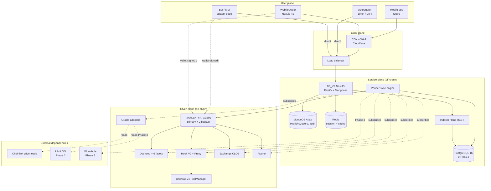

# System Architecture

**Document status**: v1.0 — 2026-04 (testnet), under revision for mainnet
**Audience**: Audit firms, VC/Grant technical reviewers, external security researchers, ecosystem partners
**Revision cadence**: Per major version; minor revisions tracked in [Changelog](../tai-nguyen/changelog.md)

---

## 1. Executive summary

PrediX V2 là **non-custodial prediction-market protocol** chạy trên Unichain (Optimism L2 anchored to Ethereum). Hệ thống có **4 layer logical**:

1. **Smart Contracts** — Ground truth on Unichain. Holds collateral, mints outcome tokens, matches orders, enforces invariants.
2. **Indexer** — Ponder 0.16 subscribe Unichain events → PostgreSQL state mirror → REST API.
3. **Backend API** — NestJS orchestrator: SIWE auth, Mongo overlays (display metadata, event groups, comments, user profiles), cache, envelope format.
4. **Frontend + Partner clients** — Next.js app, bot SDKs, aggregator integrations.

**Critical architectural invariants**:

- **On-chain state is authoritative** — off-chain layers can be rebuilt from scratch via re-index
- **Non-custodial** — protocol never holds user funds outside pending orders (Router enforces `balanceOf == 0`)
- **Upgrade-gated** — Diamond cut + Hook proxy both require 48h timelock
- **Deterministic finality** — Indexer only commits state when Unichain block is `finalized`

## 2. Layered architecture



## 3. Data flow — critical paths

### 3.1 Read path (user views market)

```
User → CDN → BE
              ├─→ Redis (hot cache 2s)
              └─→ IndexerClient (if miss)
                    └─→ Indexer API
                          └─→ PostgreSQL (state mirror)
```

Latency target: p50 < 100ms, p95 < 500ms.

### 3.2 Write path (user places trade)

```
User wallet → Unichain RPC → Router.buyYes()
                              ├─→ Exchange.fillAsChain() (if better price on CLOB)
                              └─→ Uniswap v4 PoolManager (if remaining on AMM)
                                    └─→ Hook.beforeSwap (identity commit + dynamic fee)

Downstream (async, ~15s):
  Router emits Trade event → Ponder indexes → PostgreSQL
  BE cache invalidates on next request (natural TTL)
```

Tx finality SLO:
- Soft confirmation: ~1-2 seconds (block inclusion on Unichain)
- Ponder index lag: < 10s under normal conditions
- Hard finality (L1-anchored): ~12-15 minutes

### 3.3 Resolution path

```
endTime reached → Oracle (Chainlink auto OR ManualOracle admin) reports
  → anyone calls Diamond.resolveMarket(marketId)
    → Diamond re-verifies oracle approval (FINAL-D-03)
    → Diamond queries oracle.getResolution
    → Sets market.isResolved=true, outcome, resolvedAt

User redeems anytime after resolution (up to 365d grace period):
  Diamond.redeemMarketTokens → burn winning tokens → USDC (minus fee)
```

Chi tiết: [Market Resolution SOP](03-market-resolution-sop.md).

## 4. Deployment topology

### 4.1 Current (testnet)

| Layer | Provider / Location | Redundancy |
|---|---|---|
| Smart Contracts | Unichain Sepolia (1301) | N/A — on-chain |
| RPC | Unichain official + 2 backup (QuickNode, Alchemy) | 3-node fallback |
| Indexer | Self-hosted VPS (Singapore) | Single-node + cold backup |
| Backend API | Containerized (Docker) — self-hosted (Singapore) | Single-node, k8s rollout |
| MongoDB | Atlas M10 cluster (Singapore region) | 3-node replica set |
| CDN + WAF | Cloudflare | Global |
| Frontend | Vercel (static + edge functions) | Global CDN |

### 4.2 Mainnet target (Q2 2026, post-audit)

| Layer | Upgrade |
|---|---|
| RPC | + dedicated Alchemy cluster + Conduit private RPC for sensitive calls |
| Indexer | Active-standby pair (2 nodes) với VIP failover, Prometheus alert |
| Backend API | 3-replica k8s deployment (Singapore + Tokyo + Frankfurt) + HAProxy sticky session |
| MongoDB | Atlas M30 với geo-replica (SG primary, Tokyo secondary) |
| Redis | Atlas or ElastiCache multi-AZ |
| Status page | status.predixpro.io (UptimeRobot + internal synthetic monitors) |
| CDN | Cloudflare Enterprise với DDoS protection L7 |

### 4.3 Multi-chain (Phase 3, Q4 2026+)

```
PrediX Hub (Unichain) ←→ Wormhole / LayerZero ←→ [Ethereum, Base, Arbitrum, Polygon, BSC]
                              ↑
                       Cross-chain oracle adapter
```

Strategy: Hub-and-spoke — Unichain là canonical execution layer, các chain khác là client chains (read-only state mirror + bridged deposits). Chi tiết sẽ có trong phase-3 design doc riêng khi gần hơn.

## 5. Service Level Objectives (SLO)

### 5.1 Availability targets (mainnet)

| Service | Target | Measurement window |
|---|---|---|
| Frontend (SSR + static) | 99.9% | 30-day rolling |
| Backend API `/api/v2/*` | 99.5% | 30-day rolling |
| Indexer REST (internal) | 99.5% | 30-day rolling |
| Indexer sync lag | < 60s p99 | 1h rolling |
| RPC availability | 99.9% (at least 1/3 healthy) | 30-day |
| Critical alerting | On-call paged < 2 min | Per incident |

### 5.2 Performance targets

| Operation | p50 | p95 | p99 |
|---|---|---|---|
| `GET /api/v2/markets` | 80ms | 300ms | 800ms |
| `GET /api/v2/markets/:id` | 60ms | 200ms | 500ms |
| `GET /api/v2/users/:addr/portfolio` | 100ms | 400ms | 1s |
| Orderbook snapshot | 50ms | 150ms | 400ms |
| SIWE challenge | 30ms | 100ms | 250ms |
| SIWE verify | 80ms | 200ms | 500ms |
| On-chain tx confirmation (Unichain) | 1.5s | 3s | 8s |
| Indexer live catch-up | 2s | 10s | 30s |

### 5.3 Data freshness

| Data | Freshness guarantee |
|---|---|
| On-chain state via BE (hot cache) | 2-4s |
| On-chain state via BE (warm cache) | 60s |
| Indexer state (post-block) | 5-15s typical, blocks finalize ~12-15 min (L1-anchored) |
| Price snapshot (priceSnapshot table) | Per-trade (~1-2s on-chain + ~5s index) |

## 6. Security architecture

Chi tiết đầy đủ: [Security Design Document](04-security-design.md).

### 6.1 Trust boundaries

Layer | Trust level | How trust is established
---|---|---
Smart Contracts | High (post-audit) | External audit, formal invariant tests, transparent upgrade
Indexer | Medium-high | Derived from chain via `finalized` block tag; re-buildable from scratch
Backend API | Medium | Not authoritative — can only enrich SC state with overlays
Frontend | Low | Client-controlled; FE **must** verify on-chain for critical decisions
External RPC | Low-medium | 3-node fallback; single-RPC lie cannot forge on-chain state long-term (Ponder re-orgs)
Oracle | Adapter-dependent | ManualOracle = admin trust; Chainlink = Chainlink's security; UMA = bond+dispute

### 6.2 Attack surface (summary)

| Surface | Primary mitigations |
|---|---|
| Smart contract bugs | External audit + invariant fuzzing + bug bounty |
| Admin abuse | 3/5 multisig (Phase 1) / 4/7 (Phase 2) + 48h timelock on upgrades |
| Oracle manipulation | Approval list + re-verify at resolve + Chainlink staleness + L2 sequencer feed + UMA dispute (Phase 2) |
| Reentrancy | `TransientReentrancyGuard` (EIP-1153) on all external entry points |
| Sandwich attack | Hook identity commit (EIP-1153) + Router whitelist |
| Off-chain compromise | On-chain state authoritative — BE compromise cannot drain funds |
| RPC compromise | 3-node fallback + Ponder `finalized` commit |
| Phishing | DNSSEC + CAA + clear visual indicators (mainnet banner) |

## 7. Upgrade architecture

### 7.1 Diamond (EIP-2535) upgrade

- Authority: `CUT_EXECUTOR_ROLE` (only TimelockController holds)
- Timelock: 48h via OpenZeppelin `TimelockController`
- Transparency: `CallScheduled` event broadcast publicly; community can monitor + react
- Cancel capability: multisig can `cancel(id)` within 48h window
- No emergency bypass: even `DEFAULT_ADMIN_ROLE` cannot shortcut

### 7.2 Hook proxy (ERC1967) upgrade

- Authority: Hook admin (multisig)
- Timelock: 48h custom implementation (built into proxy)
- Flow: `proposeUpgrade(newImpl, salt)` → 48h delay → `executeUpgrade()` or `cancelUpgrade()`
- Salt-mined addresses: v4 hooks require address flag bit match — salt search off-chain

### 7.3 Backward compatibility policy

- **Storage layout**: append-only (never reorder/remove columns)
- **Event signatures**: append-only (never remove/rename existing events)
- **Function signatures**: deprecation cycle — add new function → deprecate old → remove after 2 major versions
- **Public API breaking**: 90-day sunset window + version bump (`/api/v3` parallel to `/api/v2`)

## 8. Observability

### 8.1 Metrics (Prometheus)

```
# Indexer
ponder_sync_block_number
ponder_sync_lag_seconds
ponder_handler_duration_seconds{handler}
ponder_rpc_request_count{method, status}
ponder_reorg_detected_total

# Backend
be_http_requests_total{endpoint, status}
be_http_request_duration_seconds{endpoint, quantile}
be_cache_hit_ratio{tier, endpoint}
be_mongo_query_duration_seconds
be_indexer_request_duration_seconds
be_siwe_verification_count{result}

# Smart contract (derived from events)
sc_total_markets
sc_total_volume_usdc
sc_total_trades
sc_pause_events_total{module}
sc_role_changes_total{role, action}
sc_upgrade_events_total{contract}
```

### 8.2 Logs

Structured JSON (pino format) aggregated via Loki/CloudWatch/Datadog. Key fields:

- `x_request_id` (UUID v4 per request)
- `user_address` (lowercase, nullable)
- `endpoint`
- `latency_ms`
- `status`
- `error_code` (if applicable)
- `trace_id` (for distributed tracing)

### 8.3 Alerting

| Severity | Trigger | On-call response |
|---|---|---|
| P0 (page) | Indexer lag > 5 min sustained 3 min | < 15 min |
| P0 (page) | Backend 5xx > 1% sustained 2 min | < 15 min |
| P0 (page) | RPC all-fallback exhausted | < 15 min |
| P0 (page) | Invariant violation detected | < 15 min |
| P1 (alert) | Indexer lag > 60s sustained 5 min | < 1h |
| P1 (alert) | Cache hit ratio < 70% | < 1h |
| P1 (alert) | DB connection pool exhausted | < 1h |
| P2 (slack) | Deprecation warning | < 24h |

Chi tiết response: [Incident Playbook](../security/05-incident-playbook.md).

### 8.4 Transparency dashboards (public)

Post-mainnet sẽ publish public dashboards tại `status.predixpro.io`:

- Indexer sync status
- Protocol stats (volume, markets, trades)
- Recent governance actions (timelock schedules, executions)
- Audit + bounty hall of fame

## 9. Roadmap — architecture evolution

### Phase 1 (current testnet, Q1-Q2 2026)
- Unichain Sepolia deployment
- Core contracts + Indexer + BE stack
- Internal audit complete, external audit engaged

### Phase 2 (mainnet, Q2 2026)
- Unichain mainnet (Chain ID 130) deployment
- 3/5 multisig + 48h timelock
- UMA Optimistic Oracle integration
- WebSocket push API (BE → clients, for MM)
- Higher-tier partner API (see [Partner API](05-partner-api.md))

### Phase 3 (scale, Q3-Q4 2026)
- Multi-chain hub-and-spoke (Ethereum, Base, Arbitrum)
- Cross-chain oracle (Wormhole / LayerZero)
- 4/7 multisig upgrade
- Scalar markets (continuous outcomes beyond YES/NO binary)
- Formal verification for critical invariants (Certora/Halmos)

### Phase 4 (community governance, 2027+)
- PRDX governance token distribution
- On-chain governance with timelock + quorum
- Decentralized oracle committee
- Full permissionless market creation

## 10. Appendices

### A. Repository layout

```
Final_Predix_V2/
├── SC/                    # Smart contracts (Foundry)
│   └── packages/
│       ├── shared/        # interfaces + libs
│       ├── oracle/
│       ├── diamond/
│       ├── hook/
│       ├── exchange/
│       └── router/
├── INDEXER/               # Ponder 0.16 indexer
├── BE/                    # NestJS v2 backend
├── FE_new/                # Next.js 16 frontend
└── GITBOOK/               # Documentation (this)
```

### B. Version matrix (as of 2026-04)

| Component | Version | Lang/Framework |
|---|---|---|
| Smart contracts | v2.0.0 | Solidity 0.8.30 (Foundry, via_ir, cancun) |
| Indexer | v2.0.0 | Ponder 0.16.6, PostgreSQL 16, Hono 4.5 |
| Backend | v2.0.0 | NestJS 11, Fastify 5, zod 4, TypeScript 5.9.3 |
| Frontend | v2.0.0 | Next.js 16, React 19, Tailwind 4 |

### C. References

- [Kiến Trúc Tổng Thể](../kien-truc-tong-the.md) — user-facing architecture overview
- [Contract Architecture](../smart-contracts/27-contract-architecture.md) — on-chain focus
- [Backend API Overview](../backend-api/00-overview.md)
- [Indexer Overview](../indexer/00-overview.md)
- [Security Design Document](04-security-design.md)
