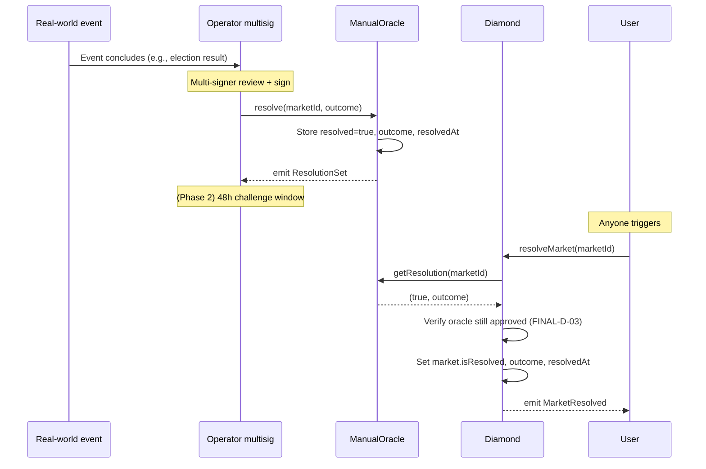
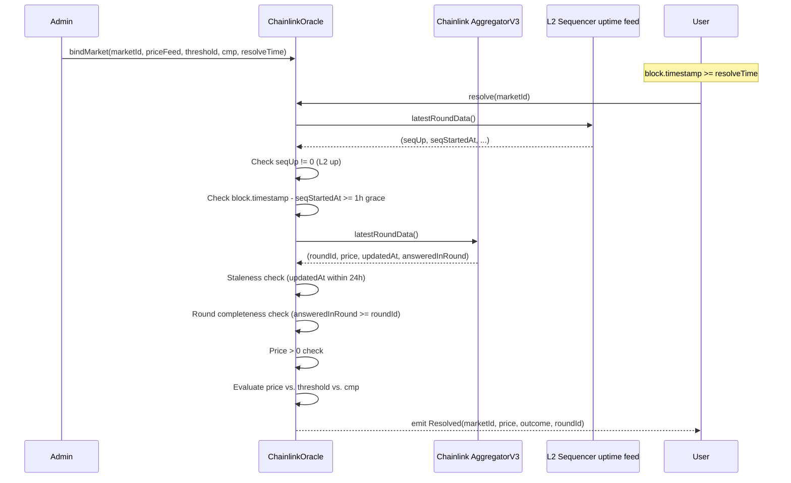
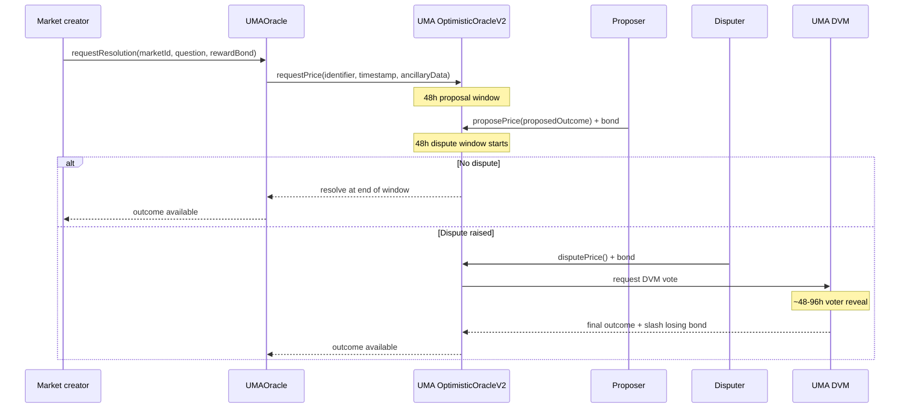

# Oracle Design Document

**Document status**: v1.0 — 2026-04 (Phase 1 live on testnet), Phase 2-3 forward-looking
**Audience**: Audit firms, protocol integrators, oracle operators, security researchers
**Why this matters**: Oracle là **single most critical component** của prediction market — resolution sai = user mất tiền không thể recover qua on-chain-only logic. Design này phải bulletproof.

---

## 1. Problem statement

Prediction market cần **trusted, verifiable source of truth** về kết quả sự kiện thực tế. Challenges:

1. **Subjective events** (bầu cử, meme, pop-culture): không có API deterministic — cần human judgment
2. **Objective events** (BTC price, election results): có data API nhưng vẫn bị manipulate (flash crash, oracle lag)
3. **Adversarial environment**: bad actor có incentive tài chính để feed kết quả sai (profit from winning side)
4. **Finality vs. speed**: resolve nhanh → user happy, nhưng dispute window ngắn → attacker exploit
5. **Censorship / liveness**: oracle đi offline / bị compromise → resolution stuck → users stuck in position
6. **Trust minimization**: protocol không nên phụ thuộc duy nhất vào một entity

PrediX address thành 3 phases với tăng dần decentralization + dispute mechanism.

## 2. Threat model cho oracle

### 2.1 Attacker profile

| Attacker | Motivation | Capability |
|---|---|---|
| Profit-seeking trader | Tilt resolution toward held position | Bribery, social engineering, misinformation |
| Oracle operator (insider) | Profit from reported outcome | Direct control of oracle resolution |
| Competitor | Protocol reputation damage | Long-term subtle manipulation |
| State actor | Censorship / political | Legal pressure, infrastructure attack |
| Random griefer | Disrupt protocol | DoS, false dispute spam |

### 2.2 Attack vectors

| Vector | Example |
|---|---|
| **Direct oracle compromise** | Steal admin key of ManualOracle, report wrong outcome |
| **Oracle bribery** | Pay admin to tilt resolution (small market, high concentration) |
| **Data source manipulation** | Trigger brief BTC flash crash → Chainlink feed → resolve market "BTC < $X" |
| **Front-run resolve** | Detect oracle update in mempool, buy winning tokens before `resolveMarket` emits |
| **Oracle liveness attack** | DDoS oracle operator / RPC → delay resolution past emergency window |
| **Feed staleness exploit** | Use old (pre-event) price feed after service recovers |
| **Dispute spam (Phase 2)** | Spam low-bond disputes to delay legitimate resolution |

## 3. Phase 1 — Current design (testnet + mainnet Q2 2026)

### 3.1 Two adapters

**`ManualOracle`** — subjective events. Admin-controlled via `OPERATOR_ROLE` multisig.

**`ChainlinkOracle`** — objective price-threshold events. Automatic via Chainlink AggregatorV3.

Both implement common `IOracle` interface. Market creator chooses which at `createMarket`.

### 3.2 ManualOracle flow



**Current safeguards:**

1. **Multisig admin**: Mainnet ManualOracle admin = 3/5 multisig (not EOA). Single operator cannot resolve alone.
2. **Oracle approval revocable**: If operator key compromise, Diamond admin revokes `setApprovedOracle(ManualOracle, false)`. Future `resolveMarket` calls revert (FINAL-D-03 re-verify). Market becomes stuck → operator trigger `enableRefundMode` → users refund 1:1.
3. **Immutable once resolved**: INV-6 — same `marketId` cannot be re-resolved.
4. **Operator accountability**: All `ResolutionSet` events indexed + public in `oracle_approval_audit` table. Audit trail for social review.

**Current gap**: No on-chain dispute mechanism. Trust = multisig + social pressure.

### 3.3 ChainlinkOracle flow



**Safeguards built-in:**

1. **Staleness window** (24h max): prevent using pre-event stale price
2. **L2 sequencer uptime check**: if sequencer was down when event supposedly resolved, reject
3. **Sequencer grace period** (1h): post-recovery buffer — feeds may lag
4. **Round completeness**: `answeredInRound >= roundId` — don't use in-progress round
5. **Positive price**: reject 0 or negative

**Current gap**: Single-feed dependency. If Chainlink feed itself compromised (extremely rare but historical examples: LUNA depeg feed edge cases) → bad resolution.

### 3.4 Deployment

**Testnet (current):**

| Adapter | Address | Admin |
|---|---|---|
| ManualOracle | `0x699A8C74663b1C852E195b2ffa00D5965E992Cf3` | Single team EOA (testnet only) |
| ChainlinkOracle | TBD | Deployer |

**Mainnet target (Q2 2026):**

| Adapter | Admin |
|---|---|
| ManualOracle | 3/5 Gnosis Safe multisig — signers by role, identity not public |
| ChainlinkOracle | Same multisig (for `bindMarket`); resolve is permissionless |

## 4. Phase 2 — UMA Optimistic Oracle integration (Q2-Q3 2026)

### 4.1 Why UMA?

UMA Optimistic Oracle (OO) provides **permissionless dispute** với bonded challenger model. Best-in-class for subjective + long-tail events (Polymarket uses UMA).

**Properties:**
- Anyone can propose resolution (with bond)
- Anyone can dispute (with bond)
- Dispute goes to UMA DVM (Data Verification Mechanism) for token-holder vote
- Economic security via UMA token + bonding

**Why not direct UMA for all markets?** UMA introduces ~48h dispute window + latency. For time-sensitive markets (sports, breaking news) — users want faster resolution. Dual-adapter approach.

### 4.2 Proposed architecture

```
Market creator chooses oracle at createMarket:
  Option A: ManualOracle     — fastest, admin-trusted (use for high-volume subjective with team oversight)
  Option B: ChainlinkOracle  — automatic, feed-backed (use for price threshold)
  Option C: UMAOracle (NEW)  — permissionless, disputable (use for subjective + dispute-sensitive)
```

New adapter: **`UMAOracle`** implements `IOracle`, wraps `OptimisticOracleV2` on Unichain (UMA team deploying 2026).

### 4.3 UMA flow (proposed)



### 4.4 Dispute bond sizing

| Network | Proposer bond | Disputer bond | Reward (for correct proposer) |
|---|---|---|---|
| Testnet | $500 USDC | $500 USDC | $50 USDC |
| Mainnet (Phase 2 launch) | $5,000 USDC | $5,000 USDC | $500 USDC |
| Mainnet (post-traction) | Scale with market size (0.5% of market TVL, min $5K max $50K) | Same | 10% of bond |

**Rationale:**
- Bond too low → spam disputes
- Bond too high → only whales can dispute legitimate wrong resolutions
- Scale with TVL: high-value markets deserve higher-security disputes

### 4.5 Timeline integration with MarketFacet

**Phase 2 implementation plan:**

1. Deploy `UMAOracle` adapter, register with Diamond (`setApprovedOracle`)
2. Market creator selects `UMAOracle` at `createMarket`
3. At `endTime`, UMA resolution window opens (48h propose)
4. If undisputed after proposal → `UMAOracle.getResolution` returns (true, outcome) at window end
5. If disputed → wait DVM vote (~4-7 days total)
6. After final outcome: anyone calls `Diamond.resolveMarket` which calls `UMAOracle.getResolution`

**User-facing timeline:**

| Market ends at T | With UMA |
|---|---|
| T + 0 | Market closed, propose window opens |
| T + 48h | If no dispute, resolution locked |
| T + 48h → T + 96h | Dispute window (if someone challenges) |
| T + 7d (worst case) | DVM votes finalize |

Compare with ManualOracle: ~hours to resolve. Trade-off: speed vs. trustlessness.

### 4.6 UMA + ManualOracle hybrid mode (future consideration)

**Idea**: Critical high-TVL markets require BOTH adapters to agree. Dual-oracle consensus:

```solidity
function getResolution(uint256 marketId)
    external view
    returns (bool resolved, bool outcome)
{
    (bool r1, bool o1) = adapterA.getResolution(marketId);
    (bool r2, bool o2) = adapterB.getResolution(marketId);
    if (!r1 || !r2) return (false, false);
    if (o1 != o2) return (false, false); // mismatch → refund mode
    return (true, o1);
}
```

If adapters disagree → `enableRefundMode` triggered by operator. Safer but complex.

**Decision**: Defer to Phase 3. Keep Phase 2 single-adapter per market.

## 5. Phase 3 — Cross-chain + decentralized committee (Q4 2026+)

### 5.1 Cross-chain oracle (Wormhole / LayerZero)

Mục đích: resolve markets về sự kiện trên Chain X dùng data từ Chain X chính xác (không dependent trên Unichain oracle seeing Ethereum event).

**Example**: "Will Ethereum validator count exceed 1M by 2027?" — best oracle là Ethereum directly, không phải Chainlink aggregator trên Unichain.

**Design**:
```
Source chain (Ethereum) contract emits event
  → Wormhole guardian network signs message
  → Wormhole receiver on Unichain verifies sigs
  → CrossChainOracle records outcome
  → getResolution(marketId) reads
```

### 5.2 Decentralized oracle committee

Long-term: move away from Phase 1-2 centralized trust → committee of N operators với threshold signature (t-of-N).

- Each operator stakes bond
- Operators vote on resolution off-chain, submit threshold-signed result on-chain
- Dispute window (short, e.g., 24h) — anyone can challenge with counter-evidence
- Slashing for provably wrong resolutions

**Reference implementations**: [Polygon ID oracle](https://polygon.technology/blog/polygon-miden-presenting-the-polygon-miden-stack), [RedStone](https://redstone.finance).

### 5.3 Open committee roadmap

| Milestone | Target |
|---|---|
| Committee size 5/7 | End of 2026 |
| Commit-reveal voting | Q1 2027 |
| Slashing + reputation system | Q2 2027 |
| Public application to join committee | 2027 |

## 6. Dispute mechanisms deep dive

### 6.1 Phase 1: social + multisig

**Current**: No on-chain dispute. Resolution via multisig — if error detected:

1. Community / internal monitoring flags issue
2. Team internal review
3. If confirmed: ADMIN revoke oracle approval → market can't resolve with bad data
4. OPERATOR `enableRefundMode` → 1:1 USDC return to holders
5. Public post-mortem

**Limitation**: Dependent on team responsiveness. Not trustless.

### 6.2 Phase 2: UMA OptimisticOracle

**Dispute flow:**

```
1. Proposer submits outcome + bond ($5K USDC mainnet)
2. 48h dispute window
3. Anyone can dispute with matching bond
4. Disputed → DVM vote (UMA token holders, commit-reveal, ~96h)
5. DVM outcome = final
6. Losing bond slashed → winning bond returned + reward
```

**Economic security**: Cost to corrupt = bond amount × number of concurrent disputed markets (attacker must lose all bonds if wrong). Scale bond with market TVL for meaningful security.

### 6.3 Phase 3: committee with slashing

**Proposed:**

```
1. Committee signs outcome (t-of-N threshold sig)
2. On-chain post with Merkle proof
3. 24h dispute window — anyone submits counter-proof (off-chain data)
4. If counter-proof valid (verified by automated check + committee supermajority)
5. Original signers slashed (lose stake)
6. New resolution posted OR refund mode triggered
```

## 7. Edge cases & known-hard events

### 7.1 Ambiguous question wording

**Example**: "Will Trump be elected President in 2024?" — what if disputed (hypothetical: contested election, court ruling, etc.)?

**Mitigation**:
- Market curators write questions with explicit resolution criteria
- `description` field in MarketCreated embeds resolution source + cutoff date
- For Phase 2 UMA: ancillary data encodes explicit criteria for voters

### 7.2 Market end before event outcome

**Example**: Market ends 2026-11-01, but event's data source releases results 2026-11-02.

**Mitigation**: Market `endTime` = trading cutoff. Oracle resolution happens after — no ambiguity. `resolveMarket` callable anytime after oracle reports.

### 7.3 Event cancelled

**Example**: Sports match cancelled due to weather.

**Response**: OPERATOR `enableRefundMode(marketId)` → 1:1 USDC back.

### 7.4 Partial / conditional outcome

**Example**: "Election result by Jan 20" — but court extends certification deadline.

**Response**: Case-by-case team review. Refund mode if truly unresolvable.

### 7.5 Oracle liveness failure

**Example**: ManualOracle admin can't sign (key lost, multisig quorum not reachable).

**Response**:
1. Wait `EMERGENCY_DELAY` (7 days) post-endTime
2. OPERATOR (different multisig) calls `emergencyResolve(marketId, outcome)` with manual judgment
3. If even that fails → `enableRefundMode`

### 7.6 Oracle fraud caught post-resolve

**Example**: ManualOracle resolved correctly, market `redeemed`, then evidence of bribery emerges.

**Response**: **Cannot revert on-chain** (INV-6 monotonic). Compensation requires off-chain: treasury payout, governance proposal. Accept finality as trade-off.

**Prevention**: Multisig + audit trail + reputation system.

### 7.7 Chainlink feed paused / deprecated

**Example**: BTC/USD feed retired mid-market.

**Response**:
1. `Oracle_StalePrice` triggers on resolve attempt
2. Market unresolvable via current adapter
3. ADMIN has option to `setApprovedOracle(newAdapter, true)`, create new adapter pointing to replacement feed, manually `bindMarket(marketId, newFeed, ...)` — requires careful migration design
4. OR OPERATOR triggers `enableRefundMode` as fallback

Phase 3 plan: support multi-feed fallback within ChainlinkOracle adapter.

## 8. Testing & verification

### 8.1 Unit tests (existing)

Each adapter 76+ tests (oracle package):

- Happy path: resolve, getResolution, getResolvedAt
- Staleness revert
- Invalid price revert
- Sequencer down revert
- Round incomplete revert
- Admin access control
- Re-resolution prevention (INV-6)

### 8.2 Fuzz tests

- `testFuzz_MultipleResolveAttempts_OnlyFirstSucceeds`
- `testFuzz_StaleRejectAllTimestamps`
- `testFuzz_SequencerDownAllStates`

### 8.3 Integration tests

- Diamond + ManualOracle end-to-end: createMarket → trade → endTime → admin resolve → user redeem
- Diamond + ChainlinkOracle: createMarket → bindMarket → resolve at price threshold
- Phase 2 will add UMA integration tests on testnet

### 8.4 Adversarial test scenarios (red team, pre-mainnet)

1. **Oracle key compromise drill**: Simulate stolen admin key. Verify revocation flow + refund flow works within 24h.
2. **Chainlink feed halt drill**: Simulate `sequencerUp = 0`. Verify resolve rejects.
3. **Stale data resolve**: Simulate feed last updated 48h ago. Verify rejection.
4. **Dispute spam (Phase 2)**: Simulate 100 concurrent disputes. Verify UMA queue + cost scaling.

## 9. Operational playbook (Phase 1)

### 9.1 Pre-market creation

- [ ] Market creator clearly writes question + resolution criteria
- [ ] Oracle type chosen (Manual / Chainlink)
- [ ] ADMIN reviews + approves oracle for this market scope
- [ ] `createMarket(question, endTime, oracle)`

### 9.2 Market lifecycle monitoring

- [ ] Dashboard alert 7d before market endTime
- [ ] Team review: is resolution source ready?
- [ ] If Chainlink: verify feed still live + active
- [ ] If Manual: assign operator on-call for endTime day

### 9.3 Post-endTime resolution

- [ ] Monitor: event concluded?
- [ ] Resolve within 24h of event conclusion (Phase 1 SLA)
- [ ] Multisig signers review proposed outcome → sign tx
- [ ] Public announcement (Discord + Twitter) with resolution evidence
- [ ] Monitor redemption inflow

### 9.4 Dispute response (Phase 1)

If community flags alleged wrong resolution:

- [ ] Preserve evidence (sources, screenshots, tx hashes)
- [ ] Internal review (Security Lead + Operations Lead + External Advisor)
- [ ] Decision: accept resolution, or trigger refund mode
- [ ] Public post-mortem within 7 days

### 9.5 Phase 2+ dispute response

Automated via UMA mechanism. Team only intervenes if UMA infrastructure itself fails (rare — covered by UMA's own SLA).

## 10. Migration strategy — Phase 1 → Phase 2

### 10.1 Timeline

| Month | Action |
|---|---|
| Month 1 (post-mainnet) | Monitor Phase 1, collect data on resolution latency + dispute rate |
| Month 2-3 | Deploy UMAOracle adapter on testnet, internal testing |
| Month 4 | Mainnet deploy UMAOracle, admin-approve, allow opt-in for new markets |
| Month 5-6 | Parallel operation — new markets choose Manual/Chainlink/UMA |
| Month 7+ | Default new markets to UMA (for subjective events); Manual becomes backup only |

### 10.2 Existing markets (at migration time)

Existing markets continue with original adapter — no migration needed. New markets default to UMA.

### 10.3 Admin communication

- T-30 days before Phase 2 launch: public announcement
- Sample markets + dispute mechanics published as learning material
- Bug bounty + testnet incentive for dispute testing

## 11. Open questions (not yet decided)

| Question | Status |
|---|---|
| UMA vs. Reality.eth vs. custom committee for Phase 2 | Evaluating — UMA leading |
| Bond sizing formula (linear vs. TVL-based) | Needs economic simulation |
| Grace period for L2 sequencer (1h optimal?) | Per-chain tune needed for mainnet |
| Cross-chain oracle Wormhole vs LayerZero | Defer to Phase 3 |
| Committee size (5/7 vs 7/10 vs 9/13) | Need governance input 2027 |

## 12. References & further reading

- [Oracle on-chain](../smart-contracts/32-oracle.md)
- [Market Resolution SOP](03-market-resolution-sop.md)
- [Custom Errors](../smart-contracts/custom-errors.md)
- [UMA Optimistic Oracle docs](https://docs.uma.xyz)
- [Chainlink Data Feeds](https://docs.chain.link/data-feeds)
- [L2 Sequencer Uptime Feeds](https://docs.chain.link/data-feeds/l2-sequencer-feeds)
- [Reality.eth](https://reality.eth.limo) (alternative OO, evaluated)
- Polymarket's oracle design (UMA-based): [polymarket.com/learn](https://polymarket.com)

## 13. Changelog

- **v1.0** — 2026-04: Initial design doc. Phase 1 specified in detail, Phase 2-3 roadmap outlined.
- Future revisions: track Phase 2 UMA integration actual flows; post-mortem edge cases from real markets.
