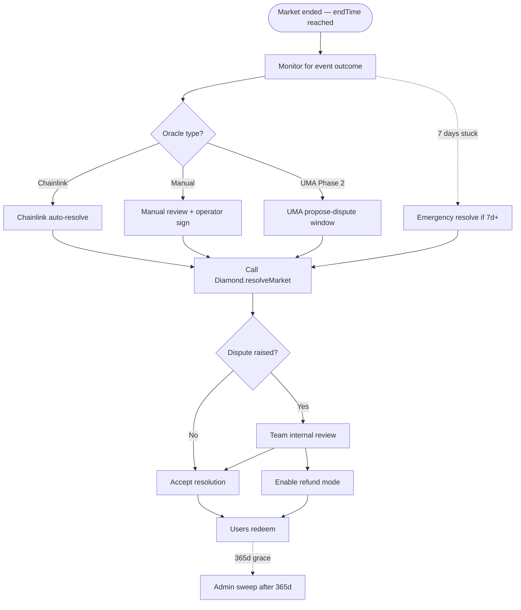

# Market Resolution SOP

**Document status**: v1.0 — 2026-04
**Audience**: Operators (on-call team), admins, community monitors, external reviewers
**Authority**: This SOP is the canonical procedure. Deviations require Security Lead + Operations Lead sign-off with written justification (post-facto acceptable for emergencies).


**Phase 1 SOP** — Based on current ManualOracle + ChainlinkOracle. Phase 2 UMA integration will add additional flows — SOP will be versioned accordingly.


---

## 1. Resolution lifecycle overview



## 2. Roles & responsibilities

### 2.1 Role matrix

| Role | Multisig identity | On-chain role | Authority |
|---|---|---|---|
| **Operator on-call** | Single operator (rotating) | n/a | Monitor, escalate, NO sign power |
| **Operations Lead** | Operations multisig member | `OPERATOR_ROLE` member | Coordinate response, call meetings |
| **Security Lead** | Security multisig member | `OPERATOR_ROLE` member | Decide risk escalation |
| **Operator multisig** | 2/3 of operator signers | `OPERATOR_ROLE` | `emergencyResolve`, `enableRefundMode` |
| **Admin multisig** | 3/5 of admin signers | `ADMIN_ROLE` | `setApprovedOracle`, `sweepUnclaimed`, `setPerMarketRedemptionFeeBps` (only reduce) |
| **ManualOracle admin** | 3/5 Gnosis Safe (same as above) | n/a | `ManualOracle.resolve(marketId, outcome)` |
| **Community (read-only)** | n/a | n/a | Flag disputes, provide evidence |

### 2.2 Decision authority

| Decision | Authority required | Time allowed |
|---|---|---|
| Resolve with Chainlink (automatic) | Any address call `resolve()` | After `resolveTime` |
| Propose manual resolution | 1 ManualOracle admin signer | After event |
| Execute manual resolution | 3/5 ManualOracle multisig | Within 24h of event |
| Dispute internal review trigger | Operations Lead | Within 6h of community flag |
| Enable refund mode | Operator multisig 2/3 | As fast as possible post-decision |
| Revoke oracle approval | Admin multisig 3/5 | As fast as possible post-compromise |
| Emergency resolve (7d stuck) | Operator multisig 2/3 | After 7d cooling-off |

## 3. Pre-resolution SOP (before market endTime)

### 3.1 T-7 days: Market review

- [ ] Operator on-call reviews markets ending within 7d
- [ ] For each market: verify resolution source availability
  - Chainlink: feed still operational + data within expected range
  - Manual: source of truth identified + access to signer accounts
  - UMA: bond budget confirmed (Phase 2)
- [ ] If any issue → escalate to Operations Lead

### 3.2 T-24 hours: Pre-end preparation

- [ ] Operator on-call + 1 oracle signer ready
- [ ] Event conclusion source URL + backup URL documented
- [ ] Verify multisig accessible (no signers traveling / locked hardware wallet)
- [ ] Announce in Discord `#announcements`: "Market X ends in 24h, resolution within ~6h post-event"

### 3.3 T-0: Market ends

No action required at endTime itself. Trading/placing/merging auto-stops (contract enforced).

## 4. Resolution SOP — by oracle type

### 4.1 ChainlinkOracle (automatic)

**When**: `block.timestamp >= resolveTime`

**Actions:**

1. **Wait** for price feed confirmation (usually auto-fresh)
2. **Any address** (can be bot, team, or user) calls:
   ```
   ChainlinkOracle.resolve(marketId)
   ```
3. Contract verifies: sequencer up, feed fresh, round complete, price > 0
4. Evaluates threshold → sets resolution
5. Emits `Resolved(marketId, price, outcome, roundId)`

**No manual team action required** (in happy path).

**Monitoring**:

- Operator on-call monitors dashboard for resolved events
- If `resolveTime` passed but no resolution after 2h → investigate
  - Feed issue? Sequencer issue? Stale data?
- If issue persists > 6h → escalate to Operations Lead for manual intervention consideration

### 4.2 ManualOracle (Phase 1, current)

**When**: Event concluded + outcome publicly verifiable

**Actions** (Operator on-call):

**Step 1 — Evidence collection (within 1h of event)**

- [ ] Screenshot primary source showing outcome
- [ ] Screenshot backup source (different publication)
- [ ] Note timestamp of sources
- [ ] Check Discord `#resolution-prep` — community flags anything?

**Step 2 — Initial sign proposal (within 3h)**

- [ ] Operator on-call posts in team channel (`#ops` private):
  - Market ID
  - Proposed outcome (YES / NO)
  - Evidence summary + source links
  - Suggested resolve time
- [ ] Minimum 2 reviewers (non-signer team members) confirm evidence

**Step 3 — Multisig execute (within 6h)**

- [ ] Operations Lead propose multisig tx:
  ```
  ManualOracle.resolve(marketId, outcome)
  ```
- [ ] 3 of 5 signers review + sign (from hardware wallets)
- [ ] Execute → `ResolutionSet` emitted

**Step 4 — On-chain diamond resolve (within 1h after oracle set)**

- [ ] Any address (bot or community) calls:
  ```
  Diamond.resolveMarket(marketId)
  ```
- [ ] Diamond re-verifies oracle approval (FINAL-D-03), queries ManualOracle, commits state

**Step 5 — Public comm (within 1h of Diamond resolve)**

- [ ] Post Discord `#announcements`:
  > ✅ **Market Resolved**: "<question>"
  > Outcome: **YES** / **NO**
  > Evidence: \[source links]
  > Redeem open: app.predixpro.io/markets/<id>
  > Operator multisig: <tx hash>
  > Diamond resolve: <tx hash>
- [ ] Post Twitter announcement
- [ ] Monitor for community response ~24h

**SLA**: ManualOracle mainnet SLA = resolution within 24h of event conclusion.

### 4.3 UMAOracle (Phase 2, Q3 2026)

**Proposed flow:**

**Step 1 — Propose (anyone)**

- Proposer submits outcome + bond ($5K USDC mainnet) via UMA OptimisticOracle
- Proposer can be team or public user
- UMA records `proposedPrice` event

**Step 2 — Dispute window (48h)**

- No team action required unless dispute arises
- Team monitors UMA dashboard for disputes

**Step 3 — If undisputed**

- After 48h window, anyone calls `Diamond.resolveMarket(marketId)`
- UMAOracle returns outcome from UMA
- Diamond commits

**Step 4 — If disputed**

- UMA DVM vote proceeds (~96h)
- No team intervention needed
- After DVM outcome, same flow as undisputed

**Team-side actions (monitoring only):**

- Review disputes — help community understand context if needed
- Do NOT take sides — let UMA mechanism decide
- If DVM outcome seems clearly wrong (rare) → consider refund mode escalation

## 5. Dispute handling SOP

### 5.1 Dispute ingestion channels

Community can raise disputes via:

- Discord `#disputes` channel with market ID + evidence
- Email `disputes@predixpro.io` (formal channel)
- Twitter mentions (informal — team follows up)

**Phase 2+ (UMA)**: Disputes go directly to UMA OO via bond. Team channels for context only.

### 5.2 Dispute triage (within 6h of flagged)

**Operations Lead actions:**

- [ ] Acknowledge receipt publicly within 2h
- [ ] Classify severity:
  - **A (critical)**: Strong evidence of wrong resolution — may affect >$10K claims
  - **B (material)**: Plausible evidence — may affect <$10K
  - **C (low)**: Request for clarification / disagreement without evidence
- [ ] Assemble review team:
  - A: Security Lead + Operations Lead + External Advisor (3-person review)
  - B: Operations Lead + 1 team member
  - C: Operator on-call self-resolves (usually just explanation)

### 5.3 Review process (within 24h of triage)

- [ ] Dedicated review meeting (team call)
- [ ] Examine evidence from both sides (resolution + counter-evidence)
- [ ] Consult independent sources (not tied to disputing party)
- [ ] Write formal review memo — findings + recommendation
- [ ] Possible outcomes:
  1. **Dismiss dispute** — resolution stands, publish reasoning
  2. **Trigger refund mode** — `enableRefundMode(marketId)` if resolution clearly unsafe
  3. **Case-by-case compensation** — treasury payout for specific affected users (rare)

### 5.4 Decision & execution (within 48h of review)

**If dismiss dispute:**

- [ ] Post public response with reasoning
- [ ] Move to post-mortem (even if dismissed, analyze for SOP improvement)

**If refund mode:**

- [ ] Security Lead + Operations Lead approve in writing
- [ ] Operator multisig 2/3 execute `Diamond.enableRefundMode(marketId)`
- [ ] Announce publicly with rationale
- [ ] Users call `refund(marketId, amount)` to exit 1:1
- [ ] INV-6 note: cannot revert the outcome if already redeemed — so compensation via treasury if needed

### 5.5 Appeals

**Phase 1**: No formal appeal process. Team decision = final.

- Community can re-open dispute only with NEW evidence (not previously considered)
- Same triage flow

**Phase 2 (UMA)**: UMA DVM built-in appeal (second vote possible if outcome contested). Team defers to UMA final.

**Phase 3 (committee)**: Multi-stage appeal — committee vote → community vote → immutable.

## 6. Edge case playbooks

### 6.1 Oracle offline / stuck

**Symptoms**: Market endTime passed, resolution not emitted after expected window.

**Playbook:**

1. **T+2h post-expected**: Operator investigate oracle health
   - ManualOracle: multisig reachable? Signer key available?
   - Chainlink: feed still updating? Sequencer up?
2. **T+6h**: Operations Lead public acknowledgment — "Resolution delayed, investigating"
3. **T+24h**: Escalation — ship workaround if possible (new oracle adapter for ChainlinkOracle edge case)
4. **T+7d**: Emergency resolve option available
   - Operator multisig decides outcome based on best available evidence
   - Public announcement with full reasoning
   - `Diamond.emergencyResolve(marketId, outcome)` executed
5. **Alternative T+any**: Refund mode if outcome genuinely undeterminable

### 6.2 Oracle reports inconsistent

**Symptoms**: Two sources (official + backup) disagree on outcome.

**Playbook:**

1. Operator on-call NOT sign resolution
2. Escalate to Security + Operations Leads
3. Review meeting: determine authoritative source per market's documented criteria
4. If unresolvable → refund mode
5. Public comm explaining source hierarchy used

### 6.3 Event fundamentally cancelled

**Example**: Sports match cancelled due to weather, election postponed by court ruling.

**Playbook:**

1. Operator on-call flag as "cancelled" within 12h
2. Operations Lead review: is cancellation final or just postponed?
   - If postponed beyond reasonable timeframe (>30d): treat as cancelled
3. Operator multisig `enableRefundMode(marketId)`
4. Users refund 1:1
5. Consider creating follow-up market (new marketId) with revised endTime

### 6.4 Partial / conditional outcome

**Example**: "Candidate X wins election" — X leads by 0.1% pending recount.

**Playbook:**

1. **Do NOT resolve prematurely** — wait for legally / socially accepted finality
2. If legitimate ambiguity > 7 days post-endTime:
   - Refund mode as default safe choice
   - Alternative: resolve based on "most likely outcome" via team judgment + comm
3. Phase 2 UMA: defer to DVM voter judgment

### 6.5 Resolution already emitted but error found post-redeem

**Scenario**: Redemption happened, then evidence of wrong resolution emerges.

**INV-6 constraint**: Cannot revert on-chain.

**Playbook:**

1. **Preserve evidence** + timeline of who knew what, when
2. Governance / treasury decision on compensation
3. Affected users identified via `TokensRedeemed` events
4. Treasury payout = difference (correct payout - actual payout)
5. Full post-mortem + SOP improvement
6. If negligence caused error: compensation from multisig signers' personal stake (Phase 3+ when signers staked)

**Phase 3 outlook**: Committee-based oracle with slashing + insurance fund.

### 6.6 Operator signer compromise

**Scenario**: One ManualOracle multisig signer's key is compromised.

**Playbook:**

1. **Immediate**: Pause affected module (`PAUSER_ROLE` pause MARKET)
2. **T+1h**: Admin multisig 3/5 `revokeRole(OPERATOR_ROLE, compromisedAddress)` + `revokeRole(ManualOracle admin, compromisedAddress)` (if separate)
3. **T+4h**: Rotate key — new signer onboarded, added to Safe
4. **T+6h**: Security audit of any resolutions signed by compromised key within suspicious window
5. **T+24h**: Public post-mortem
6. **Preemptive**: All multisig signers have:
   - Hardware wallets (Ledger recommended)
   - Geographic + email/phone separation
   - Never share signing session screen on video calls

See [Multisig & Key Management](06-multisig-key-management.md).

### 6.7 Flash crash / manipulated price feed

**Scenario**: Chainlink feed briefly shows price crash during event window due to exchange flash crash.

**Playbook:**

1. Chainlink's staleness + round checks should usually catch
2. If passes but community flags manipulation:
   - Review: does the 24h window price data agree with "real" non-manipulated price?
   - If flash crash was momentary AND market bound to single-tick trigger:
     - Community review + team judgment
     - Likely: refund mode + separate treasury decision for pre-crash positions
3. Post-mortem: consider binding to TWAP instead of spot in future markets

**Phase 3**: Multi-feed consensus to eliminate single-feed manipulation risk.

## 7. Grace period & sweep SOP

### 7.1 T+365d (grace period expiry)

Once market resolved, users have **365 days** to redeem. Unclaimed at deadline:

**Actions:**

1. **T-30d before expiry**: Notify unredeemed users via Discord + on-chain event listener emails (if opted-in)
2. **T+0 (365d elapsed)**: Admin multisig can execute:
   ```
   Diamond.sweepUnclaimed(marketId)
   ```
3. Unclaimed USDC → fee recipient (protocol treasury)
4. Public log: `UnclaimedSwept(marketId, amount)` emitted

**Why 365 days**: Long enough for users forget + remember, short enough for accounting closure. Industry standard.

### 7.2 Sweep priority

Admin should NOT sweep preemptively — only when:
- 365 days has passed (smart contract enforced via `GRACE_PERIOD` constant)
- Notification attempts were made
- Treasury needs operational funding (not speculative use)

## 8. Communication templates

### 8.1 Market resolved (success)

```
✅ Market Resolved: "<question>"

Outcome: YES / NO
Source: <primary source link>

Token redemption is now open:
https://app.predixpro.io/markets/<id>

Winning token holders can claim USDC at $1.00 per token (minus redemption fee).

Transaction: <etherscan link to MarketResolved event>
```

### 8.2 Market delayed

```
⏳ Market Resolution Delayed: "<question>"

Expected resolution: <datetime>
Current status: Investigating <reason>

We're awaiting:
- <specific condition>

Next update: within <X hours>
```

### 8.3 Refund mode triggered

```
⚠️ Market Refund Mode: "<question>"

After review, we've determined this market cannot be resolved fairly due to <reason>.

All users can now exit their positions at $1.00 per token, regardless of YES or NO side.

To refund:
1. Go to https://app.predixpro.io/markets/<id>
2. Click "Refund"

You'll receive USDC 1:1 with your token balance.

No one wins or loses — all collateral is returned.

Announcement transaction: <etherscan link>
```

### 8.4 Dispute acknowledgment

```
📋 Dispute Acknowledged: Market "<question>"

We've received a dispute request for this market. Our team is reviewing.

Timeline:
- Triage complete: within 6h (by <datetime>)
- Review decision: within 48h of triage (by <datetime>)

We'll post updates here. No action required from token holders during review.
```

### 8.5 Oracle compromise incident

```
🚨 Security Notice: Oracle Affected

We've detected a potential issue with oracle <address>.
Precautionary actions:
- Oracle approval revoked
- Affected markets paused
- User funds are safe

Status page: https://status.predixpro.io/incident/<id>
Full details within 24h.
```

## 9. Metrics & SLA

### 9.1 KPI targets

| Metric | Phase 1 target | Phase 2 target |
|---|---|---|
| Resolve time post-event | < 24h (ManualOracle SLA) | < 72h (UMA proposer avg) |
| Resolution accuracy | 100% (zero wrong resolutions) | 99.9% (UMA dispute resolution) |
| Dispute response time | < 6h to triage | Automated |
| Refund mode triggers | < 1% of markets | < 0.5% |
| Emergency resolve triggers | < 0.1% | < 0.05% |

### 9.2 Public transparency

Published monthly on status.predixpro.io:

- Total markets created / resolved / refunded
- Median resolution latency
- Number of disputes + outcomes
- Any incidents + post-mortems

## 10. SOP change management

This SOP is versioned. Changes require:

1. **Proposal** — Operations Lead drafts + posts in `#ops-improvements`
2. **Review** — Minimum 2 weeks comment window
3. **Approval** — Security Lead + Operations Lead sign-off
4. **Training** — All operators read updated SOP, confirm comprehension
5. **Publish** — Update this page + announce changelog

Emergency SOP deviations allowed but require post-facto review + formal update within 30d.

## 11. Contacts

- **Operator on-call rotation**: see internal wiki
- **Operations Lead**: via team channel or `ops-lead@predixpro.io`
- **Security Lead**: via team channel or `security@predixpro.io`
- **Disputes formal channel**: `disputes@predixpro.io`
- **PR / Comms emergency**: via Operations Lead

## 12. References

- [Oracle Design Document](02-oracle-design.md)
- [Incident Playbook](../security/05-incident-playbook.md)
- [Multisig & Key Management](06-multisig-key-management.md)
- [Security Design](04-security-design.md)
- [MarketFacet on-chain](../smart-contracts/market-facet.md)

## 13. Changelog

- **v1.0** — 2026-04: Initial SOP for Phase 1. Phase 2 UMA flow outlined but not yet executable.
