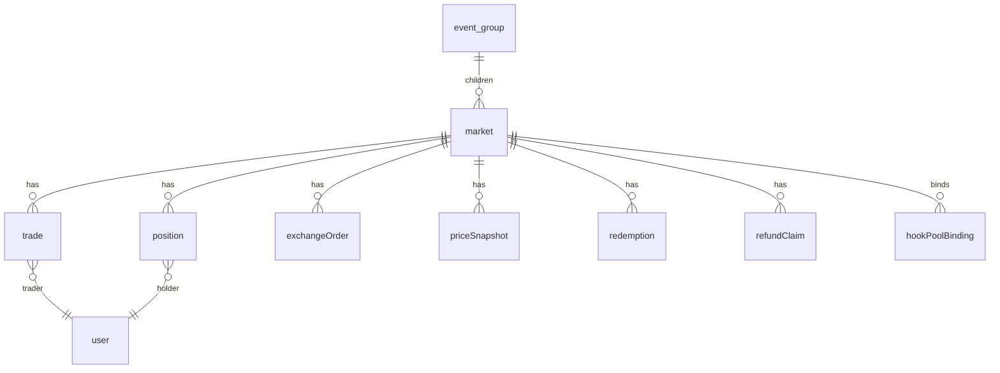

# Schema (28 Tables)

PostgreSQL schema được define trong `INDEXER/ponder.schema.ts` qua Ponder Drizzle-like DSL.


**Schema là append-only**. Không reorder / remove / đổi type column — breaks re-backfill.


## Sơ đồ nhóm tables

## 1. Core market tables

### `market`

| Column | Type | Ý nghĩa |
|---|---|---|
| `id` | bigint PK | `marketId` (uint256 monotonic) |
| `question` | text | Immutable |
| `endTime` | bigint | Unix seconds |
| `oracle` | hex | Address |
| `creator` | hex | Market creator |
| `yesToken` / `noToken` | hex | Outcome token addresses |
| `eventId` | bigint | 0 = standalone; != 0 = event child |
| `perMarketCap` | bigint | 0 = default cap |
| `snapshottedRedemptionFeeBps` | integer | Fee snapshot tại create (FINAL-H04) |
| `perMarketRedemptionFeeBps` | integer | Override |
| `redemptionFeeOverridden` | boolean | Flag explicit |
| `totalCollateral` | bigint | USDC deposited |
| `volume` | bigint | Lifetime volume (Σ Router.Trade.amountIn) |
| `tradeCount` | integer | Count |
| `isResolved` | boolean | |
| `outcome` | boolean | true = YES won |
| `resolvedAt` | bigint | |
| `resolutionType` | text | `NONE` \| `ORACLE` \| `EMERGENCY` \| `REFUND` |
| `refundModeActive` | boolean | |
| `refundEnabledAt` | bigint | |
| `sweptAt` | bigint | |
| `lastTradeAt` | bigint | Drives BE `isLive` heuristic |
| `createdAt` / `createdBlock` / `createdTxHash` | bookkeeping | |

Indexes: `endTime`, `lastTradeAt`, `isResolved`, `eventId`, `oracle`, `creator`.

### `event_group`

| Column | Type | Ý nghĩa |
|---|---|---|
| `id` | bigint PK | `eventId` |
| `name` | text | |
| `marketIds` | json | Array of child market IDs |
| `endTime` | bigint | |
| `creator` | hex | |
| `childMarketCount` | integer | |
| `isResolved` | boolean | |
| `winningIndex` | integer | Index vào `marketIds[]` |
| `winningChildMarketId` | bigint | |
| `refundModeActive` | boolean | |
| `resolvedAt` | bigint | |

## 2. Trades

### `trade` (canonical từ Router.Trade)

| Column | Type | Ý nghĩa |
|---|---|---|
| `id` | text PK | `${txHash}:${logIndex}` |
| `marketId` | bigint | |
| `trader` / `recipient` | hex | |
| `tradeType` | integer | 0=BUY_YES, 1=SELL_YES, 2=BUY_NO, 3=SELL_NO |
| `isBuy` | boolean | |
| `side` | text | `YES` \| `NO` |
| `amountIn` / `amountOut` | bigint | |
| `clobFilled` / `ammFilled` | bigint | Split |
| `yesPrice` | bigint | Post-trade |
| `timestamp` / `blockNumber` / `txHash` | bookkeeping | |

### `takerFill` (CLOB taker fills trực tiếp, không qua Router)

Schema tương tự `trade`. API `/api/markets/:id/trades` union 2 bảng này.

## 3. Positions & user state

### `position`

| Column | Type | Ý nghĩa |
|---|---|---|
| `id` | text PK | `${user}:${marketId}` |
| `user` | hex | |
| `marketId` | bigint | |
| `yesBalance` / `noBalance` | bigint | |
| `totalSpent` / `totalReceived` | bigint | |
| `realizedPnl` | bigint | |
| `outcomeAtResolve` | text nullable | `won` \| `lost` \| `refund` \| null |

Indexes: `user`, `marketId`, `(user, marketId)`, `(user, outcomeAtResolve)`.

### `positionSplit` / `positionMerge` — audit trails

Mỗi lần user split/merge được ghi 1 row. Dùng cho user history view.

### `redemption` / `refundClaim`

Audit trail cho `redeem` và `refund`.

## 4. Orders (CLOB)

### `exchangeOrder`

| Column | Type | Ý nghĩa |
|---|---|---|
| `id` | text PK | `orderId` |
| `marketId` | bigint | |
| `owner` | hex | |
| `side` | text | `BUY_YES` \| `SELL_YES` \| `BUY_NO` \| `SELL_NO` |
| `price` | bigint | |
| `amount` / `filled` / `remaining` | bigint | |
| `status` | text | `OPEN` \| `FILLED` \| `CANCELLED` |
| `placedAt` / `filledAt` / `cancelledAt` | bigint | |

## 5. AMM & pricing

### `hookPoolBinding`

Map `PoolId → (marketId, yesToken)` từ `Hook_PoolRegistered`.

### `ammPoolState` (DRAFT — pricing layer)

| Column | Type | Ý nghĩa |
|---|---|---|
| `poolId` | hex PK | |
| `sqrtPriceX96` | bigint | |
| `liquidity` | bigint | |
| `tick` | integer | |
| `updatedAt` | bigint | |

### `priceSnapshot`

Dual-source price history:

| Column | Type | Ý nghĩa |
|---|---|---|
| `id` | text PK | `${marketId}:${timestamp}:${source}` |
| `marketId` | bigint | |
| `yesPrice` | bigint | |
| `source` | text | `router` (canonical) \| `hook_amm` (analytics) |
| `timestamp` | bigint | |

## 6. Aggregates

### `protocolStats` (singleton, id=1)

| Column | Type |
|---|---|
| `totalMarkets` | integer |
| `totalVolume` | bigint |
| `totalTrades` | integer |
| `totalFeesCollected` | bigint |
| `totalUsers` | integer |
| `lastUpdated` | bigint |

### `userStats`

Per-user leaderboard: `totalVolume`, `tradeCount`, `winRate`, `currentStreak`, `bestStreak`, `rank`.

## 7. Audit trails

### `diamondCutHistory`

Mỗi `DiamondCut` event → 1 row. Dùng cho transparent upgrade audit.

### `roleGrantAudit`

| Column | Type |
|---|---|
| `id` | text PK |
| `role` | hex |
| `account` | hex |
| `sender` | hex |
| `action` | text (`granted` \| `revoked`) |
| `timestamp` | bigint |

### `oracleApprovalAudit`

Admin `setApprovedOracle` calls.

### `pauseStateChange`

Mỗi pause/unpause → 1 row.

### `hookUpgradeHistory`

`proposeUpgrade` / `executeUpgrade` / `cancelUpgrade` audit trail cho Hook proxy.

## Schema file

Source: [`INDEXER/ponder.schema.ts`](https://github.com/predix-protocol/indexer/blob/main/ponder.schema.ts)
