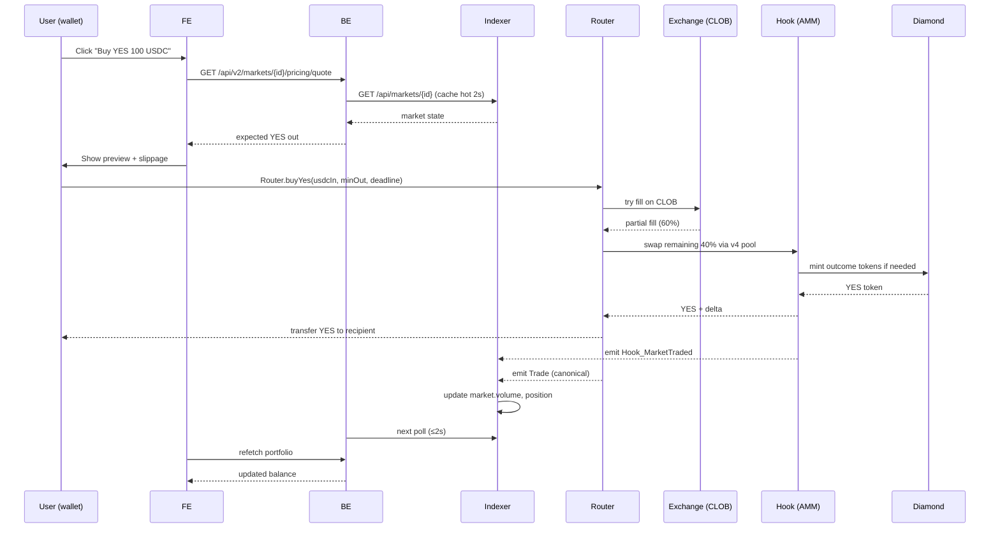

# Kiến Trúc Tổng Thể

PrediX V2 gồm **4 lớp độc lập** giao tiếp theo chiều dữ liệu một chiều: Smart Contracts ghi state on-chain → Indexer đọc events → Backend serve REST API → Frontend render UI.

## Sơ đồ tổng thể

```mermaid
flowchart LR
    User[👤 User<br/>Wallet] -->|Read/Write<br/>on-chain| SC
    User -->|Read<br/>(HTTP)| FE
    FE[Frontend<br/>Next.js 16] -->|REST /api/v2| BE
    BE[Backend<br/>NestJS + Fastify] -->|HTTP /api| IDX
    IDX[Indexer<br/>Ponder 0.16] -->|WS/HTTP<br/>eth_getLogs| RPC
    RPC[(Unichain RPC)] --- SC
    SC[Smart Contracts<br/>Diamond + Hook + Exchange + Router]
    BE -->|Auth SIWE<br/>+ overlays| Mongo[(MongoDB<br/>market_displays,<br/>users, audit_log)]
    IDX -->|Handlers| PG[(PostgreSQL<br/>28 tables)]
```

## Vai trò từng lớp

### 1. Smart Contracts (`SC/`)

**Ground truth của protocol.** Giữ collateral, mint outcome tokens, match orders, emit events.

| Package | Vai trò |
|---|---|
| `shared` | Interfaces, constants, storage libs, reentrancy guard |
| `oracle` | ManualOracle + ChainlinkOracle adapters |
| `diamond` | EIP-2535 proxy, 6 facets (Market, Event, AccessControl, Pausable, Cut, Loupe) |
| `hook` | `PrediXHookV2` (Uniswap v4 hook) + ERC1967 proxy với 48h timelock |
| `exchange` | `PrediXExchange` — CLOB on-chain |
| `router` | `PrediXRouter` — stateless aggregator |

Solidity `0.8.30`, Foundry, `evm=cancun`, `via_ir=true`. Chi tiết: [Contract Architecture](smart-contracts/27-contract-architecture.md).

### 2. Indexer (`INDEXER/`)

**Ponder 0.16** subscribe events từ SC → populate PostgreSQL + expose Hono REST API cho BE.

- 13 contracts subscribed (Diamond facets, Hook, Exchange, Router, Oracle adapters, PoolManager, OutcomeToken factory)
- 28 tables (market, event_group, trade, position, exchangeOrder, priceSnapshot, protocolStats, userStats, audit trails…)
- Reorg safety: dùng `finalized` block tag của Unichain (~12-15 min L2 finality)
- API `/api/markets`, `/api/events`, `/api/stats`, `/api/portfolio/:address`

Chi tiết: [Indexer Overview](indexer/00-overview.md).

### 3. Backend (`BE/`)

**NestJS 11 + Fastify + zod 4 + Mongoose + lru-cache + viem**. Là sole gateway giữa FE và Indexer; overlay Mongo cho admin metadata (display title, category, event groupings).

- 27 modules: markets, events, trading, users, portfolio, leaderboard, social, gamification, admin, auth, faucet…
- Schema-first: zod → DTO → OpenAPI auto-generated
- Response envelope `{ data, meta }` + error `{ error, meta }`
- Auth: SIWE (Sign-In with Ethereum) → session token
- Cache: 2 tier (hot 2s, warm 60s)
- Primitives: lowercase address, decimal-string price, unix-sec timestamp

Chi tiết: [Backend API Overview](backend-api/00-overview.md).

### 4. Frontend (`FE_new/`)

**Next.js 16 App Router + React 19 + Tailwind 4 + Ant Design 6 + Wagmi 2 + Viem 2 + RainbowKit**.

- `openapi-fetch` client — types auto-generated từ BE OpenAPI spec
- Adapter layer với 100% coverage gate
- Zustand (persist) + TanStack Query + SWR
- ZeroDev passkey (account abstraction) + Circle BridgeKit (cross-chain)
- i18n: en / vi / ja / ko

## Dataflow ví dụ: "User place a buy YES market order"



## Các quyết định kiến trúc quan trọng

| Quyết định | Lý do |
|---|---|
| **Diamond (EIP-2535)** thay vì UUPS proxy | Vượt 24KB bytecode limit; replace từng function thay vì toàn bộ contract |
| **Hook ERC1967 + 48h timelock** riêng biệt với Diamond | Hook upgrade độc lập khỏi Diamond, bảo vệ LP bằng delay 48h |
| **CLOB on-chain** thay vì off-chain orderbook | Censorship-resistant; verifiable solvency |
| **Router stateless + zero-custody** | Dễ audit (`balanceOf(router) == 0` sau mỗi call); không single point of compromise |
| **Ponder thay vì The Graph** | Type-safe TS, control đầy đủ handler logic, deploy self-hosted |
| **BE là sole gateway đến Indexer** | FE không gọi thẳng Indexer — cho phép BE overlay, cache, auth, envelope |
| **Outcome tokens ERC-20** thay vì ERC-1155 (Polymarket) | LP trên DEX, collateral trên lending, composable DeFi |
| **Redemption fee snapshot tại creation** | Admin không thể raise fee retroactively sau khi market resolved (FINAL-H04) |
| **Identity commit qua EIP-1153** cho anti-sandwich | Router commit caller vào transient storage trước swap — hook validate trong beforeSwap |

## Trust boundaries

- **SC ↔ SC**: Router trusts Exchange + Hook qua whitelist (`setTrustedRouter`). Hook verify Router qua identity commit.
- **SC ↔ Indexer**: Indexer đọc RPC node; không có trust assumption đặc biệt (handler fail-loud, reorg-safe).
- **Indexer ↔ BE**: BE treat Indexer là upstream truth; BE không ghi ngược vào Indexer DB.
- **BE ↔ FE**: FE trust BE response envelope; không trust JS `number` cho money (decimal strings only).
- **User ↔ BE (auth)**: SIWE challenge/verify; session token trong localStorage; 401 → re-sign.

## Khi nào dùng lớp nào?

| Use case | Lớp nên gọi |
|---|---|
| Hiển thị market list, detail, pricing history | **BE** (đã cache, có overlay metadata) |
| Đọc user portfolio với PnL | **BE** (đã compute PnL, join audit log) |
| Place trade | **SC Router** trực tiếp qua wallet |
| Listen event real-time cho bot MM | **On-chain** (qua viem `watchContractEvent`) hoặc **Indexer poll** |
| Analytics thô (full historical trades) | **Indexer REST** |
| Admin write (feature market, update display) | **BE admin endpoints** (SIWE + role check) |
| Upgrade facet / hook implementation | **SC** + TimelockController (governance) |
