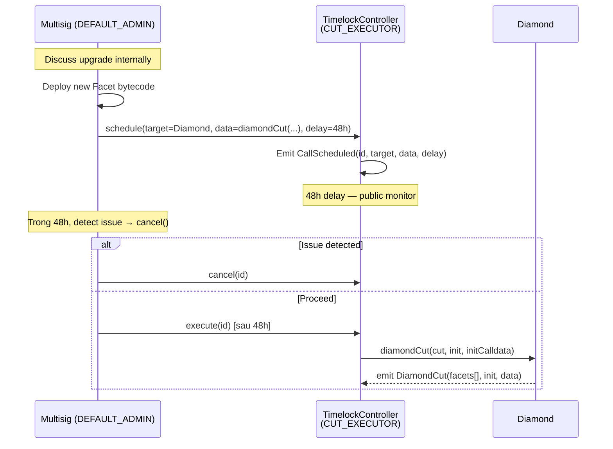
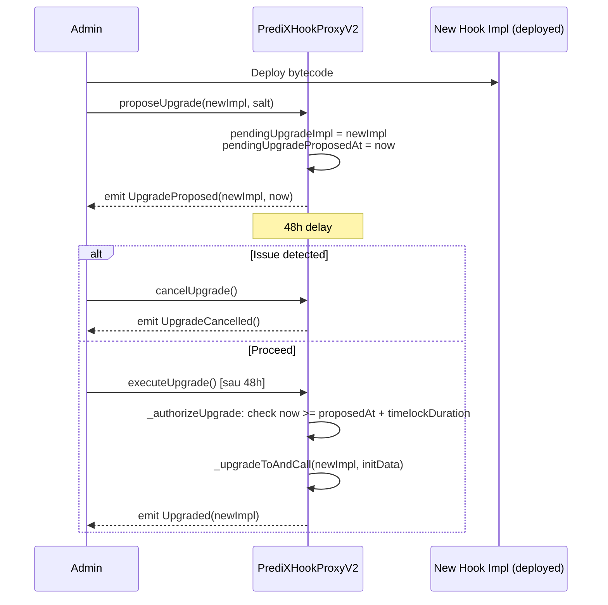

# Timelock & Upgrade Governance

PrediX có **2 upgrade path riêng biệt**: Diamond (facets) và Hook proxy. Cả hai đều có **48h timelock** — admin không thể upgrade ngay lập tức.

## Diamond upgrade (facets)

### Authority model

```
DEFAULT_ADMIN_ROLE     ← multisig (grant/revoke các role)
   │
   │ grants
   ▼
CUT_EXECUTOR_ROLE      ← CHỈ TimelockController được hold
   │
   │ calls diamondCut
   ▼
Diamond                ← protocol proxy
```

**Key guarantee (NEW-01)**: `DEFAULT_ADMIN_ROLE` không thể bypass timelock — không thể tự call `diamondCut` trực tiếp. Muốn upgrade, phải `schedule()` qua Timelock, chờ 48h, rồi `execute()`.

### Flow



### TimelockController config

```yaml
minDelay: 172800           # 48h (seconds)
proposers:
  - 0x<multisig>           # Admin multisig
executors:
  - address(0)              # Anyone can execute after delay
admin: address(0)            # Self-governed (no admin role)
```

**Why `executors: address(0)`?** Anyone can call `execute()` sau 48h — nghĩa là nếu multisig "lost keys" hoặc goes dark, ai cũng có thể push scheduled upgrade qua finish line. Safer than requiring same multisig.

### Audit trail

Mọi `diamondCut` execution emit event:

```solidity
event DiamondCut(FacetCut[] _diamondCut, address _init, bytes _calldata);
```

Indexer lưu vào `diamond_cut_history`. BE serve qua `GET /api/v2/admin/diamond-cuts`.

Ngoài ra Timelock emit:

- `CallScheduled(id, target, data, delay)` — khi schedule
- `Cancelled(id)` — khi cancel
- `CallExecuted(id, target, data)` — khi execute

---

## Hook upgrade (ERC1967 proxy)

Hook V2 dùng **ERC1967 proxy pattern** với custom 48h timelock — không dùng TimelockController vì simpler + more readable cho Hook specifically.

### Flow



### Functions

```solidity
function proposeUpgrade(address newImpl, bytes32 salt) external onlyAdmin;
function executeUpgrade() external onlyAdmin;
function cancelUpgrade() external onlyAdmin;
function setTimelockDuration(uint256 newDuration) external onlyAdmin;  // Itself timelock-gated
```

### Salt parameter

Hook address trong v4 được mine để flag bits khớp `getHookPermissions()`. Khi upgrade impl mới, salt dùng để reproduce address (via CREATE2). Admin phải mine salt offline + pass vào `proposeUpgrade`.

### `initReverted` recovery

Nếu impl mới có `initialize()` bug → init revert. Proxy catch revert + emit `InitReverted(reason)` + rollback state. Admin có thể `proposeUpgrade` lần nữa với impl fix.

---

## Admin multisig

**Recommended config cho mainnet**: Gnosis Safe multisig, threshold **3-of-5** hoặc **5-of-9**.

Signer roles:

- Technical lead (CTO)
- Security lead
- Operations lead
- External advisor (independent)
- Optional: community representative, audit firm rep

**Key management**:

- Hardware wallet (Ledger / Trezor) cho mỗi signer
- Geographic distribution
- Documented rotation policy (annual key refresh)

## Pause mechanism

Separate từ upgrade — `PAUSER_ROLE` có thể immediate pause (no timelock) module MARKET:

- **Purpose**: Emergency stop cho incident response
- **Effect**: Freeze split/merge/redeem/placeOrder/AMM swap
- **KHÔNG affect**: refund, resolve, cancelOrder, fillAsChain (user cần thoát được)

Pause là recoverable — admin `unpause(module)` unfreeze.

## Role rotation

Admin có thể grant/revoke role mà không cần timelock (chỉ upgrade `diamondCut` cần). Log:

- `RoleGranted(role, account, sender)`
- `RoleRevoked(role, account, sender)`

Indexed vào `role_grant_audit`. Public view: `GET /api/v2/admin/role-changes`.

**Last-admin protection**: revoke last `DEFAULT_ADMIN_ROLE` bị block (`AC_LastAdminProtection()`) — protocol luôn có ít nhất 1 admin.

---

## Community monitoring

Public có thể monitor timelock qua:

1. **Etherscan**: Watch Timelock contract → alert khi `CallScheduled` emitted
2. **Indexer REST**: `GET /api/v2/admin/diamond-cuts` + `/api/v2/admin/hook-proxy-upgrades`
3. **BE admin views**: same data qua `GET /api/v2/admin/*`

Alert community channel (Discord #governance) sẽ post manually cho mọi major upgrade. Sau mainnet sẽ auto-post qua bot.

## Upgrade philosophy

1. **Never rush**: 48h là minimum — nếu complex upgrade, announce sớm hơn (weeks)
2. **Testnet first**: Mọi facet/impl mới deploy + test trên testnet ≥2 weeks trước mainnet
3. **Audit if material**: Change logic ≠ cosmetic → external audit nếu budget allow
4. **Transparent reasoning**: Publish "upgrade rationale" doc trước mỗi major change
5. **Defer khi unclear**: Nếu community debate về upgrade → defer, không push through
