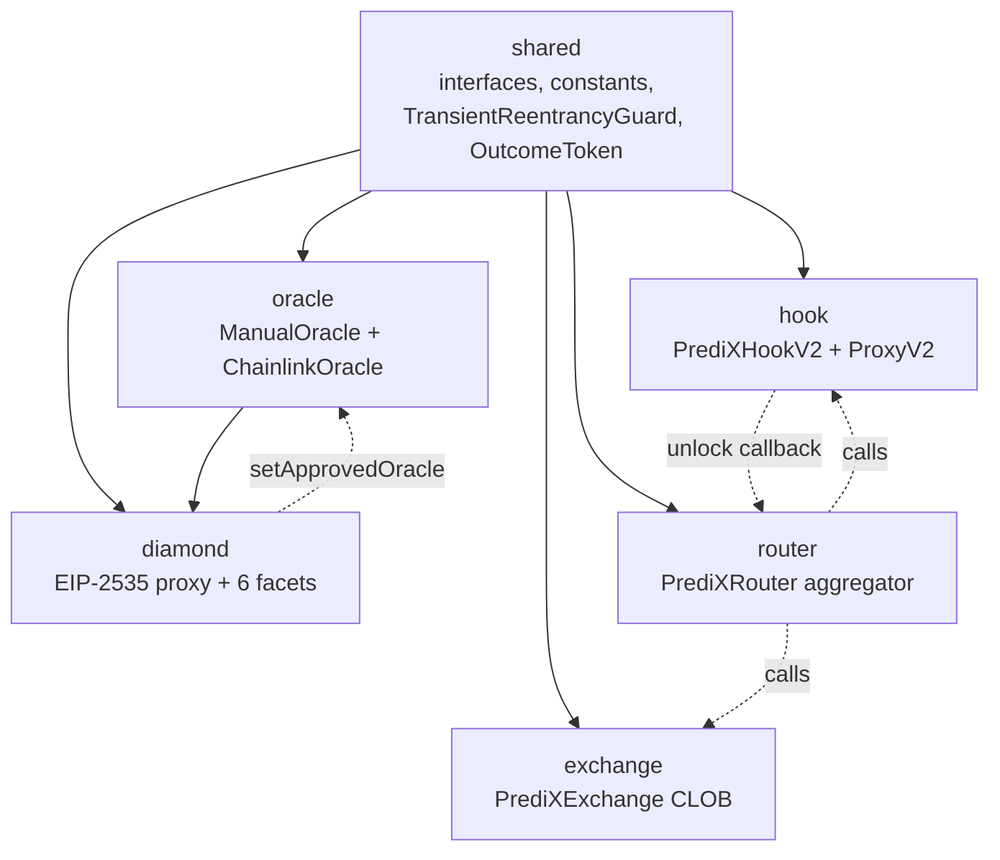

# Contract Architecture

PrediX V2 gồm **6 package độc lập**, mỗi package compile riêng, có test suite riêng, chỉ giao tiếp qua interface trong `shared/`.

## Package dependency flow

**Luật cross-package**: import chỉ đi qua `@predix/shared/interfaces/`. Không package nào import trực tiếp implementation của package khác. Nếu cần symbol dùng chéo — thêm vào `shared/` trước.

## 6 package & vai trò

| Package | Vai trò | Ghi chú |
|---|---|---|
| **`shared`** | Interfaces (`IMarketFacet`, `IOracle`, `IOutcomeToken`…), constants (`Roles`, `Modules`), storage libs, `TransientReentrancyGuard` (EIP-1153), `OutcomeToken` ERC-20 | Base, mọi package import |
| **`oracle`** | 2 adapter: `ManualOracle` (admin confirm), `ChainlinkOracle` (price feed, round-pinned) | Implements `IOracle` |
| **`diamond`** | EIP-2535 proxy + 6 facets | Core protocol |
| **`hook`** | `PrediXHookV2` (Uniswap v4 Hook) + `PrediXHookProxyV2` (ERC1967 proxy + 48h timelock) | Implements `IHooks` của v4-core |
| **`exchange`** | `PrediXExchange` — CLOB on-chain với 3 MatchType, bitmap 99 tick | Standalone |
| **`router`** | `PrediXRouter` — stateless aggregator route giữa Exchange + Hook AMM, Permit2-native, zero-custody | Aggregate Exchange + Hook |

## 6 Facets trong Diamond

| Facet | Chức năng chính |
|---|---|
| **MarketFacet** | `createMarket`, `splitPosition`, `mergePositions`, `resolveMarket`, `emergencyResolve`, `redeem`, `enableRefundMode`, `sweepUnclaimed` |
| **EventFacet** | Multi-outcome events (Polymarket-style): `createEvent`, `resolveEvent`, mutual-exclusion resolution |
| **AccessControlFacet** | `grantRole`, `revokeRole`, `hasRole` — 5 roles |
| **PausableFacet** | `pause(module)`, `unpause(module)`, module-keyed (`MARKET`, `DIAMOND`) |
| **DiamondCutFacet** | `diamondCut` — thêm/replace/remove facet, **gate bởi `CUT_EXECUTOR_ROLE` + TimelockController 48h** |
| **DiamondLoupeFacet** | `facets()`, `facetAddresses()`, `facetFunctionSelectors()` — EIP-2535 introspection |


**KHÔNG có `OwnableFacet`**. Access control dùng role-based hoàn toàn; ownership ngầm = ai giữ `DEFAULT_ADMIN_ROLE`. `diamondCut` là quyền riêng của `CUT_EXECUTOR_ROLE` (giữ bởi TimelockController).


## Toolchain

| Item | Giá trị |
|---|---|
| Solidity | `0.8.30` exact |
| EVM version | `cancun` (cho EIP-1153 transient storage) |
| Optimizer | `via_ir=true`, `runs=200` |
| Bytecode hash | `none` |
| Test framework | Foundry (forge) |
| Dependency vendoring | `lib/` — OpenZeppelin, Uniswap v4-core/periphery, Permit2, Chainlink AggregatorV3Interface |

## Mapping contract ↔ địa chỉ

Xem [Deployed Addresses](deployed-addresses.md).

## Storage strategy

- **Diamond storage pattern** (EIP-2535): mỗi facet dùng slot riêng `keccak256("predix.storage.<module>")`. Library `Lib*Storage` return pointer tới struct `Layout`.
- **Append-only**: không reorder / remove column trong struct storage. Violation = brick upgrade.
- **Transient storage** (EIP-1153): reentrancy guard và Hook identity-commit dùng slot transient — reset mỗi tx, không chiếm storage vĩnh viễn.

## Upgrade governance

- **Diamond**: `diamondCut` gọi qua `TimelockController` (48h delay). Holder duy nhất của `CUT_EXECUTOR_ROLE` là timelock contract, ngay cả `DEFAULT_ADMIN_ROLE` không thể bypass (closes audit finding NEW-01).
- **Hook Proxy**: upgrade 2-step qua ERC1967 + 48h timelock:
  1. `proposeUpgrade(newImpl, salt)` emit `UpgradeProposed`, record timestamp
  2. Sau 48h → `executeUpgrade()` triển khai impl mới
  3. Trong 48h, admin có thể `cancelUpgrade()`

Chi tiết: [Timelock & Upgrade Governance](../security/04-timelock-governance.md).

## User flow ↔ contract call map

| User action | Contract gọi | Event phát ra |
|---|---|---|
| Approve USDC | `USDC.approve(Router/Exchange/Diamond, amount)` | `Approval` |
| Split $1 → 1 YES + 1 NO | `Diamond.splitPosition(marketId, amount)` | `PositionSplit` |
| Merge 1 YES + 1 NO → $1 | `Diamond.mergePositions(marketId, amount)` | `PositionMerged` |
| Mua YES bằng market order | `Router.buyYes(...)` | `Trade` (canonical); `Hook_MarketTraded` nếu qua AMM |
| Đặt limit order | `Exchange.placeOrder(marketId, side, price, amount)` | `OrderPlaced` → `OrderMatched` khi fill |
| Huỷ lệnh | `Exchange.cancelOrder(orderId)` | `OrderCancelled` |
| Redeem sau resolve | `Diamond.redeemMarketTokens(marketId)` | `TokensRedeemed` |
| Refund nếu market hủy | `Diamond.refund(marketId)` | `MarketRefunded` |
| Admin resolve | `Diamond.resolveMarket(marketId)` | `MarketResolved` |
| Admin emergency resolve (sau 7d delay) | `Diamond.emergencyResolve(marketId, outcome)` | `MarketEmergencyResolved` |

Chi tiết signature: [MarketFacet reference](market-facet.md) và [Developer Guides](../developers/34-developer-quickstart.md).
