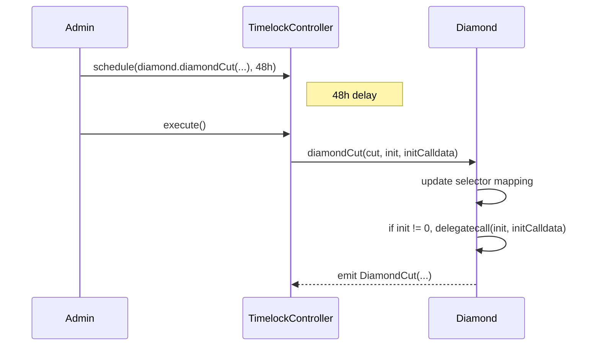

# Diamond Proxy (EIP-2535)

Diamond là contract hub của PrediX. Mọi user action (split, merge, trade setup, resolve, redeem, refund) đi qua Diamond rồi `delegatecall` tới facet tương ứng.

## Tại sao dùng Diamond (EIP-2535)?

| Lý do | Giải thích |
|---|---|
| **Vượt 24KB bytecode limit** | Logic protocol (lifecycle + events + access + pause + upgrade) > 24KB → phải tách facets |
| **Upgrade từng function** | Thay thế selector riêng lẻ, không redeploy toàn bộ contract |
| **Shared storage** | Mọi facet chia sẻ storage của Diamond (dùng diamond storage pattern) |
| **Đã production** | Aavegotchi, Beanstalk, Nayms — có battle-test |

## 6 Facets

Tham khảo [EIP-2535 spec](https://eips.ethereum.org/EIPS/eip-2535).

| Facet | Selector chính | Role yêu cầu |
|---|---|---|
| **DiamondCutFacet** | `diamondCut(cut, init, calldata)` | `CUT_EXECUTOR_ROLE` (chỉ TimelockController giữ) |
| **DiamondLoupeFacet** | `facets()`, `facetAddresses()`, `facetFunctionSelectors(facet)`, `facetAddress(selector)` | Public view |
| **AccessControlFacet** | `grantRole`, `revokeRole`, `hasRole`, `renounceRole` | `DEFAULT_ADMIN_ROLE` hoặc role admin |
| **PausableFacet** | `pause(module)`, `unpause(module)`, `paused(module)` | `PAUSER_ROLE` |
| **MarketFacet** | Xem [MarketFacet reference](market-facet.md) | Mixed (ADMIN cho create, public cho trade/redeem) |
| **EventFacet** | Xem [EventFacet reference](event-facet.md) | Mixed |


**KHÔNG có `OwnableFacet`**. Ownership trong PrediX là ngầm = holder của `DEFAULT_ADMIN_ROLE`. Upgrade authority tách riêng = `CUT_EXECUTOR_ROLE` (giữ bởi TimelockController, không ai có thể bypass kể cả admin).


## Cách hoạt động

Mọi lệnh gọi vào Diamond được route qua selector + fallback:

```
User calls diamond.splitPosition(marketId, amount)
   ↓
Diamond fallback function:
   1. Extract selector (first 4 bytes of calldata)
   2. Lookup facet address trong DiamondStorage.selectorToFacet[selector]
   3. delegatecall(facet, calldata) — facet code chạy trong storage context của Diamond
   ↓
MarketFacet code executes, reads/writes Diamond storage
```

Selector bảo vệ (không thể remove qua `diamondCut`):

- `DiamondCutFacet.diamondCut`
- Một số selector của `DiamondLoupeFacet` (cho introspection)

## DiamondCut — quy trình upgrade



Các FacetCut action:

- `Add(facet, selectors[])`: thêm selector mới, selector đã tồn tại ở facet khác → revert
- `Replace(facet, selectors[])`: swap facet cho selector đã có
- `Remove(0, selectors[])`: xoá selector

## Diamond storage pattern

Mỗi module lưu state trong một slot riêng:

```solidity
library LibMarketStorage {
    bytes32 internal constant SLOT = keccak256("predix.storage.market");

    struct Layout {
        mapping(uint256 marketId => MarketData) markets;
        // ... append-only
    }

    function layout() internal pure returns (Layout storage l) {
        bytes32 slot = SLOT;
        assembly { l.slot := slot }
    }
}
```

**Hard rule**: storage struct **append-only**. Reorder / remove / đổi type → brick upgrade.

## MarketData struct (simplified)

```solidity
struct MarketData {
    string question;
    uint256 endTime;
    address yesToken;
    address noToken;
    uint256 eventId;         // 0 = standalone; != 0 = child của EventGroup
    address oracle;
    bool isResolved;
    bool outcome;            // true = YES thắng, false = NO thắng
    uint256 totalCollateral;
    uint256 resolvedAt;
    bool refundModeActive;
    uint16 snapshottedRedemptionFeeBps;  // Fee snapshot tại create (FINAL-H04)
    uint16 perMarketRedemptionFeeBps;    // Override per-market
    bool redemptionFeeOverridden;        // Flag explicit
    uint256 perMarketCap;                // 0 = dùng default cap
}
```


**Fee snapshot tại create** (audit finding FINAL-H04): `snapshottedRedemptionFeeBps` được set tại thời điểm `createMarket`. Khi user redeem sau resolve, fee áp dụng = snapshot tại thời điểm create, **không** phải giá trị admin có thể raise sau đó. Chi tiết: [Phí Giao Dịch](../khai-niem-cot-loi/20-phi-giao-dich.md).


## Hằng số quan trọng

| Tên | Giá trị | Ý nghĩa |
|---|---|---|
| `EMERGENCY_DELAY` | 7 days | Thời gian cooling-off trước khi operator được gọi `emergencyResolve` |
| `GRACE_PERIOD` | 365 days | Sau khi resolve, user có 1 năm để redeem; hết hạn admin có thể `sweepUnclaimed` |
| `MAX_REDEMPTION_FEE_BPS` | 1500 (15%) | Hard cap của redemption fee |
| `BPS_DENOMINATOR` | 10000 | 100% basis points |
