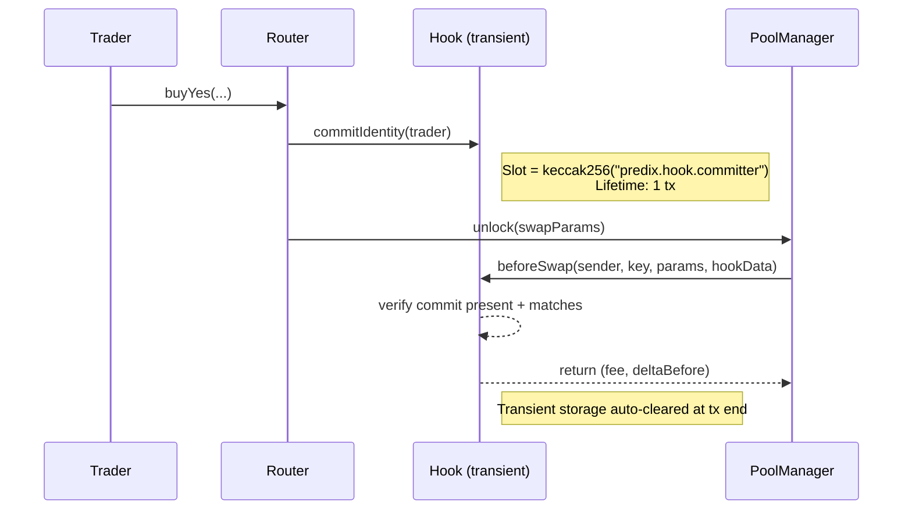

# PrediXHookV2 (Uniswap v4)

`PrediXHookV2` là Uniswap v4 Hook bổ sung logic prediction-market vào pool AMM. Deploy dưới dạng ERC1967 proxy (`PrediXHookProxyV2`) cho phép upgrade có timelock.

Source: `SC/packages/hook/src/hooks/PrediXHookV2.sol`
Proxy: `SC/packages/hook/src/proxy/PrediXHookProxyV2.sol`


**Tên canonical là V2**. Nếu docs khác hoặc code cũ reference `PrediXHookV1` — đó là drift, V1 không còn deploy.


## Hook permissions

Hook address được mine salt sao cho flag bit khớp `getHookPermissions()`:

| Hook point | Kích hoạt | Mục đích |
|---|---|---|
| `beforeInitialize` | ✅ | Validate pool registration (chỉ Diamond được register) |
| `afterInitialize` | ✅ | Set pool metadata (marketId, YES token address) |
| `beforeSwap` | ✅ | Dynamic fee + identity-commit verification |
| `afterSwap` | ✅ | Emit `Hook_MarketTraded` cho indexer |

Uniswap v4 reference: [Hook permissions](https://docs.uniswap.org/contracts/v4/concepts/hooks).

## Dynamic Fee

Phí tăng khi market gần end time — bảo vệ LP khỏi informed trader (adverse selection):

| Thời gian còn lại | Phí |
|---|---|
| > 7 ngày | 0.5% |
| 3–7 ngày | 1.0% |
| 1–3 ngày | 2.0% |
| < 24 giờ | 5.0% |

Code computed trong `beforeSwap`, return fee với `LPFeeLibrary.OVERRIDE_FEE_FLAG` để PoolManager nhận override.

## Identity Commit (anti-sandwich)

Cơ chế cốt lõi của V2 — thay thế approach V1 (block-based direction check).

**Lý do**: V1 detect sandwich bằng `(block.number, direction)` per user+pool → có false positive khi cùng block nhiều user cùng direction, lại không bắt được cross-block sandwich.

**V2 approach** (EIP-1153 transient storage):



Sandwich attacker **không thể** gọi Hook từ ngoài Router whitelist → không commit được → `beforeSwap` revert `Hook_IdentityCommitMissing`.

### TrustedRouter whitelist

```solidity
function setTrustedRouter(address router, bool trusted) external;  // Only Diamond admin
```

Chỉ router trong whitelist mới được commit identity. Ngăn random attacker deploy fake router.

## Pool registration

```solidity
function registerMarketPool(
    uint256 marketId,
    address yesToken,
    PoolKey calldata key
) external;
```

**Role**: Chỉ Diamond được gọi (`msg.sender == diamond`).
**Effect**: Map `PoolId → (marketId, yesToken)` trong state của Hook. `beforeInitialize` verify `poolId` đã register.

## ERC1967 Proxy với 48h timelock

`PrediXHookProxyV2` implement upgrade 2-step:

```solidity
function proposeUpgrade(address newImpl, bytes32 salt) external;  // Admin
function executeUpgrade() external;                                // Sau 48h
function cancelUpgrade() external;                                 // Trong 48h
```

**Flow**:
1. Admin call `proposeUpgrade(newImpl, salt)` → emit `UpgradeProposed(newImpl, proposedAt)`, store timestamp.
2. **48 giờ delay** — cho phép LP + user react.
3. Admin call `executeUpgrade()` → `_authorizeUpgrade()` check time >= `proposedAt + 48h` → ERC1967 `_upgradeToAndCall(newImpl)`.
4. Trong 48h, admin có thể `cancelUpgrade()` nếu phát hiện sai.

Initial impl bị revert trong `initialize()` (guarded bởi `_disableInitializers()` pattern — chỉ proxy được init).

### `setTimelockDuration`

```solidity
function setTimelockDuration(uint256 newDuration) external;  // Admin, itself timelock-gated
```

Cho phép tăng duration (giảm blocked). Default 48h.

## Public view functions

```solidity
function getMarketForPool(PoolId poolId) external view returns (uint256 marketId);
function getYesTokenForPool(PoolId poolId) external view returns (address);
function isTrustedRouter(address) external view returns (bool);
function getHookPermissions() external pure returns (Hooks.Permissions memory);
function pendingUpgradeImpl() external view returns (address);
function pendingUpgradeProposedAt() external view returns (uint256);
function timelockDuration() external view returns (uint256);
```

## Pause

Module key riêng cho Hook: `DIAMOND` pause không ảnh hưởng Hook; Hook có cờ pause nội bộ cho emergency.

## Events

```solidity
event Hook_PoolRegistered(uint256 indexed marketId, PoolId indexed poolId, address yesToken);
event Hook_MarketTraded(
    uint256 indexed marketId,
    address indexed trader,
    bool isBuy,
    uint256 amount,
    uint256 cost,
    uint8 side,
    uint256 yesPrice
);
event Hook_TrustedRouterUpdated(address indexed router, bool trusted);
event Hook_AdminChangeProposed(address indexed newAdmin, uint256 proposedAt);
event Hook_AdminUpdated(address indexed oldAdmin, address indexed newAdmin);
event Hook_PauseStatusChanged(bool paused);

// Proxy events
event UpgradeProposed(address indexed newImpl, uint256 proposedAt);
event Upgraded(address indexed newImpl);
event UpgradeCancelled();
event AdminChangeProposed(address indexed newAdmin, uint256 proposedAt);
event AdminChanged(address indexed oldAdmin, address indexed newAdmin);
event TimelockDurationUpdated(uint256 oldDuration, uint256 newDuration);
event InitReverted();
```

## Invariants liên quan

- INV-5: `beforeSwap` **luôn** require identity commit trong transient storage. Violation = block trade.
- Upgrade governance: ERC1967 proxy, timelock ≥48h (gia hạn được, không giảm).

Xem [Invariants](../security/02-invariants.md) và [Timelock & Upgrade Governance](../security/04-timelock-governance.md).
