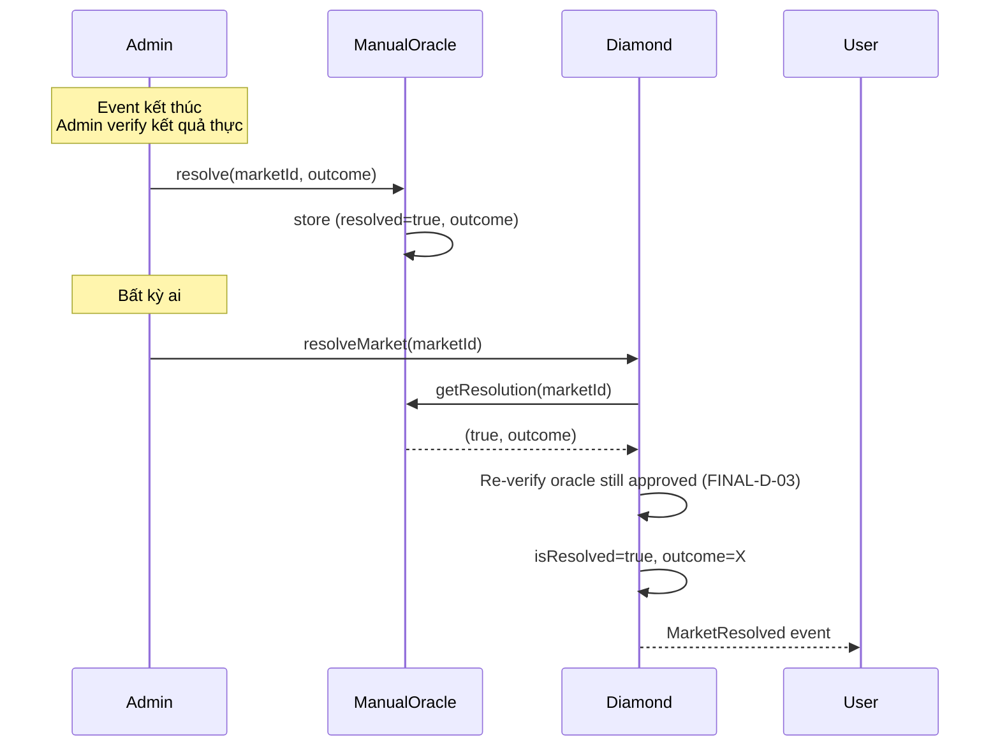

# Oracle

PrediX dùng pluggable oracle pattern. Mỗi oracle implement `IOracle`; Diamond approve address cụ thể qua `setApprovedOracle`. `createMarket` chỉ nhận oracle đã approved.

Source: `SC/packages/oracle/`
Interface: `SC/packages/shared/src/interfaces/IOracle.sol`

## Interface chung

```solidity
interface IOracle {
    /// @notice Query resolution status + outcome cho một market.
    /// @return resolved True nếu oracle có kết quả
    /// @return outcome True = YES thắng; False = NO thắng
    function getResolution(uint256 marketId)
        external view returns (bool resolved, bool outcome);
}
```

## 1. ManualOracle

Admin-confirmed oracle cho events chủ quan (chính trị, thể thao, sự kiện xã hội, pop-culture).

Source: `SC/packages/oracle/src/ManualOracle.sol`

### Functions

```solidity
// Admin — confirm kết quả
function resolve(uint256 marketId, bool outcome) external;

// Public view
function getResolution(uint256 marketId) external view returns (bool resolved, bool outcome);
function getResolvedAt(uint256 marketId) external view returns (uint64);
```

### Flow


## 2. ChainlinkOracle

Automated resolution dựa trên Chainlink price feed. Use case: "BTC > $100K trước Q3?", "ETH > $10K trước 2027?".

Source: `SC/packages/oracle/src/ChainlinkOracle.sol`

### Kiểm tra an toàn (built-in)

| Check | Giải thích |
|---|---|
| **Staleness** | `updatedAt` trong vòng 24h — else revert `Oracle_StalePrice` |
| **L2 sequencer uptime** | Với L2 chains, check Chainlink sequencer uptime feed — đảm bảo sequencer up trong ≥ grace period |
| **Round completeness** | `answeredInRound >= roundId` — tránh incomplete round |
| **Price > 0** | Revert `Oracle_InvalidPrice` nếu ≤ 0 |

### Functions

```solidity
// Admin — bind market tới Chainlink feed + threshold + comparison
function bindMarket(
    uint256 marketId,
    address priceFeed,
    int256 threshold,
    Comparison cmp,        // GT | GTE | LT | LTE
    uint256 resolveTime    // timestamp earliest có thể resolve
) external;

// Public — trigger resolution sau resolveTime
function resolve(uint256 marketId) external;

function getResolution(uint256 marketId) external view returns (bool, bool);
```

## 3. Oracle re-verify at resolve (FINAL-D-03)


**Critical security feature**: Diamond **re-check oracle approval tại thời điểm `resolveMarket`**, không chỉ tại `createMarket`.


Lý do: nếu oracle bị compromise sau khi market tạo, admin có thể revoke approval qua `setApprovedOracle(oracle, false)`. Market chưa resolve sẽ không thể proceed với oracle đó → admin trigger `enableRefundMode` thay vì accept kết quả giả.

Code path:
```solidity
function resolveMarket(uint256 marketId) external {
    MarketData storage m = LibMarketStorage.layout().markets[marketId];
    // Re-verify oracle still approved (FINAL-D-03)
    if (!LibConfigStorage.layout().approvedOracles[m.oracle]) {
        revert Market_OracleNotApproved();
    }
    // ... proceed
}
```

## Tạo custom oracle adapter

Bất kỳ ai cũng có thể deploy oracle adapter riêng. Chỉ cần:

1. Implement `IOracle` interface
2. Deploy contract
3. Admin approve: `diamond.setApprovedOracle(yourAdapter, true)`
4. Khi tạo market: `diamond.createMarket(..., yourAdapter)`

### Template

```solidity
// SPDX-License-Identifier: MIT
pragma solidity ^0.8.30;

import {IOracle} from "@predix/shared/interfaces/IOracle.sol";

contract MyCustomOracle is IOracle {
    address public immutable admin;
    mapping(uint256 => bool) public resolved;
    mapping(uint256 => bool) public outcomes;

    error NotAdmin();
    error AlreadyResolved();

    constructor(address _admin) {
        admin = _admin;
    }

    function resolve(uint256 marketId, bool outcome) external {
        if (msg.sender != admin) revert NotAdmin();
        if (resolved[marketId]) revert AlreadyResolved();
        resolved[marketId] = true;
        outcomes[marketId] = outcome;
    }

    function getResolution(uint256 marketId)
        external view returns (bool, bool)
    {
        return (resolved[marketId], outcomes[marketId]);
    }
}
```

Best practices:
- Immutable resolution — không revert kết quả đã commit (INV-6).
- Event logging cho audit trail.
- Timelock / multisig cho admin role.
- Dispute window nếu cần (delay X ngày trước khi consider final).

## Roadmap

| Phase | Oracle type |
|---|---|
| Phase 1 (hiện tại) | ManualOracle + ChainlinkOracle |
| Phase 2 | UMA Optimistic Oracle adapter |
| Phase 3 | Cross-chain oracle (Wormhole / LayerZero) |

Phase 2/3 chưa có code trong source. Claim về "UMA" trong docs cũ đã bị deprecate — sẽ implement khi đến phase đó.

## Events (ManualOracle)

```solidity
event ResolutionSet(uint256 indexed marketId, bool outcome, address indexed operator);
event AdminChanged(address indexed oldAdmin, address indexed newAdmin);
```

## Events (ChainlinkOracle)

```solidity
event MarketBound(uint256 indexed marketId, address priceFeed, int256 threshold, uint8 cmp, uint256 resolveTime);
event Resolved(uint256 indexed marketId, int256 price, bool outcome, uint80 roundId);
```

Indexer reference: [Events Mapping](../indexer/03-events-mapping.md).
