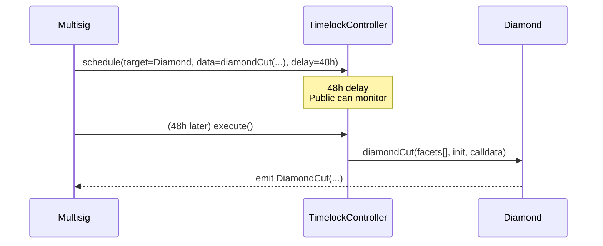

# Access Control & Timelock

PrediX dùng **role-based access control** (OpenZeppelin-style) qua `AccessControlFacet`. Upgrade authority tách riêng qua `CUT_EXECUTOR_ROLE` gắn với `TimelockController` (48h delay).

## 5 Roles

Source: `SC/packages/shared/src/constants/Roles.sol`

| Role | Hash ID | Mục đích | Holder điển hình |
|---|---|---|---|
| **`DEFAULT_ADMIN_ROLE`** | `0x00` | Role admin gốc — grant/revoke các role khác | Multisig (Gnosis Safe) |
| **`ADMIN_ROLE`** | `keccak256("predix.role.admin")` | Tạo market, cấu hình fee, approve oracle, set cap | Team multisig |
| **`OPERATOR_ROLE`** | `keccak256("predix.role.operator")` | Emergency resolve (sau 7d), enable refund mode | Operations multisig |
| **`PAUSER_ROLE`** | `keccak256("predix.role.pauser")` | Pause/unpause module | Security monitoring + multisig |
| **`CUT_EXECUTOR_ROLE`** | `keccak256("predix.role.cut_executor")` | **Duy nhất** được gọi `diamondCut` | `TimelockController` contract |


**`DEFAULT_ADMIN_ROLE` không thể bypass `CUT_EXECUTOR_ROLE`** (closes audit finding NEW-01). Ngay cả admin gốc cũng phải đi qua TimelockController 48h để upgrade facet. Đây là safeguard chống admin-compromise.


## Ma trận quyền

| Hàm | PUBLIC | ADMIN | OPERATOR | PAUSER | CUT_EXECUTOR | DEFAULT_ADMIN |
|---|---|---|---|---|---|---|
| `createMarket` |  | ✓ |  |  |  |  |
| `createEvent` |  | ✓ |  |  |  |  |
| `setApprovedOracle` |  | ✓ |  |  |  |  |
| `setDefaultRedemptionFeeBps` |  | ✓ |  |  |  |  |
| `setPerMarketCap` |  | ✓ |  |  |  |  |
| `splitPosition`, `mergePositions` | ✓ |  |  |  |  |  |
| `resolveMarket` | ✓ |  |  |  |  |  |
| `redeem`, `redeemMarketTokens` | ✓ |  |  |  |  |  |
| `refund` (khi refund mode) | ✓ |  |  |  |  |  |
| `placeOrder`, `cancelOrder` (own order) | ✓ |  |  |  |  |  |
| `buyYes` / `sellYes` / `buyNo` / `sellNo` (Router) | ✓ |  |  |  |  |  |
| `emergencyResolve` (+7d delay) |  |  | ✓ |  |  |  |
| `enableRefundMode` |  |  | ✓ |  |  |  |
| `sweepUnclaimed` (+365d grace) |  | ✓ |  |  |  |  |
| `pause(module)` / `unpause(module)` |  |  |  | ✓ |  |  |
| `diamondCut` (via Timelock) |  |  |  |  | ✓ |  |
| `grantRole` / `revokeRole` |  |  |  |  |  | ✓ |
| Hook: `proposeUpgrade` (+48h timelock) |  | ✓ |  |  |  |  |
| Hook: `setTrustedRouter` |  | ✓ |  |  |  |  |

## AccessControl functions

```solidity
function grantRole(bytes32 role, address account) external;
function revokeRole(bytes32 role, address account) external;
function hasRole(bytes32 role, address account) external view returns (bool);
function getRoleMember(bytes32 role, uint256 index) external view returns (address);
function getRoleMemberCount(bytes32 role) external view returns (uint256);
function renounceRole(bytes32 role, address account) external;
```

## Last-admin protection

Contract ngăn chặn revoke last holder của `DEFAULT_ADMIN_ROLE` — đảm bảo protocol luôn có ít nhất 1 admin để manage roles.

```solidity
// Trong AccessControlFacet
function _revokeRole(bytes32 role, address account) internal {
    if (role == DEFAULT_ADMIN_ROLE && getRoleMemberCount(role) == 1) {
        revert AC_LastAdminProtection();
    }
    // ... normal revoke
}
```

## Safety caps

Module `MARKET` có 3 cap do ADMIN cấu hình:

| Cap | Scope | Default |
|---|---|---|
| `defaultPerMarketCap` | Max USDC mỗi market | `100_000_000_000` ($100K testnet) |
| `perMarketCap[marketId]` | Override per market (0 = dùng default) | 0 |
| Per-position cap | (optional, chưa enable) | N/A |

Cap tăng dần khi protocol trưởng thành (testnet → mainnet phased launch).

## Emergency controls

| Cơ chế | Role | Mô tả |
|---|---|---|
| **Pause module MARKET** | PAUSER | Freeze split/merge/redeem/placeOrder/AMM swap. Không freeze: refund, resolve, cancel, fillAsChain. |
| **Pause module DIAMOND** | PAUSER | Freeze toàn bộ Diamond (kể cả admin functions) — dùng cho critical incident. |
| **Emergency resolve** | OPERATOR | Confirm outcome thủ công sau `EMERGENCY_DELAY = 7 days`. Dùng khi oracle stuck. |
| **Enable refund mode** | OPERATOR | Kích hoạt full refund cho market không thể resolve công bằng. Mọi holder burn token → USDC 1:1. |
| **Hook pause** | Hook admin | Freeze swap qua Uniswap pool (LP rút liquidity vẫn được). |

## Reentrancy guard (EIP-1153)

Source: `SC/packages/shared/src/utils/TransientReentrancyGuard.sol`

```solidity
contract TransientReentrancyGuard {
    bytes32 private constant _SLOT = bytes32(uint256(keccak256("predix.reentrancy.v1")) - 1);

    modifier nonReentrant() {
        assembly { if tload(_SLOT) { revert(0, 0) } tstore(_SLOT, 1) }
        _;
        assembly { tstore(_SLOT, 0) }
    }
}
```

**Lý do dùng transient storage**:
- Gas: `tstore`/`tload` ~100 gas vs `sstore` >5000 gas (cold).
- Auto-reset cuối tx: không cần manually reset; cũng không thể "leak" giữa txs.
- Mọi facet + Router + Exchange share cùng mechanism.

20+ functions được bảo vệ bởi `nonReentrant`: `splitPosition`, `mergePositions`, `redeemMarketTokens`, `refund`, `sweepUnclaimed`, `placeOrder`, `fillAsChain`, `buyYes`/`sellYes`/`buyNo`/`sellNo`.

## TimelockController

Source: `lib/openzeppelin-contracts/contracts/governance/TimelockController.sol`

Config deploy:

| Tham số | Giá trị |
|---|---|
| `minDelay` | `172800` (48 giờ) |
| `proposers` | Admin multisig |
| `executors` | `address(0)` (anyone can execute after delay) |
| Admin của timelock | `address(0)` (self-governed) |

Flow:



Trong 48h:
- Anyone có thể monitor scheduled calls qua event `CallScheduled`.
- Multisig có thể `cancel()` nếu phát hiện sai.

## Best practice deployment

1. Deploy TimelockController với 48h delay + multisig proposer.
2. Transfer `DEFAULT_ADMIN_ROLE` sang multisig.
3. Grant `CUT_EXECUTOR_ROLE` **CHỈ** cho TimelockController — revoke khỏi mọi address khác (kể cả multisig).
4. Verify: `getRoleMemberCount(CUT_EXECUTOR_ROLE) == 1` và member đó là Timelock address.

Khi user đọc `hasRole(CUT_EXECUTOR_ROLE, X)` cho mọi address khác → false. Đây là invariant runtime.

## Liên quan

- [Timelock & Upgrade Governance](../security/04-timelock-governance.md) — chi tiết upgrade flow
- [Invariants](../security/02-invariants.md) — 7 critical invariants
- [Incident Playbook](../security/05-incident-playbook.md) — emergency response
