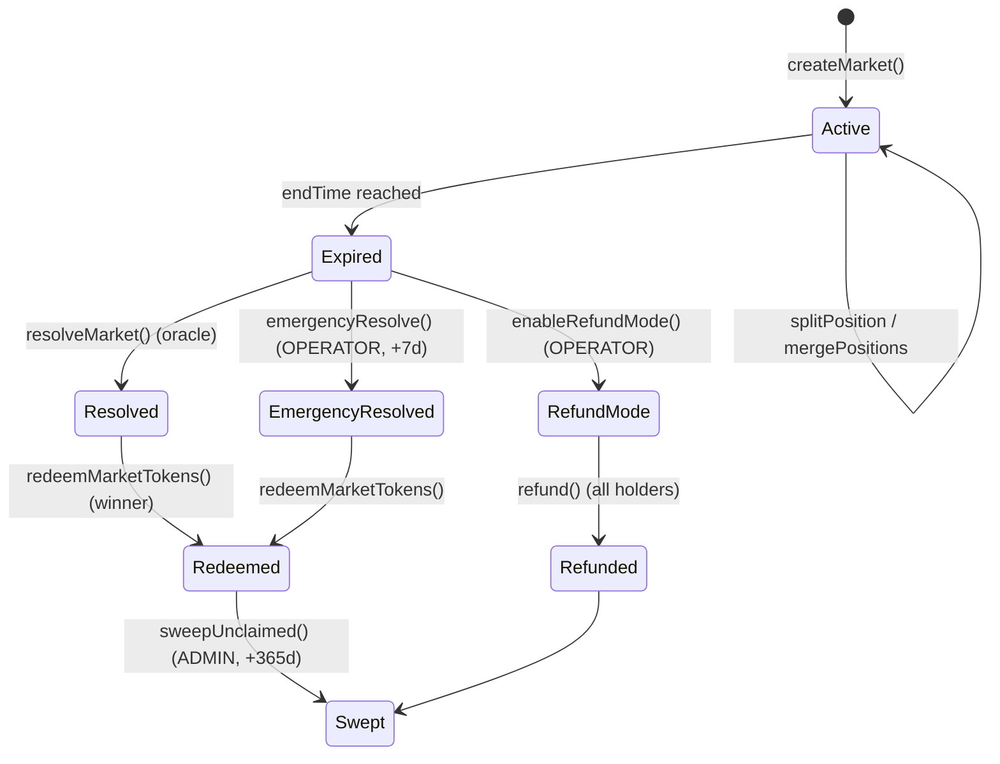

# MarketFacet

`MarketFacet` là facet trung tâm của Diamond, handle toàn bộ lifecycle của binary prediction market.

Source: `SC/packages/diamond/src/facets/market/MarketFacet.sol`

## Lifecycle diagram



## Admin functions

### `createMarket`

```solidity
function createMarket(
    string calldata question,
    uint256 endTime,
    address oracle
) external returns (uint256 marketId);
```

**Role**: `ADMIN_ROLE`
**Module pause**: `MARKET` không được pause

**Checks**:
- `bytes(question).length > 0` → else `Market_EmptyQuestion`
- `endTime > block.timestamp` → else `Market_InvalidEndTime`
- `oracle` phải đã approved qua `setApprovedOracle` → else `Market_OracleNotApproved`

**Effects**:
- Deploy mới 2 `OutcomeToken` (YES, NO)
- Tăng `marketId` counter (monotonic uint256)
- Snapshot `defaultRedemptionFeeBps` vào `snapshottedRedemptionFeeBps` (fix FINAL-H04)

**Event**: `MarketCreated(marketId, creator, oracle, yesToken, noToken, endTime, question)`

### `setApprovedOracle`

```solidity
function setApprovedOracle(address oracle, bool approved) external;
```

**Role**: `ADMIN_ROLE`
Thêm/xoá oracle vào danh sách cho phép dùng trong `createMarket`.

### `setDefaultRedemptionFeeBps` / `setPerMarketRedemptionFeeBps`

```solidity
function setDefaultRedemptionFeeBps(uint16 bps) external;
function setPerMarketRedemptionFeeBps(uint256 marketId, uint16 bps) external;
```

**Role**: `ADMIN_ROLE`
**Cap**: `bps <= MAX_REDEMPTION_FEE_BPS (1500)` — else `Market_RedemptionFeeTooHigh`


Thay đổi `defaultRedemptionFeeBps` KHÔNG ảnh hưởng market đã tạo — do fee snapshot tại create. Chỉ `setPerMarketRedemptionFeeBps` mới override cho market cụ thể (và chỉ chỉnh xuống — hard cap vẫn áp dụng).


### `setDefaultPerMarketCap` / `setPerMarketCap`

```solidity
function setDefaultPerMarketCap(uint256 cap) external;
function setPerMarketCap(uint256 marketId, uint256 cap) external;
```

**Role**: `ADMIN_ROLE`
Cap TVL cho mỗi market (USDC đơn vị 6 decimals). `cap = 0` → dùng default.

## User functions

### `splitPosition`

```solidity
function splitPosition(uint256 marketId, uint256 amount) external;
```

**Role**: Public
**Checks**: market active + not resolved + `USDC.allowance >= amount`
**Effects**:
- Transfer `amount` USDC từ user → Diamond
- Mint `amount` YES + `amount` NO → user
- `totalCollateral += amount`

**Event**: `PositionSplit(user, marketId, amount)`

### `mergePositions`

```solidity
function mergePositions(uint256 marketId, uint256 amount) external;
```

**Role**: Public
**Checks**: user có `>= amount` YES và `>= amount` NO
**Effects**:
- Burn `amount` YES + `amount` NO từ user
- Transfer `amount` USDC → user
- `totalCollateral -= amount`

**Event**: `PositionMerged(user, marketId, amount)`

### `resolveMarket`

```solidity
function resolveMarket(uint256 marketId) external;
```

**Role**: Public (anyone can trigger after oracle is ready)
**Checks**:
- Market endTime đã qua
- Oracle vẫn được approved tại thời điểm resolve (re-verify — fix FINAL-D-03)
- Oracle has resolution

**Effects**: `isResolved = true`, `outcome = oracle.outcome`, `resolvedAt = now`
**Event**: `MarketResolved(marketId, outcome)`

### `redeem` / `redeemMarketTokens`

```solidity
function redeemMarketTokens(uint256 marketId) external;
function redeem(uint256 marketId, uint256 amount) external;
```

**Role**: Public
**Checks**: market resolved + user holds winning tokens
**Effects**:
- Burn winning tokens của user
- Tính fee theo `snapshottedRedemptionFeeBps` (hoặc `perMarketRedemptionFeeBps` nếu overridden)
- Transfer `amount - fee` USDC → user
- Transfer `fee` USDC → fee recipient

**Event**: `TokensRedeemed(marketId, user, amount, payout)`

### `refund`

```solidity
function refund(uint256 marketId, uint256 amount) external;
```

**Role**: Public, chỉ khi `refundModeActive = true`
**Effects**: Burn YES hoặc NO tokens → return USDC 1:1 (pro-rata nếu collateral không đủ)

**Event**: `MarketRefunded(marketId, user, amount)`

## Operator functions

### `emergencyResolve`

```solidity
function emergencyResolve(uint256 marketId, bool outcome) external;
```

**Role**: `OPERATOR_ROLE`
**Checks**: `block.timestamp >= endTime + EMERGENCY_DELAY (7 days)`
**Use case**: Oracle stuck / compromised; operator confirm kết quả thủ công sau cooling-off.

**Event**: `MarketEmergencyResolved(marketId, outcome, operator)`

### `enableRefundMode`

```solidity
function enableRefundMode(uint256 marketId) external;
```

**Role**: `OPERATOR_ROLE`
**Use case**: Market không thể resolve công bằng (event cancelled, data ambiguous).
**Effect**: Toàn bộ holder có thể burn token lấy USDC 1:1.

**Event**: `RefundModeEnabled(marketId)`

### `sweepUnclaimed`

```solidity
function sweepUnclaimed(uint256 marketId) external;
```

**Role**: `ADMIN_ROLE`
**Checks**: `block.timestamp >= resolvedAt + GRACE_PERIOD (365 days)`
**Effect**: Transfer collateral chưa claim → fee recipient.

**Event**: `UnclaimedSwept(marketId, amount)`

## View functions

```solidity
function getMarket(uint256 marketId) external view returns (MarketData memory);
function getPerMarketCap(uint256 marketId) external view returns (uint256);
function getEffectiveRedemptionFeeBps(uint256 marketId) external view returns (uint16);
function isResolved(uint256 marketId) external view returns (bool);
```

## Pause semantics

Module `MARKET` (key `keccak256("predix.module.market")`) có thể pause bởi `PAUSER_ROLE`:

| Function | Check pause? |
|---|---|
| `createMarket` | ✅ |
| `splitPosition`, `mergePositions` | ✅ |
| `redeem`, `redeemMarketTokens` | ✅ |
| `refund` | ❌ (always open — user cần thoát) |
| `resolveMarket` | ❌ (finality phải đi qua) |
| `emergencyResolve`, `enableRefundMode`, `sweepUnclaimed` | ❌ (admin path) |

## Invariants liên quan

Xem [Invariants](../security/02-invariants.md):

- INV-1: `YES.totalSupply == NO.totalSupply == totalCollateral` cho market chưa resolve
- INV-4: `effectiveRedemptionFeeBps <= MAX_REDEMPTION_FEE_BPS (1500)`
- INV-6: Resolution monotonic — một khi `isResolved = true`, không thể revert
- INV-7: Chỉ Diamond được mint/burn outcome token
