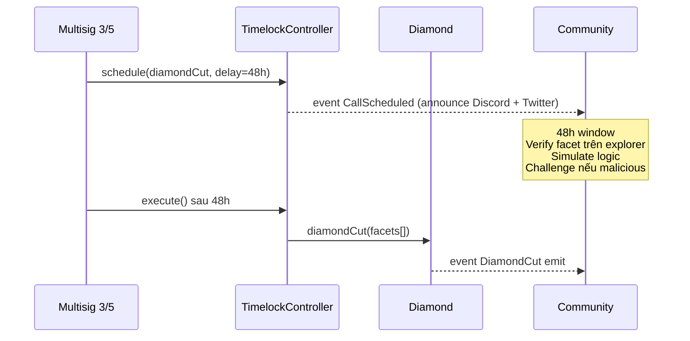

# Bảo mật & timelock

PrediX áp dụng defense-in-depth. Không có "magic" — chỉ nhiều lớp, mỗi lớp làm 1 việc đơn giản nhưng verify được.

## 5 lớp phòng thủ

1. **Protocol design** — non-custodial, stateless router, transparent upgrade.
2. **Contract implementation** — custom errors, 3 loại reentrancy guard, fail-loud pattern, checks-effects-interactions.
3. **Operational** — multisig 3/5 admin + 2/3 operator, HSM signer, role separation.
4. **Observability** — event on-chain, Dune dashboard, Datadog alert, audit trail indexer.
5. **Community** — public bug bounty, open dashboards, governance transparency.

## 7 invariants hard-enforce

| # | Invariant | Mô tả | Enforce |
|---|---|---|---|
| INV-1 | Collateral solvency | `YES.totalSupply == NO.totalSupply == market.totalCollateral` | Diamond mint/burn atomic |
| INV-2 | Exchange solvency | `Σ order.depositLocked == USDC.balanceOf(exchange) + Σ token.balanceOf(exchange)` | Exchange invariant test fuzz |
| INV-3 | Router non-custody | `balanceOf(router) == 0` sau mỗi public call | Router `FinalizeBalanceNonZero` revert |
| INV-4 | Redemption fee bound | `effectiveRedemptionFeeBps ≤ 1500` (15% cap) | MarketFacet require |
| INV-5 | Hook identity commit | `beforeSwap` require identity commit via EIP-1153 | Hook verify transient storage |
| INV-6 | Resolution monotonicity | `isResolved` set 1 lần, không revert | MarketFacet require |
| INV-7 | Outcome token supply | Chỉ Diamond mint/burn outcome token | OutcomeToken `onlyFactory` |

Invariant test fuzz 10.000 runs trong CI. Fail → block merge.

## Audit posture

### Internal audits

- **V1** (2026-03): Manual review + automated static analysis trên 6 package. ~50 finding, all remediated.
- **V2** (2026-04-17): Post Hook V1→V2 refactor + diamond cut timelock. ~30 finding, remediated majority.

### External audits

- **Shortlist**: Spearbit, Trail of Bits, OpenZeppelin, Zellic.
- **Schedule**: 1-2 audit round Q2 2026, trước mainnet launch.
- **Status**: Pending. Mainnet deploy chờ green-light.

### Recent fixes (current branch `bundle-a/group-x/x2-gap-c-matchmath-helper`)

13 commits audit fix ahead of `develop`:
- **GAP-C MatchMath helper** — preview/execute parity trên Exchange.
- **MERGE taker price improvement** — BACKLOG.
- **NEW-M7 two-pass virtual-NO** — thin pool safety margin 3%.
- **H-R1 ClobSkipped** — emit + selector extraction khi CLOB revert.
- **FINAL-M06 hook proxy timelock** — 48h self-gated monotonic.
- **NEW-M4 canonical PoolKey** — enforce lpFee + tickSpacing match.
- **F-X-02 setDiamond 2-step** — propose/execute với 48h delay.
- **SPEC-03 CREATOR_ROLE** — gate createMarket + createEvent.
- **FIN-02 Chainlink adjacency** — round `updatedAt` validation.
- **FIN-03 proposeTrustedRouter** — reject silent timer reset.
- **M-NEW-01 beforeDonate endTime** — chặn donate sau endTime.

### Open findings (pre-mainnet blockers)

5 finding đang xử lý, **chưa release mainnet**:

- **C-01 refund asymmetric burn** — formula cũ `(yes+no)/2` phá INV-1. Fix: `min(yes, no)`.
- **H-02 diamondCut no timelock** — cần wrap vào TimelockController 48h (GHOST test branch, chờ merge).
- **H-03 sweepUnclaimed** — không burn outstanding supply → late redeem underflow.
- **H-04 retroactive redemption fee** — admin raise fee không nên apply cho market đang tồn tại (fix: snapshot fee tại creation, đã partial fix).
- **H-05 emergencyResolve check** — cần check oracle state trước khi cho operator front-run.

Follow [changelog](../tai-nguyen/changelog.md) update status.

## Timelock — 48h delay

Mọi upgrade có blast radius đi qua timelock 48h.

### Diamond facet upgrade



Holder `CUT_EXECUTOR_ROLE` = **chỉ TimelockController contract**. Không có EOA nào bypass được.

### Hook proxy upgrade

Tương tự Diamond nhưng contract riêng (ERC1967 proxy):

```solidity
proposeUpgrade(newImpl) → readyAt = now + timelockDuration
// timelockDuration ≥ 48h min, monotonic (chỉ tăng được)
// ...48h chờ...
executeUpgrade(newImpl, sig, readyAt) 
  require(readyAt <= now)
  _implementation = newImpl
```

### Tại sao 48h, không short hơn

- 48h = đủ để community trong APAC + EU + US thấy announcement.
- Testnet Gnosis 24h thường bị miss.
- Trade-off: emergency fix chậm. Mitigate: bug bounty + external audit trước deploy.

### Không thể bypass

- Admin **không có emergency upgrade** path. Nếu cần rollback, phải deploy contract mới + migrate (user action).
- `timelockDuration` monotonic → không thể giảm 48h → 1h để rush.

## Bug bounty

**Range** (theo severity):

| Severity | Reward USDC | Ví dụ |
|---|---|---|
| Critical | $50k – $500k | Drain funds, break INV-1 solvency |
| High | $10k – $50k | Bypass timelock, retroactive fee |
| Medium | $1k – $10k | DoS, griefing |
| Low | $100 – $1k | Event mismatched, minor UI |

Payout từ treasury. Contact: security@predix.app (public key PGP publish sau mainnet).

### Safe harbor

Good-faith researcher có safe harbor — không bị kiện pháp lý nếu:
- Disclose private trước public.
- Không drain funds ngoài POC amount (< $1k).
- Không store/share user data.
- Respect 90-day responsible disclosure window.

## Incident response

### Severity tiers

- **P0** (critical, user fund at risk): Page 24/7 on-call within 15 min.
- **P1** (high, service degradation): Alert within 1h.
- **P2** (medium, non-fund impact): Slack within 24h.
- **P3** (low, info only): Backlog.

### P0 response flow

1. **Detect** — Prometheus alert / user report / bug bounty submission.
2. **Triage** — verify exploit within 30 min. Team Discord emergency channel.
3. **Contain** — Pause relevant module (`PausableFacet.pause(MARKET)`) to stop bleeding.
4. **Fix** — patch code, audit fix internally.
5. **Deploy** — timelock 48h (không bypass) OR if fix qua config only (e.g. oracle revoke) → instant.
6. **Postmortem** — public disclosure trong 72h, blog post, root cause analysis.

Ví dụ scenarios + playbook: xem incident playbook internal (chưa public).

## Monitoring

- **Prometheus metrics**: latency, error rate, indexer lag, circuit breaker state.
- **Datadog**: alert threshold on revert rate, contract state anomaly.
- **On-chain watchers**: Forta / Tenderly / custom — alert khi:
  - `diamondCut` scheduled.
  - Hook upgrade proposed.
  - Oracle revoke.
  - Unusual volume spike (>10× 24h average).
  - Router balance ≠ 0 post-tx (impossible but monitor anyway).
- **Community dashboard** (Dune): TVL, volume, user count, pool depth per market.

## Non-negotiable rules

- **Không** admin emergency withdraw từ Exchange / Router / Pool.
- **Không** pausable cho withdraw paths (user luôn rút được token của mình).
- **Không** blacklist user (protocol-level). Block danh sách sanction chỉ ở FE level.
- **Không** upgrade tx path mà không timelock — mọi state-changing admin action đi qua 48h.

## Tham khảo

- Consensys Smart Contract Best Practices
- SCSVS — Smart Contract Security Verification Standard
- SWC Registry (Smart Contract Weakness Classification)
- Trail of Bits — Building Secure Contracts
- Secureum
