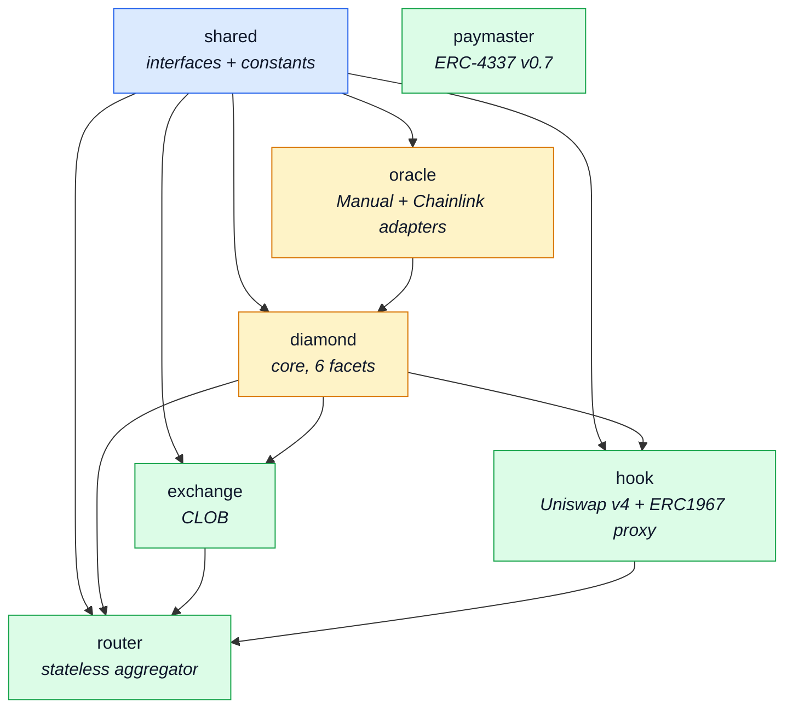

# Smart contracts

Solidity 0.8.30, Foundry, EVM cancun (EIP-1153 transient storage). 6 package, monorepo.

## Dependency graph



Rule: cross-package import **chỉ** qua `@predix/shared/interfaces/`. Không import implementation của package khác.

## Diamond (EIP-2535)

Single proxy `PrediX Diamond` với 6 facet. Mỗi facet là module riêng, upgrade được từng cái.

| Facet | Chức năng |
|---|---|
| **MarketFacet** | createMarket, split, merge, resolve, redeem, emergencyResolve, refundMode, sweep |
| **EventFacet** | createEvent, resolveEvent, groupSplit, groupMerge, refundMode event |
| **AccessControlFacet** | grantRole, revokeRole, 6 role: DEFAULT_ADMIN, OPERATOR, PAUSER, CUT_EXECUTOR, CREATOR, REGISTRAR |
| **PausableFacet** | pause(module), unpause(module) — pause theo module: MARKET, DIAMOND |
| **DiamondCutFacet** | diamondCut — thêm/sửa/xoá facet, gated bởi CUT_EXECUTOR_ROLE qua TimelockController 48h |
| **DiamondLoupeFacet** | facets(), facetAddresses(), facetFunctionSelectors() — introspection |

**Storage**: Diamond storage pattern. Mỗi facet có struct `Layout` tại slot `keccak256("predix.storage.<module>")`. Append-only, không reorder/remove trường.

## Hook (Uniswap v4)

**Contract**: `PrediXHookV2` (implementation) + `PrediXHookProxyV2` (ERC1967 proxy).

**Callbacks** được set theo permissions flag trong hook address (salt-mined):

- `beforeInitialize`: đặt permission flag + init pool state.
- `beforeAddLiquidity`: chặn add LP nếu market resolved / refunded.
- `beforeRemoveLiquidity`: track pool registration (hookPoolBinding).
- `beforeSwap`: apply dynamic fee + anti-sandwich identity verify (EIP-1153 transient storage).
- `afterSwap`: no-op.
- `beforeDonate`: chặn donate sau endTime (brute-force payout protection).

**Key functions**:
- `registerMarketPool(marketId, poolKey, yesIsCurrency0)` — bind market ↔ v4 pool, verify canonical PoolKey (lpFee + tickSpacing match).
- `commitSwapIdentityFor(...)` — Router commit identity trước swap, Hook verify trong `beforeSwap`.
- `proposeTrustedRouter / executeTrustedRouter` — 2-step rotate Router address (48h timelock, không silent reset).

**Hook proxy upgrade** — 48h monotonic timelock:
- `proposeUpgrade(newImpl)` → `readyAt = now + timelockDuration` (min 48h).
- Chờ 48h → `executeUpgrade(newImpl, sig, readyAt)`.
- `timelockDuration` chỉ **tăng được** (monotonic), không giảm xuống dưới 48h.

## Exchange (CLOB)

**Contract**: `PrediXExchange`.

**Order struct** (packed 5 slots):
```solidity
struct Order {
  address owner;      // 20 bytes
  uint40 timestamp;   // 5 bytes
  uint8 side;         // BUY_YES/SELL_YES/BUY_NO/SELL_NO
  bool cancelled;
  bytes32 marketId;   // 32 bytes
  uint32 price;       // 6-decimal fixed point, 10_000 to 990_000
  uint128 amount;
  uint128 filled;
  uint256 depositLocked;
}
```

**Entry points**:
- `placeOrder(order)` + auto-match loop.
- `cancelOrder(orderId)` — owner only.
- `fillMarketOrder(marketId, side, amountIn, maxFills)` — permissionless, `taker == msg.sender` gate.

**3 match types**:

1. **Complementary**: BUY_YES ↔ SELL_YES cùng market.
2. **Mint** (synthetic): BUY_YES + BUY_NO ≥ $1. Diamond mint cặp YES+NO, split cho 2 buyer, spread → protocol.
3. **Merge** (synthetic): SELL_YES + SELL_NO ≤ $1. Diamond gom + burn, trả USDC 2 seller, spread → protocol.

**Shared math**: `MatchMath` library (GAP-C fix) — đảm bảo preview/execute 1-wei parity.

## Router (stateless)

**Contract**: `PrediXRouter`. Không giữ tiền — bất biến `balanceOf(router) == 0` sau mỗi public call.

**Entry points** (exact-in):
```solidity
buyYes(marketId, usdcIn, minYesOut, recipient, maxFills, deadline)
sellYes(marketId, yesIn, minUsdcOut, ...)
buyNo(...)
sellNo(...)
```

**Waterfall**:
1. Pull USDC từ Permit2.
2. **CLOB leg**: `exchange.fillMarketOrder(...)` — try ăn limit orders.
   - CLOB revert → emit `ClobSkipped(reason)` event (H-R1 fix), fall back AMM full.
3. **AMM leg**: gọi `hook.commitSwapIdentityFor(...)` → `poolManager.swap(...)` → `unlockCallback(...)` extract amount.
4. **Virtual-NO two-pass** (NEW-M7): nếu pool thiếu depth → reduce size với 3% safety margin.
5. **Cleanup**: refund dust, assert router balance = 0 (`FinalizeBalanceNonZero` revert nếu sai).

## Oracle

**Contract**: `ManualOracle` + `ChainlinkOracle`. Plugin kiến trúc — thêm oracle mới = deploy adapter mới, `approveOracle(addr)`.

### ChainlinkOracle
- `register(marketId, feed, threshold, gte, snapshotAt)` — bind market với Chainlink feed.
- `resolve(marketId, roundIdHint)`:
  - Validate `roundData.updatedAt >= snapshotAt` (round cover snapshot).
  - Validate `previousRound.updatedAt < snapshotAt` (adjacency, FIN-02 fix).
  - L2 sequencer uptime check.
  - Outcome = `price >= threshold` (nếu `gte=true`).

### ManualOracle
- Admin report, `admin revoke` cho phép delete report (risk flag: H-10).
- Phase 2 sẽ hoá thành multisig signer + UMA fallback.

## Paymaster (ERC-4337)

**Contract**: `PrediXPaymaster`. Sponsor gas cho user qua EntryPoint v0.7.

- Owner = OPERATOR (testnet) / Gnosis Safe 2-of-3 (mainnet).
- Signer off-chain (backend) ký verify UserOp eligibility.
- Policy: sponsor cho user đã session SIWE + action trong whitelist (swap, split, merge, redeem, place/cancel order).

## Toolchain + quality gates

- Compile: `forge build`, EVM cancun, `via_ir=true`, `optimizer_runs=200`, `bytecode_hash=none`.
- Test: `forge test` — **119 test files**, unit + fuzz + invariant.
- Invariants critical:
  - INV-1: `YES.totalSupply == NO.totalSupply == market.totalCollateral`.
  - INV-2: Exchange solvency `Σ order.depositLocked == balance`.
  - INV-3: `balanceOf(router) == 0` post-call.
  - INV-4: `redemptionFeeBps ≤ 1500` (15% cap).
  - INV-6: Resolution monotonicity (không revert isResolved).
- Format: `forge fmt --check`.
- Static analysis: Slither 0 critical.

## Upgrade model

| Component | Mechanism | Delay |
|---|---|---|
| Diamond facets | `diamondCut` via `CUT_EXECUTOR_ROLE` (TimelockController) | 48h |
| Hook implementation | `propose/executeUpgrade` qua ERC1967 proxy | 48h monotonic |
| Oracle adapter | `approveOracle` instant (add), `revokeOracle` instant (remove) | 0h |
| Exchange / Router | **Immutable**. Deploy mới, migrate off-chain. | N/A |

Exchange và Router không có proxy. Thay đổi = redeploy + migrate (một lần). Thiết kế trade-off: đơn giản + bất biến hơn proxy.
