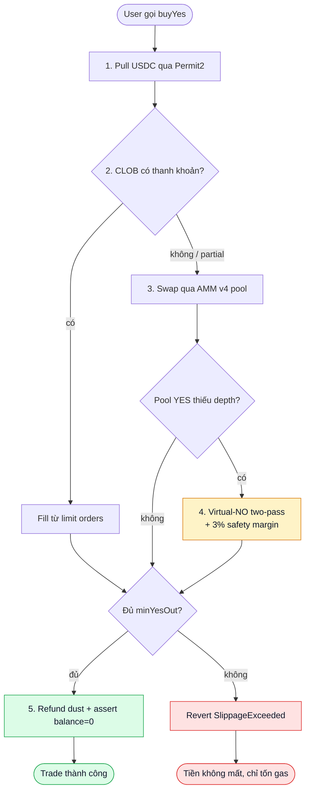

# CLOB và AMM lai

PrediX kết hợp 2 cơ chế thanh khoản: sổ lệnh on-chain (CLOB) và pool Uniswap v4 (AMM). Router tự động chọn path tốt nhất.

## Tại sao lai thay vì chọn 1

| | CLOB only (Polymarket) | AMM only (Uniswap) | Lai (PrediX) |
|---|---|---|---|
| Giao dịch nhỏ | OK, nhưng slippage rộng nếu ít maker | Smooth, slippage thấp | Smooth + price improvement nếu có maker |
| Giao dịch lớn | Market depth phụ thuộc hoàn toàn maker | Slippage tăng theo quy mô | Drain CLOB trước, AMM phần còn lại |
| Sức hút maker | Cần limit order | Chỉ LP được | Hỗ trợ cả hai — maker + LP |
| Giá công bằng | Maker tự set | AMM curve | AMM là floor, CLOB cho price improvement |

## Router — entry point duy nhất

Mọi swap đều gọi `PrediXRouter`. Router là **stateless** — không giữ tiền sau mỗi tx. Bất biến: `balanceOf(router) == 0` sau khi call xong, enforce on-chain.

Flow khi bạn gọi `buyYes(marketId, usdcIn, minYesOut, deadline)`:

Tất cả 1 tx atomic. Revert = không mất gì (ngoài gas, miễn phí với smart account).

## CLOB — sổ lệnh on-chain

- Contract: `PrediXExchange`.
- Tick size 99 giá: $0.01, $0.02, …, $0.99.
- User đặt **limit order** side YES hoặc NO với price và amount. Deposit token hoặc USDC bị lock tới khi khớp hoặc cancel.
- Matching 3 loại:
  - **Complementary**: BUY_YES ↔ SELL_YES (đơn giản).
  - **Mint**: BUY_YES + BUY_NO ≥ $1.00. Ví dụ: BUY_YES $0.60 + BUY_NO $0.45 = $1.05. Protocol mint cặp YES+NO từ USDC, đưa YES cho buyer YES, NO cho buyer NO, spread $0.05 → protocol.
  - **Merge**: SELL_YES + SELL_NO ≤ $1.00. Protocol gom YES+NO, burn → USDC trả cho 2 seller, spread → protocol.

Không ai bị thiệt: mỗi matching đều thoả điều kiện cả 2 phía OK với giá.

## AMM — Uniswap v4 pool

Mỗi market có 1 hoặc 2 pool v4:
- Pool YES-USDC
- Pool NO-USDC (một số market)

**Hook** của PrediX plug vào v4 pool:
- `beforeSwap` áp dụng **dynamic fee** tuỳ theo khoảng cách tới endTime (xem [Cấu trúc phí](phi.md)).
- `beforeSwap` verify anti-sandwich identity — Router phải commit identity trước khi pool swap, chặn MEV frontrun trong cùng block.
- `beforeAddLiquidity` chặn add LP sau khi market resolved.
- `beforeDonate` chặn donate sau endTime — tránh brute-force payout attack.

Hook **không giữ tiền user lâu**. LP nhận LP token theo chuẩn v4 PositionManager.

## Dynamic fee

Khác AMM thường (fee cố định 0.3%), PrediX fee thay đổi theo thời gian còn lại:

| Thời gian tới endTime | Phí AMM |
|---|---|
| > 7 ngày | 0.5% |
| 3–7 ngày | 1.0% |
| 1–3 ngày | 2.0% |
| < 24 giờ | 5.0% |

Lý do: gần endTime, toxic flow (người có thông tin nội bộ) tăng → LP cần spread rộng hơn. Chi tiết: [Cấu trúc phí](phi.md).

## Khi nào Router thích CLOB hơn AMM

Router luôn check CLOB trước. Logic:
- Nếu CLOB có order với giá tốt hơn AMM spot → ăn CLOB.
- Một phần ăn CLOB, phần còn lại swap AMM nếu CLOB không đủ depth.
- Nếu CLOB revert (không đủ token match, giá lệch) → Router skip, emit `ClobSkipped(reason)` event, fall back toàn bộ qua AMM.

Bạn không cần quan tâm — Router luôn trả giá tốt nhất trong cùng tx.

## Tự trade trên AMM trực tiếp?

Có thể. Pool YES-USDC là v4 pool bình thường — bạn swap qua UniversalRouter, Uniswap web, hoặc trực tiếp PoolManager. Nhưng bạn sẽ **bỏ qua CLOB liquidity** → giá có thể kém hơn.

Luôn dùng `PrediXRouter` để tận dụng cả hai.
