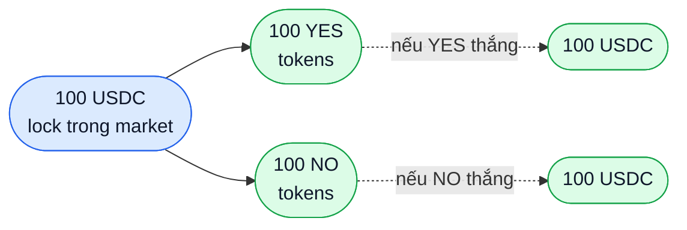

# Outcome token (YES/NO)

Mỗi market có 2 ERC-20 token. Hiểu chúng = hiểu cơ chế cốt lõi của PrediX.

## YES và NO là gì

- Cả hai đều là ERC-20 chuẩn, 6 decimals (giống USDC).
- Mỗi market có cặp YES/NO riêng — token YES của market A không dùng được ở market B.
- Mint chỉ bởi Diamond contract, không ai khác.

## Bất biến trung tâm

```
YES.totalSupply == NO.totalSupply == market.totalCollateral
```

Tổng supply YES = Tổng supply NO = USDC đang lock trong market. Không bao giờ khác.



Điều này đảm bảo: **khi resolve, protocol luôn đủ USDC để trả cho người giữ token đúng**.

## Split — mint YES+NO từ USDC

- Bạn gửi 100 USDC vào Diamond.
- Diamond lock 100 USDC, mint cho bạn 100 YES + 100 NO.
- Atomic: cả 3 step nằm trong 1 tx.

Khi nào dùng:
- Muốn làm market maker — bán cả YES và NO riêng biệt với giá > $0.50 mỗi token.
- Arbitrage khi YES + NO > $1 trên thị trường → split USDC, bán cả hai.

## Merge — burn YES+NO → USDC

- Ngược split. Gửi 100 YES + 100 NO → nhận 100 USDC, supply cả hai giảm 100.
- Cần giữ đủ cả hai số lượng bằng nhau.

Khi nào dùng:
- Bạn có vị thế cả YES và NO (do trade hay do resolve market khác), muốn rút ra.
- Arbitrage khi YES + NO < $1 → mua cả hai, merge, ăn spread.

## Tại sao YES + NO luôn ≈ $1

Vì split/merge là arbitrage riskless:

- **YES + NO > $1** → ai cũng có thể split 1 USDC → mint 1 YES + 1 NO → bán cả hai → ăn lời > 0. Nhiều người làm → giá YES + NO bị đẩy xuống $1.
- **YES + NO < $1** → ai cũng có thể mua 1 YES + 1 NO ngoài thị trường → merge → nhận 1 USDC → ăn lời > 0. Đẩy giá lên $1.

Arbitrage tự động do AMM + bots, không cần người vận hành.

## Redeem — khi market resolve

- Market được oracle resolve, ví dụ YES = true.
- Diamond đặt `outcome = true`, `isResolved = true`.
- User có YES token → gọi `redeem(marketId)` → mỗi 1 YES đổi 1 USDC (trừ fee redemption, thường 0–1.5%).
- NO token trở thành $0 — không còn thanh khoản, không redeem được.

## Refund mode

Nếu market không thể resolve (oracle down, dispute không giải quyết được), admin có thể bật **refund mode**:

- User gửi số lượng YES = NO (ví dụ 100 YES + 100 NO) → nhận 100 USDC.
- Không ai thua, ai thắng — mọi người nhận lại đúng số họ đã split, pro-rata.
- Detail: [Resolution & oracle](resolution.md).

## Token đứng độc lập được không

- Có. YES và NO là ERC-20 chuẩn, transfer/approve/permit như mọi token.
- Có thể bỏ vào Uniswap pool khác, lending protocol (khi được list), NFT mint conditions, v.v.
- Khác Polymarket ERC-1155 không ai dám list vì không standard.

Đây là lý do PrediX chọn ERC-20 — **composability với DeFi** là giá trị lâu dài.

## Decimal & encoding trên contract

- Amount 1 USDC = `1_000_000` (6 decimals, base unit).
- Amount 1 YES = `1_000_000` (cũng 6 decimals).
- Price $0.48 = `480_000` (fixed-point 6 decimals). Range hợp lệ: `10_000` đến `990_000` (0.01 đến 0.99).

Chi tiết integration: [developers/router-integration.md](../developers/router-integration.md).
