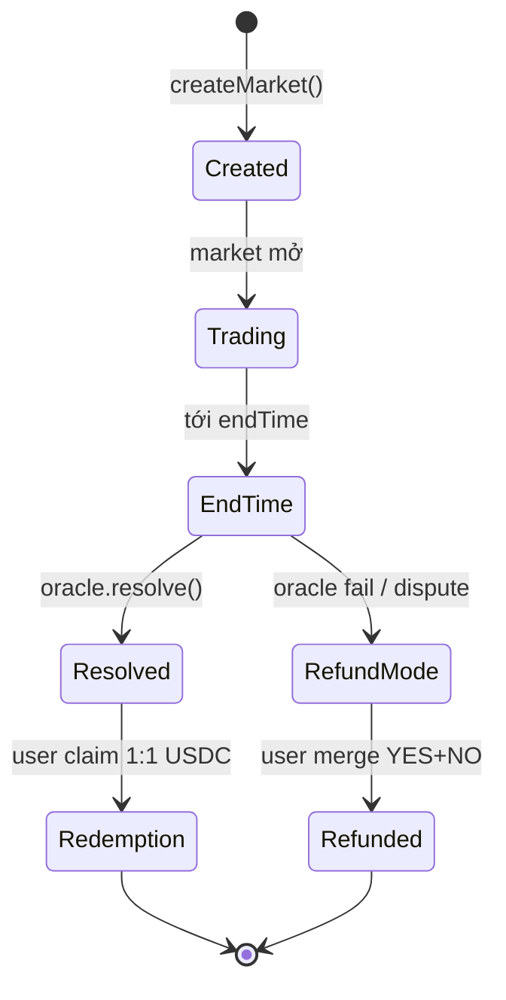

# Resolution & oracle

Một market cần một nguồn *sự thật* để quyết định YES hay NO thắng. Nguồn đó là **oracle**.

## Lifecycle market

- **Created** — Admin hoặc creator tạo market, đặt `endTime` và chọn oracle.
- **Trading** — User split / merge / trade tới `endTime`.
- **EndTime** — Trading đóng (hook chặn add liquidity + swap). Oracle window mở.
- **Resolved** — Oracle gọi `resolveMarket()` với kết quả YES hoặc NO.
- **Redemption** — Ai giữ token đúng → redeem 1:1 USDC trừ fee.
- **RefundMode** — Fallback nếu oracle không resolve được (oracle down, dispute hung).
- **Refunded** — User burn cặp YES+NO → nhận USDC pro-rata.

## Các loại oracle

### Manual oracle (Phase 1)

- Multisig 3/5 đọc kết quả từ nguồn thực tế (báo chí, API chính thức, on-chain data).
- Ký tx `ManualOracle.setOutcome(marketId, outcome)`.
- Sau khi ký, kết quả **immutable** — không revert được (invariant INV-6).
- Audit trail on-chain: event `OracleReportCreated`, indexer record vào bảng `manualOracleReport`.

Dùng cho: sự kiện subjective (ai thắng bầu cử, ai thắng game), chưa có feed on-chain.

### Chainlink oracle

- Market gắn với một Chainlink price feed (ví dụ `BTC/USD`).
- Oracle tự động check `price >= threshold` tại `snapshotAt` (thời điểm đóng).
- Enforce:
  - `roundData.updatedAt >= snapshotAt` (round đã cover snapshot time).
  - `previousRound.updatedAt < snapshotAt` (chọn đúng round adjacent).
  - L2 sequencer uptime feed OK (không resolve trong grace period sau outage).
- Anyone gọi `resolve()` được, không cần admin.

Dùng cho: price-threshold market (BTC > $100k, ETH < $2k, v.v.).

### UMA oracle (Phase 2, Q3 2026)

- Permissionless propose + 48h dispute window.
- Nếu dispute, UMA DVM (Data Verification Mechanism) vote quyết định.
- Bond scaling 0.5% TVL (min $5k, max $50k).

Dùng cho: sự kiện cần decentralized resolution, không muốn phụ thuộc multisig.

### Committee oracle (Phase 3, 2027+)

- Threshold signature (t-of-N validator).
- Commit-reveal voting, slashing nếu sai.
- Cross-chain support qua Wormhole/LayerZero.

## Resolve sai — làm gì

Nếu một market resolve sai (oracle sai, bug, manipulation):

1. **Trong Phase 1**: Multisig discuss, social consensus. Nếu đa số đồng ý sai, có thể `enableRefundMode(marketId)` → mọi người lấy lại USDC theo merge.
2. **Trong Phase 2 (UMA)**: Dispute qua UMA protocol, DVM vote.
3. **Không bao giờ**: revert isResolved=true. Invariant INV-6 đảm bảo không flip outcome đã set.

## Refund mode

Khi oracle không thể resolve (feed down, không ai care, dispute không giải quyết được):

- Admin (TimelockController 48h delay) gọi `enableRefundMode(marketId)`.
- User gọi `refund(marketId)` → gửi `min(yesBalance, noBalance)` cặp YES+NO → nhận USDC pro-rata.
- Giả sử user có 100 YES và 80 NO → refund 80 cặp → nhận 80 USDC. Còn dư 20 YES → mất (không paired với NO).

Refund mode là fallback cuối cùng, ưu tiên không dùng.

## Ai có thể tạo market

- **Phase 1 hiện tại**: Chỉ address có `CREATOR_ROLE` (admin + whitelist creator).
- **Phase 3 (2027+)**: Permissionless — ai cũng tạo được nếu stake bond PRX (10k PRX proposed). Bond slash nếu market malformed hoặc resolve chung bị dispute.

Reason: tránh spam market trong lúc chưa có dispute mechanism.

## Timing

- **Resolve window**: 7 ngày sau endTime. Chậm hơn → refund mode default (tránh user tiền mắc kẹt).
- **Redemption**: không deadline. Grace 365 ngày, sau đó admin `sweepUnclaimed` thu hồi token chưa claim về treasury.
- **Dispute** (UMA phase 2): 48h sau propose.

Tất cả các time parameters này config per-market hoặc global, xem [giao-thuc/smart-contracts.md](../giao-thuc/smart-contracts.md).
