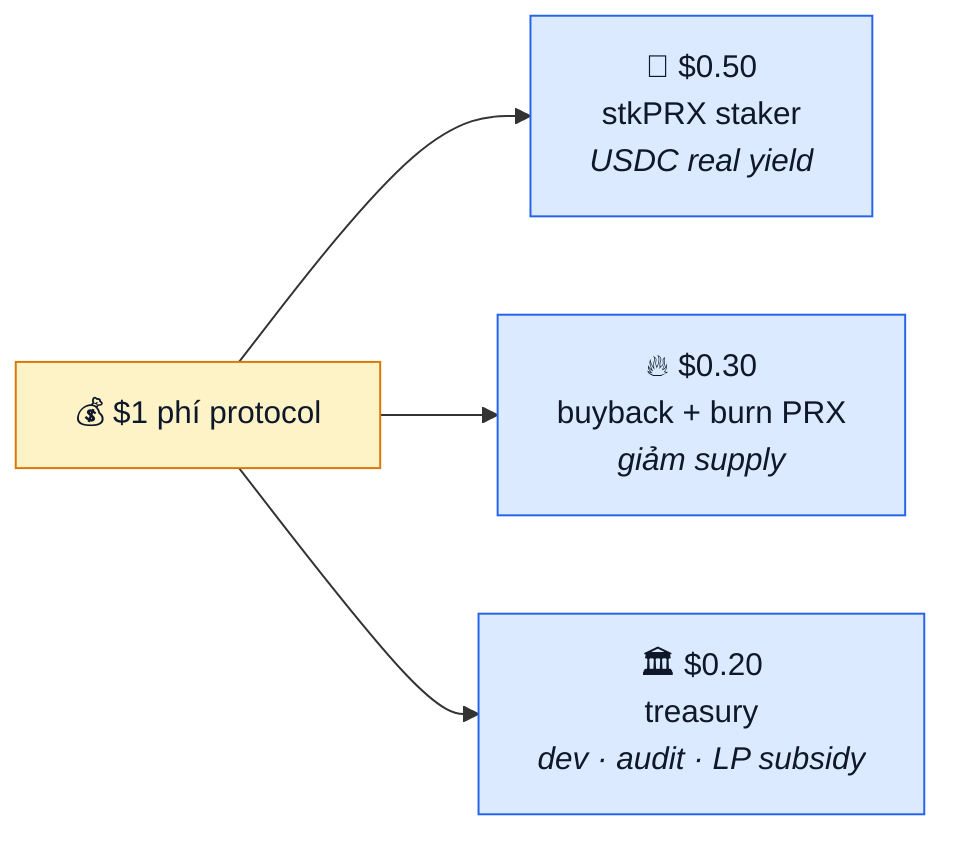

# Doanh thu & buyback-burn

30% phí protocol quay về mua PRX từ thị trường và burn vĩnh viễn. Giảm supply → hỗ trợ giá dài hạn.

## Cơ chế

1. Mỗi week, protocol collect phí từ AMM + CLOB + redemption + creation.
2. Smart contract tính `30% × weekly_fee_USDC`.
3. Gọi Router mua PRX trên thị trường (OrderBook hoặc DEX) bằng USDC đó.
4. PRX mua được gửi tới `0x0` (burn) hoặc lock trong contract không ai unlock được.
5. Event `BuybackExecuted(usdcSpent, prxBurned)` emit on-chain.

Burn không reversible. Supply vĩnh viễn giảm.

## Phí đi đâu — tổng kết

Mỗi $1 phí thu chia 3 dòng:



## Dự phóng buyback

Với giả định:

| Year | Volume/tháng | Fee mix | Revenue/năm | 30% buyback/năm |
|---|---|---|---|---|
| Y1 | $50M | 0.5% | $3M | $900k |
| Y2 | $200M | 0.3% | $7.2M | $2.16M |
| Y3 | $1B | 0.2% | $24M | $7.2M |

Ở Y3 với FDV $100M (giả sử), buyback $7.2M/năm = **7.2% supply burn/năm** nếu giá steady.

Thực tế tốc độ burn tính bằng:

```
burn_per_year = buyback_USD / avg_PRX_price
%_of_circulating = burn_per_year / circulating_supply
```

Giá PRX cao → burn ít token, nhưng % USD value burn cao như nhau.

## Net deflationary condition

PRX net deflationary khi:
```
burn_per_year > emission_per_year
```

Emission = community pool release + team vesting + treasury unlock. Sau năm 4, emission ≈ 0 (vest xong).

- **Y1-Y4**: Emission dominant → circulating tăng.
- **Y4+**: Emission ≈ 0 → net deflationary nếu volume đủ (> $2-4M/tháng).

Trong period Y1-Y4, buyback-burn giảm tốc độ dilution, không đảo chiều.

## So sánh

| Protocol | Buyback-burn % revenue | Deflationary? |
|---|---|---|
| Binance BNB | 20% (quarterly) | Yes (cap 100M) |
| GMX | 0% (100% → staker) | No (inflation esGMX) |
| Pendle | 0% | No |
| dYdX (v4) | ~0% | No (emission cao) |
| **PrediX** | **30%** | **Yes post-Y4** |

PrediX chọn mô hình BNB (burn aggressive) kết hợp GMX (real yield), thay vì pure one. Trade-off: ít yield staker (50% thay vì 100%), nhưng supply pressure giảm.

## Treasury — 20% còn lại

Treasury dùng cho:

- **Dev funding**: lương team sau vest, grants cho contributor ngoài.
- **Audit**: external audit định kỳ ($100k-500k/round).
- **LP subsidy**: pool nào được gauge vote → treasury pay LP reward.
- **Insurance fund**: backup nếu có exploit (Phase 2).

Treasury on-chain, multisig 3/5 tiêu. Report quarterly on-chain (balance + spend log).

## Cách theo dõi

- Dashboard public on Dune/analytics (sau TGE): weekly burn, cumulative burn, treasury balance.
- Event `BuybackExecuted` trên mainnet có timestamp + amount.
- Burn verify bằng check `PRX.totalSupply()` giảm theo thời gian.

## Break-even protocol

Fixed cost ~$1M/năm (team post-vest + infra + audit). Protocol sustainable khi:
```
30% × fee_revenue ≥ 0 (sang net deflationary)
50% × fee_revenue đủ để giữ staker không unstake
20% × fee_revenue ≥ $1M/năm fixed cost
```

Suy ra fee_revenue ≥ $5M/năm = ~$417k/tháng. Với fee mix 0.3%, cần volume ~$140M/tháng.

Thấp hơn đối thủ (Polymarket ~$500M-1B/tháng đang achieve) → PrediX khả thi ở scale nhỏ hơn nhiều.

## Risk

- **Volume không đạt**: buyback nhỏ, burn ít, không deflationary. Tokenomics effect kém.
- **Price manipulation**: thời điểm buyback có thể bị front-run. Mitigate: random timing trong tuần, chia thành 5-10 tx nhỏ.
- **Governance attack**: ai đó vote đổi 30% → 0%. Mitigate: constant locked in contract, cần vePRX supermajority (> 66%) đổi.

## Tóm tắt

Buyback-burn là mechanic phổ biến, hoạt động tốt khi có volume + emission đã vest. PrediX áp dụng standard với tỷ lệ cao (30% thay vì 10-20% phổ biến), nhưng floor thấp để hiệu quả: chỉ cần $140M volume/tháng break-even, so với $500M+ của Polymarket.

Không phải magic, nhưng là alignment tốt: user trade → protocol earn → token holder benefit.
