# vePRX & gauge voting

Hệ thống governance theo mô hình Curve (veCRV). Lock PRX → nhận quyền vote + boost.

## vePRX là gì

**vePRX** = "vote-escrowed PRX". Khi bạn lock PRX, vault mint ra vePRX (non-transferable) biểu diễn governance weight.

- Bạn **không nhận thêm token**, chỉ là ghi nhận quyền.
- Weight giảm tuyến tính theo thời gian — gần hết lock thì weight càng thấp.
- Hết lock: vePRX = 0, PRX unlock rút ra được.

## Công thức weight

```
vePRX_weight = PRX_locked × (remaining_lock_time / max_lock_time)
max_lock_time = 4 năm
```

Ví dụ:
- Lock 1000 PRX trong 4 năm (max) → 1000 vePRX (1:1).
- Lock 1000 PRX trong 2 năm → 500 vePRX.
- Lock 1000 PRX trong 1 năm → 250 vePRX.
- Sau 6 tháng pass (lock 4-năm còn 3.5 năm) → weight giảm từ 1000 → 875 vePRX.

Decay tuyến tính theo block. Không step.

## Quyền vote

vePRX dùng để:

1. **Gauge voting** — phân bổ LP subsidy.
2. **Protocol params** — vote fee rate, oracle approved list, market creation bond.
3. **Treasury spend** — approve grant / audit funding.
4. **Emergency pause** (nếu vePRX majority vote) — chỉ trong crisis.

## Gauge voting — PrediX's flywheel

Mỗi market có một **gauge**. vePRX holder vote gauge nào nhận LP subsidy từ treasury (20% fee budget).

```mermaid
flowchart LR
    Lock[User lock PRX] --> VePRX[vePRX weight]
    VePRX --> Vote[Vote gauge weekly]
    Vote --> Subsidy[Treasury chia LP subsidy<br/>theo % vote]
    Subsidy --> LP[LP earn nhiều hơn]
    LP --> Depth[Pool depth tăng]
    Depth --> Trader[Trader happier]
    Trader --> Volume[Volume tăng]
    Volume --> Fee[Fee tăng]
    Fee --> Yield[stkPRX yield tăng]
    Yield --> Demand[User mua PRX để stake]
    Demand --> Lock

    classDef hot fill:#fef3c7,stroke:#d97706,color:#0f172a
    class Volume,Fee,Yield hot
```



Mô hình "vote market" từ Curve / Balancer. PrediX áp dụng cho prediction market — gauge = pool YES-USDC (hoặc NO-USDC) của một market cụ thể.

## Ai muốn vote gì

- **LP đang cung cấp thanh khoản** muốn vote cho pool họ LP → nhận subsidy nhiều hơn.
- **Project owner tạo market** muốn vote cho market của mình → attract LP + trader.
- **Trader quan tâm market nào** muốn vote cho market đó → depth sâu hơn.

Có thể có **bribe market** — project bên ngoài trả PRX/USDC cho vePRX holder vote pool của họ. Chuẩn DeFi (Convex/Votium model).

## Bribe market (Phase 2)

Dự kiến ra sau TGE + 6 tháng. Flow:

1. Project A muốn pool X nhận subsidy.
2. Project A deposit 10,000 USDC vào bribe contract + chọn gauge X.
3. vePRX holder vote cho gauge X → nhận share bribe pro-rata.
4. Epoch kết thúc: subsidy pool X đã đi, USDC bribe chia cho voter.

PrediX self-host bribe layer hoặc partner với Votium/Paladin.

## Boost USDC yield từ staker

vePRX holder cũng là stkPRX holder → nhận yield USDC gấp (xem [Staking real yield](staking-real-yield.md)):

- No lock: 1.0× yield, 0 vote.
- 4 năm lock: 2.5× yield, 4× vote weight.

Hai thứ đi cùng — lock lâu = yield cao + vote mạnh.

## Restrictions

- vePRX **không transfer** được. Buy PRX → lock mới có.
- **Extend lock** được — bạn có 1-năm lock còn 3 tháng, extend thêm 9 tháng lên 1 năm mới.
- **Early unlock** với penalty: Phase 2 cho phép unlock sớm trả 50% PRX penalty (đi vào treasury). Hiện tại: hard lock.

## Rủi ro governance

- **Vote concentration**: Nếu một whale lock lớn → control gauge subsidy. Mitigate: có quadratic-vote experimentation trong Phase 2 (voting power theo sqrt(vePRX) thay vì linear).
- **Bribe corruption**: Voter chọn theo bribe, không theo merit. Trade-off của model vote market — chấp nhận (Curve vận hành hiệu quả dù có bribe).
- **Low participation**: Nếu ít ai vote → subsidy phân bổ sai. Mitigate: default fallback (đều các pool) + incentive vote (emission small PRX cho voter).

## Timeline triển khai

| Phase | Feature |
|---|---|
| TGE Q4 2026 | Lock PRX → vePRX. Gauge vote basic (subsidy phân bổ theo vote). |
| TGE + 3m | Fee boost tier kích hoạt. |
| TGE + 6m | Bribe market Phase 1 (partner Votium/Paladin). |
| TGE + 12m | Protocol params vote (fee rate, oracle list). |
| TGE + 18m | Treasury spend governance. |
| 2027+ | Quadratic voting experiment, cross-chain gov. |
