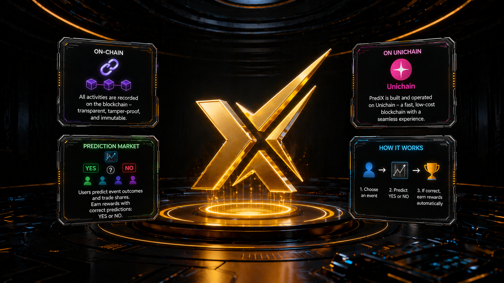

# PrediX

Prediction market on-chain trên Unichain. Mỗi sự kiện có hai outcome token YES / NO; token đúng redeem 1:1 USDC khi market resolve.

> 🟡 **Trạng thái**: Beta trên **Unichain Sepolia testnet** (chain `1301`). Mainnet (chain `130`) sẽ launch sau external audit hoàn tất — xem [Network info](bat-dau/README.md#network-info).

**Ví dụ**: Market *"Bitcoin vượt $100k trước 2027?"* tạo ra 2 token YES + NO. User mua bên mình tin sẽ thắng.

| Khi market resolve | YES holder | NO holder |
|---|---|---|
| Sự kiện **xảy ra** | Nhận `$1 USDC / token` | `$0` (mất hết) |
| Sự kiện **không xảy ra** | `$0` (mất hết) | Nhận `$1 USDC / token` |

---

## Đọc gì trước

| Bạn là… | Bắt đầu từ |
|---|---|
| Trader muốn vào ngay | [Bắt đầu](bat-dau/README.md) |
| Muốn hiểu sản phẩm trước | [Khái niệm](khai-niem/README.md) |
| Cần tutorial từng bước | [Hướng dẫn](huong-dan/README.md) |
| Stake PRX + governance + rewards | [Kinh tế](kinh-te/README.md) |
| Builder tích hợp | [Developers](developers/README.md) |

Đọc sâu giao thức + bảo mật: [Giao thức](giao-thuc/README.md).

---

## Điểm khác biệt

- **Outcome token là ERC-20** — composable với DeFi (LP, collateral, vault, lending). Không phải ERC-1155 như Polymarket.
- **Hybrid CLOB + AMM** — Router tự động split lệnh giữa on-chain order book và Uniswap v4 pool, lấy giá tốt nhất trong cùng tx.
- **Real yield** — phí protocol chia cho staker (USDC thật), PRX buyback-burn giảm supply, insurance fund. Không emission.
- **Non-custodial** — Router stateless, bất biến `balanceOf(router) == 0` enforce on-chain. Diamond + Hook upgrade qua 48h timelock, không emergency bypass.
- **Account abstraction** — đăng nhập bằng passkey (UX web2) hoặc crypto wallet. PrediX có chương trình gas sponsor cho user đủ điều kiện — áp dụng cả 2 account types.

---

## Liên kết

- **App**: [app.predix.app](https://app.predix.app) (testnet beta)
- **Explorer testnet**: [sepolia.uniscan.xyz](https://sepolia.uniscan.xyz)
- **Explorer mainnet**: [uniscan.xyz](https://uniscan.xyz) (post-launch)
- **Contract addresses**: [giao-thuc/architecture.md#contract-addresses](giao-thuc/architecture.md#contract-addresses) (testnet live + mainnet TBA)
- **Bug bounty + audit**: [giao-thuc/bao-mat.md](giao-thuc/bao-mat.md)
- **Discord, Twitter, GitHub**: [tai-nguyen/links.md](tai-nguyen/links.md)
