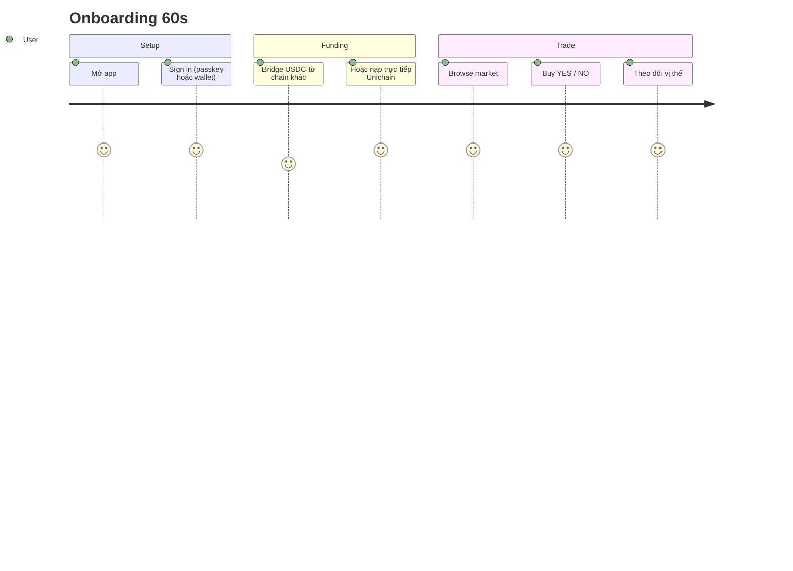

# Bắt đầu

Trade lần đầu trên PrediX trong dưới 2 phút.

## 3 bước

1. **[Kết nối ví](ket-noi-vi.md)** — Passkey (sinh trắc học, 1-tap), MetaMask, hoặc smart account ECDSA. Gas sponsor mặc định.
2. **[Bridge USDC](bridge.md)** — Nếu USDC của bạn đang ở chain khác, bridge sang Unichain trước.
3. **[Trade lần đầu](giao-dich-dau-tien.md)** — Buy YES hoặc NO trong 30 giây.

Theo dõi vị thế realtime ở [Portfolio](../huong-dan/portfolio.md).

## Hỏi nhanh

- [Passkey vs MetaMask, chọn cái nào?](faq.md#passkey-vs-metamask)
- [Tại sao YES + NO luôn ≈ $1?](faq.md#yes-no-1-dollar)
- [Có phí gas không?](faq.md#gas-co-mat-tien)
- [USDC từ Binance, Coinbase chuyển sang được không?](faq.md#nap-tu-cex)
- [Mất thiết bị có passkey thì sao?](faq.md#mat-passkey)

[Xem toàn bộ FAQ →](faq.md)

## Network info

| | |
|---|---|
| **Chain** | Unichain (chain ID `130`) |
| **RPC** | `https://mainnet.unichain.org` |
| **Explorer** | [uniscan.xyz](https://uniscan.xyz) |
| **USDC contract** | TBA — xem [addresses](../giao-thuc/addresses.md) |

> **Tip**: App tự động add Unichain vào ví khi bạn kết nối lần đầu. Không cần thêm thủ công.
