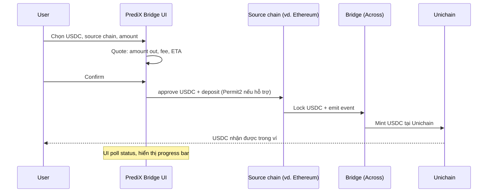

# Bridge USDC sang Unichain

PrediX dùng USDC trên Unichain làm collateral. Nếu USDC của bạn đang ở chain khác, bạn cần bridge.

## Source chain hỗ trợ

| Chain | Bridge mặc định trong app | Thời gian | Phí ước tính |
|---|---|---|---|
| **Ethereum** | Across, Stargate | 5-15 phút | $2-8 (tuỳ gas) |
| **Base** | Across, Superbridge | 2-5 phút | $0.5-2 |
| **Arbitrum** | Across, Stargate | 2-5 phút | $0.5-2 |
| **Optimism** | Across, Superbridge | 2-5 phút | $0.5-2 |
| **Polygon** | LayerZero, Across | 5-10 phút | $1-3 |
| **CEX** (Binance, Coinbase, OKX...) | Withdraw trực tiếp Unichain (nếu CEX hỗ trợ) hoặc rút Ethereum/Arbitrum rồi bridge | Xem CEX docs | Phí withdrawal CEX |

> **Tip**: Coinbase + Binance đã/đang add Unichain network. Withdraw trực tiếp tiết kiệm 1 step bridge.

## Flow trong app

PrediX UI có **Bridge widget** tích hợp — không cần mở Across/Stargate ở tab riêng.

## Bước

1. Vào **Deposit** ở header app.
2. Chọn **Bridge from another chain**.
3. Chọn source chain + amount USDC.
4. Quote: thấy phí + thời gian + amount cuối nhận được.
5. **Approve USDC** ở source chain (1 lần per token, dùng Permit2 nếu chain hỗ trợ).
6. **Deposit** — sign tx ở source chain.
7. App switch network sang Unichain, poll status.
8. ETA xong → USDC vào ví Unichain. Sẵn sàng trade.

## Bridge thẳng từ CEX

Nhiều CEX đã list Unichain. Withdraw flow:

1. Trên CEX, chọn USDC → Withdraw.
2. Network: chọn **Unichain** (nếu có). Nếu chưa có → withdraw qua Ethereum hoặc Arbitrum, sau đó bridge.
3. Paste địa chỉ ví Unichain (PrediX UI có nút copy).
4. Confirm 2FA / email.
5. Đợi CEX process (5-30 phút tuỳ CEX).

> **Quan trọng**: Test trước với amount nhỏ ($10) lần đầu. Sai network = mất tiền không recover được.

## Slippage & quote

Bridge có **slippage** (giá USDC chuyển đổi giữa các chain có spread nhỏ).

- **Across, Stargate**: thường 0.05-0.2% slippage.
- Quote app hiển thị: amount out **sau khi trừ phí + slippage**.
- Nếu giá biến động lớn trong lúc bridge, có thể bị refund về source chain (Across/LayerZero handle case này).

## Nếu bridge stuck

- Across, Stargate: thường tự complete trong 1-30 phút. Nếu sau 1h chưa thấy: check explorer source chain (tx confirmed?), check destination chain (đã có UserOp/relay?).
- Liên hệ bridge support trực tiếp — PrediX không vận hành bridge, chỉ tích hợp UI.
- Cần help: [Discord](../tai-nguyen/links.md) #bridge-support.

## Bridge ngược (Unichain → chain khác)

Cùng UI:

1. **Withdraw** ở header.
2. **Bridge to another chain**.
3. Chọn destination + amount.
4. Sign tx ở Unichain.
5. Đợi bridge complete.

## Native ETH cho gas

Nếu bạn dùng MetaMask EOA (không smart account), cần ETH Unichain để trả gas:

- Bridge cùng widget: chọn **ETH** thay vì USDC.
- Số lượng nhỏ thôi — gas Unichain rất rẻ (~$0.001-0.01 / tx).
- Smart account user: bỏ qua, paymaster sponsor.

## Câu hỏi an toàn

- **Bridge có an toàn không?** PrediX tích hợp các bridge có tổng TVL hàng tỷ USD và đã audit nhiều round (Across, Stargate, LayerZero). Tuy nhiên cross-chain bridge là **vector tấn công lớn nhất trong DeFi history** ($2B+ exploited 2022-2024). Chỉ bridge số lượng cần thiết, không hold dài hạn trên bridge contract.
- **PrediX có giữ tiền tôi trong lúc bridge?** Không. Bridge contract của bên thứ 3 (Across, Stargate). PrediX chỉ provide UI tiện cho user.
- **Phí bridge đi đâu?** Vào relayer / LP của bridge protocol đó. PrediX không thu phí bridge.
