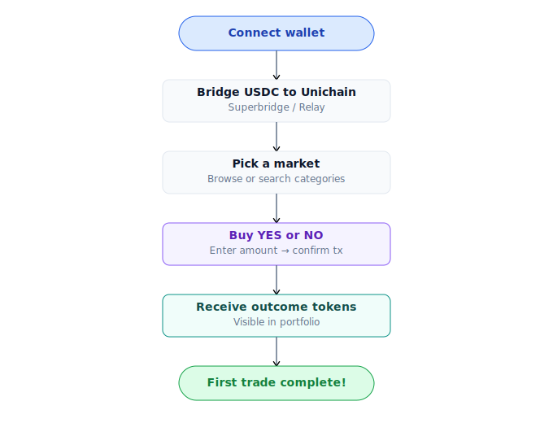

# Trade lần đầu

Mua YES hoặc NO trên một market. ~30 giây từ click đến confirm.

## Bước

1. Vào [Markets](https://app.predix.app/markets), browse hoặc search market quan tâm.
2. Click vào card → trang detail.
3. Panel bên phải: chọn tab **Buy**.
4. Chọn side **YES** (sự kiện sẽ xảy ra) hoặc **NO** (không xảy ra).
5. Nhập amount USDC chi (ví dụ: 100).
6. Preview hiển thị:
   - Amount YES / NO nhận được
   - Average price
   - Slippage estimate
   - Fee breakdown (CLOB taker / AMM swap)
7. Click **Buy** → ví request confirm (Touch ID nếu passkey, popup MetaMask nếu EOA).
8. Tx confirm trong ~2 giây trên Unichain. Vị thế xuất hiện ở [Portfolio](../huong-dan/portfolio.md).

## Đang xảy ra gì bên dưới

Tất cả 1 tx atomic. Slippage > tolerance → revert, tiền không mất.

## Loại lệnh

| Loại | Khi nào dùng | Phí |
|---|---|---|
| **Market** (instant) | Vào ngay theo giá hiện tại | Dynamic 0.5-5% AMM, 0-1% CLOB taker tuỳ thời gian endTime |
| **Limit** (CLOB) | Đặt giá chờ khớp | 0% maker, 0-1% taker |
| **Split** | Mint cặp YES+NO từ USDC để market-make | Free |
| **Merge** | Burn cặp YES+NO lấy USDC | Free |

Chi tiết: [Market order](../huong-dan/giao-dich-market.md), [Limit order](../huong-dan/dat-lenh-limit.md).

## Ví dụ thực tế

Market: *"BTC vượt $100k trước 2027-01-01?"*. Giá YES hiện = $0.48.

Bạn chi 100 USDC mua YES:

| Path | Amount in | Avg price | YES out | Fee |
|---|---|---|---|---|
| CLOB (limit orders sẵn) | 40 USDC | $0.480 | 83.3 YES | 0% (bootstrap) |
| AMM swap | 60 USDC | $0.485 | 122.7 YES | 0.6 USDC (1% tier 3-7d) |
| **Tổng** | **100 USDC** | **$0.483** | **~205 YES** | **~0.6 USDC** |

Nếu BTC vượt $100k trước deadline:
- Market resolve YES = true.
- Bạn redeem 205 YES → nhận `205 × (1 - feeBps/10000)` USDC. Với fee 1%: **202.95 USDC**. Lợi nhuận ~103 USDC.

Nếu không xảy ra:
- YES tokens = $0. Lỗ 100 USDC.

## Sell vị thế

Cùng panel, tab **Sell**:

1. Chọn YES hoặc NO bạn đang giữ.
2. Nhập amount muốn sell.
3. Preview USDC nhận về.
4. Confirm.

Router tìm path tốt nhất ngược lại — drain bid orders CLOB trước, swap AMM phần còn lại.

## Hold tới resolve

Không sell — giữ token tới khi market resolve, sau đó redeem 1:1 USDC nếu thắng. Chi tiết: [Redeem & refund](../huong-dan/redeem-va-claim.md).

## Lỗi thường gặp lần đầu

- **"Insufficient USDC balance"** — Bridge USDC sang Unichain trước. Xem [Bridge](bridge.md).
- **"Slippage exceeded"** — Giá chạy quá tolerance trong lúc tx pending. Tăng slippage (default 0.5% → 1%) hoặc retry.
- **"Wallet not connected"** — Click Sign in / Connect wallet ở header.
- **"Market paused"** — Hiếm — admin pause market vì lý do bảo mật. Xem thông báo trong UI.
