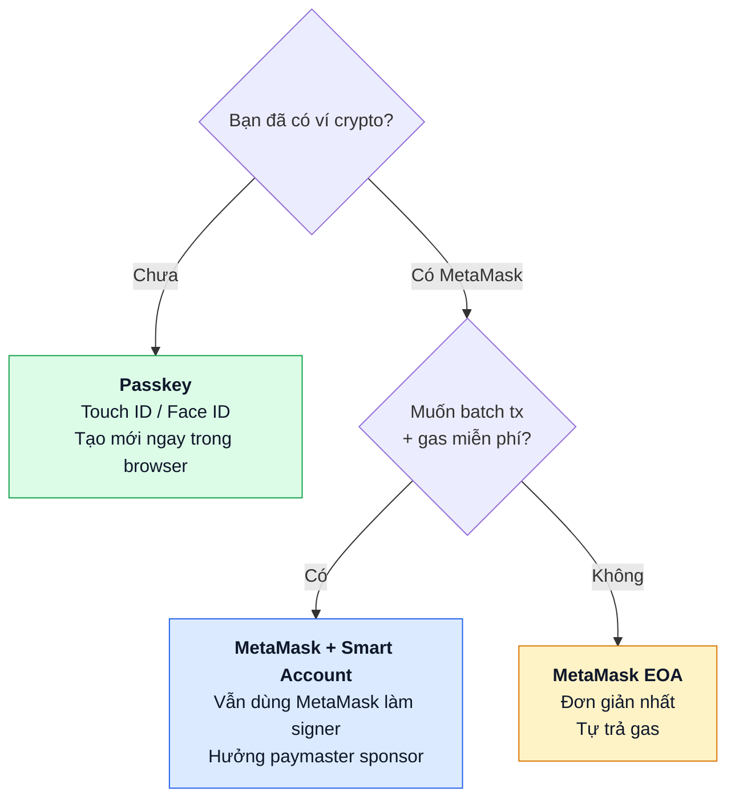
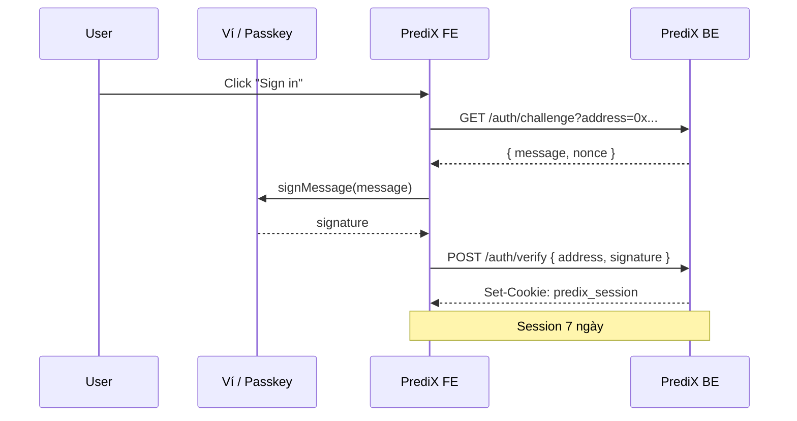

# Kết nối ví

PrediX hỗ trợ 3 cách đăng nhập. Cả 3 đều **non-custodial** — không ai (kể cả PrediX) giữ private key của bạn.

## Chọn nhanh

## So sánh

| | Passkey | MetaMask + Smart Account | MetaMask EOA |
|---|---|---|---|
| Cài extension | Không | Có | Có |
| Backup recovery | Cloud sync (iCloud/Google) hoặc thiết bị thứ 2 | Seed phrase (BIP-39) | Seed phrase |
| Phí gas | Sponsor qua paymaster | Sponsor qua paymaster | Tự trả ETH |
| Batch transaction | Có (1-click `[approve, swap]`) | Có | Không (2 tx riêng) |
| Đăng ký lần đầu | ~5 giây | ~30 giây + sign | Đã có ví → instant |
| Phù hợp số dư | Nhỏ–vừa | Mọi mức | Mọi mức |

## Passkey — nhanh nhất

Passkey dùng chuẩn WebAuthn — sinh trắc học (Touch ID, Face ID, Windows Hello) hoặc PIN của thiết bị xác thực. Private key sinh ra và lưu trong **Secure Enclave / TPM**, không export được.

### Tạo mới

1. Mở [app.predix.app](https://app.predix.app) → **Sign up**.
2. Chọn **Continue with passkey**.
3. Browser hỏi xác thực sinh trắc học. Confirm.
4. Smart account (ERC-4337 Kernel) được deploy on-chain ở swap đầu tiên (counterfactual address ngay từ đầu).

### Backup

- **iCloud Keychain** (iPhone, Mac) — passkey sync giữa các thiết bị Apple đã sign-in cùng Apple ID.
- **Google Password Manager** (Android, Chrome) — sync giữa devices.
- **Hardware key** (YubiKey, Titan) — passkey đứng độc lập, không phụ thuộc cloud.

> **Cảnh báo**: Nếu chỉ có 1 thiết bị + không sync cloud + không có backup → mất thiết bị = mất ví. Khuyến nghị enable cloud sync hoặc thêm thiết bị thứ 2.

### Recovery (mất thiết bị)

Phase 1: tạo lại passkey trên thiết bị mới qua cloud sync (nếu enabled).

Phase 2 (TBA): **Social recovery** với guardian — chỉ định N người tin cậy, M trong N có thể restore quyền truy cập.

## MetaMask + Smart Account

Nếu bạn đã có MetaMask hoặc Rainbow, upgrade lên smart account:

1. Connect MetaMask qua RainbowKit.
2. Sign-in (SIWE — Sign-In With Ethereum) — ký 1 message offline, không tốn gas.
3. App detect EOA → đề xuất **Upgrade to Smart Account**.
4. Sign 1 tx duy nhất tạo Kernel smart account với MetaMask EOA làm validator ECDSA.
5. Sau đó mọi action đi qua smart account: batch tx, paymaster sponsor.

**Khi nào dùng**: muốn giữ seed phrase của MetaMask làm backup nhưng vẫn hưởng UX của smart account (batch + gasless).

## MetaMask EOA (truyền thống)

1. Connect MetaMask qua RainbowKit.
2. Ký SIWE message.
3. Trade trực tiếp — mỗi tx tự trả gas ETH.

**Khi nào dùng**: bạn muốn full control, không quan tâm gasless, hoặc tích hợp tooling khác (Frame, ledger với MetaMask).

## SIWE session

Tất cả 3 cách trên đều dùng **SIWE** (EIP-4361) để tạo session với backend:

Session lưu HTTPOnly cookie, không expose JS. Hết hạn → re-sign.

## Permissions cần biết

Khi connect, app request:
- **eth_requestAccounts** — đọc address.
- **personal_sign** — ký SIWE (off-chain, không tốn gas).
- **eth_sendTransaction** hoặc UserOp — execute tx.

App **không bao giờ** request `eth_signTypedData` cho approve token với amount lớn không cần thiết — luôn permit2 với deadline ngắn.

## Đăng xuất

- App: nút **Disconnect** ở header. Xoá session cookie.
- Wallet: ngắt kết nối từ MetaMask UI.
- Smart account: chỉ "log out" session — smart account vẫn tồn tại on-chain, lần sau sign in lại dùng cùng address.
