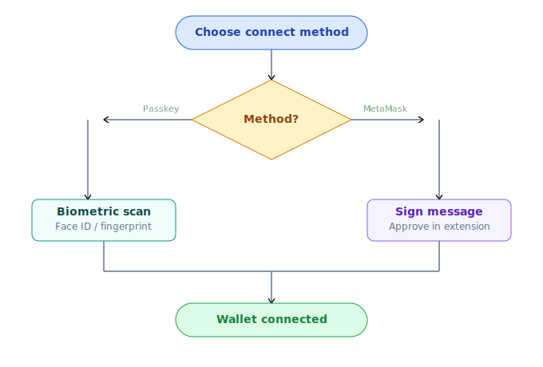
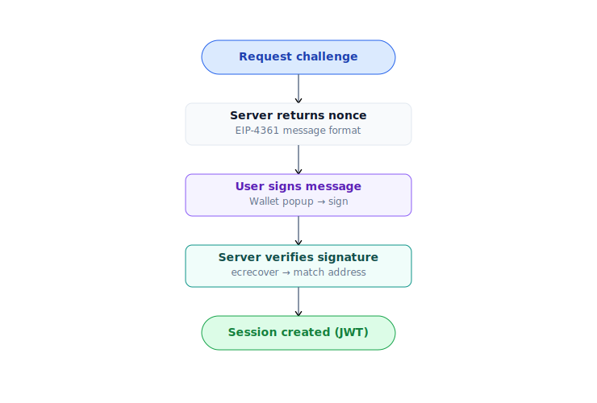

# Kết nối ví

PrediX có **2 phương pháp đăng nhập**. Cả 2 đều **non-custodial** — không ai (kể cả PrediX) giữ private key của bạn.

## Chọn nhanh

## So sánh

| | Passkey + Smart Account | Crypto wallet (EOA) |
|---|---|---|
| **Trải nghiệm** | Web2-like, sinh trắc học | Web3 truyền thống, ký mỗi tx |
| **Cài extension** | Không | Có (MetaMask, Rainbow…) |
| **Backup recovery** | Cloud sync (iCloud / Google), hoặc thiết bị thứ 2 | Seed phrase BIP-39 (12-24 từ) |
| **Hardware wallet** | Không (private key trong Secure Enclave) | Có (Ledger, Trezor) |
| **Phí gas** | Tự trả qua paymaster (USDC) | Tự trả ETH (Unichain rẻ ~$0.001-0.01/tx) |
| **Batch transaction** | Có (1-click `[approve, swap]` atomic) | Không (2 tx riêng) |
| **Đăng ký lần đầu** | ~5 giây sinh trắc học | Đã có ví → instant |
| **Phù hợp** | User mới · onboarding nhanh | DeFi user · custody lớn · hardware wallet |

> **Ghi chú gas**: Mặc định cả 2 phương pháp user đều tự trả gas. PrediX có **chương trình gas sponsor** cho user đủ điều kiện (vd: new user onboarding, stake holder ngưỡng X, campaign-eligible event) — **áp dụng cho cả 2 account types**, không phụ thuộc loại ví. Cơ chế: smart account → paymaster cover trực tiếp; EOA → rebate/refund off-chain (chi tiết công bố pre-launch). Tiêu chí + duration sponsor program có thể thay đổi theo governance vote.

## Passkey + Smart Account

Passkey dùng chuẩn **WebAuthn** — sinh trắc học (Touch ID, Face ID, Windows Hello) hoặc PIN của thiết bị xác thực. Private key sinh ra và lưu trong **Secure Enclave / TPM**, không export được.

Khi sign-up, app tự deploy một **Kernel smart account (ERC-4337)** — wallet contract on-chain validator bằng passkey signature. Mọi action đi qua UserOp.

### Tạo mới

1. Mở [app.predix.app](https://app.predix.app) → **Sign up**.
2. Chọn **Continue with passkey**.
3. Browser hỏi xác thực sinh trắc học. Confirm.
4. Smart account counterfactual address xuất hiện ngay (deploy on-chain ở action đầu tiên).

### Backup

- **iCloud Keychain** (iPhone, Mac) — passkey sync giữa các thiết bị Apple cùng Apple ID.
- **Google Password Manager** (Android, Chrome) — sync giữa devices.
- **Hardware key** (YubiKey, Titan) — passkey lưu trên hardware key, dùng plug-in xác thực.

> **Cảnh báo**: Nếu chỉ có 1 thiết bị + không sync cloud + không có hardware key backup → mất thiết bị = mất ví. Khuyến nghị enable cloud sync hoặc thêm thiết bị thứ 2 ngay sau sign-up.

### Recovery (mất thiết bị)

Hiện tại: tạo lại passkey trên thiết bị mới qua cloud sync (nếu enabled).

Roadmap: **Social recovery** với guardian — chỉ định N người tin cậy, M trong N có thể restore quyền truy cập (TBA).

## Crypto wallet (EOA)

Dùng wallet truyền thống bạn đã có — MetaMask, Rainbow, Coinbase Wallet, hoặc bất kỳ wallet nào hỗ trợ WalletConnect / hardware wallet.

### Bước

1. Click **Connect wallet** ở header.
2. Chọn wallet (MetaMask / Rainbow / WalletConnect / Ledger…).
3. Approve connection request trong wallet.
4. Ký **SIWE message** (Sign-In With Ethereum) — off-chain, không tốn gas.
5. Trade trực tiếp — mỗi tx tự trả gas ETH.

### Khi nào nên dùng

- Bạn đã có DeFi workflow với MetaMask + hardware wallet.
- Custody số dư lớn — muốn seed phrase backup chuẩn BIP-39.
- Tích hợp tooling khác (Frame, Rabby, Safe multisig).
- Preferred full control, không muốn dependency vào paymaster.

## SIWE session

Cả 2 phương pháp đều dùng **SIWE** (EIP-4361) để tạo session với backend:

