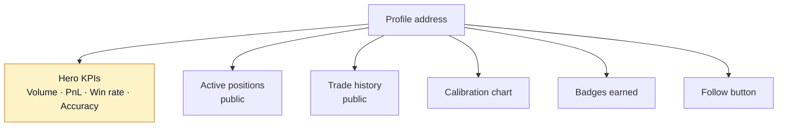
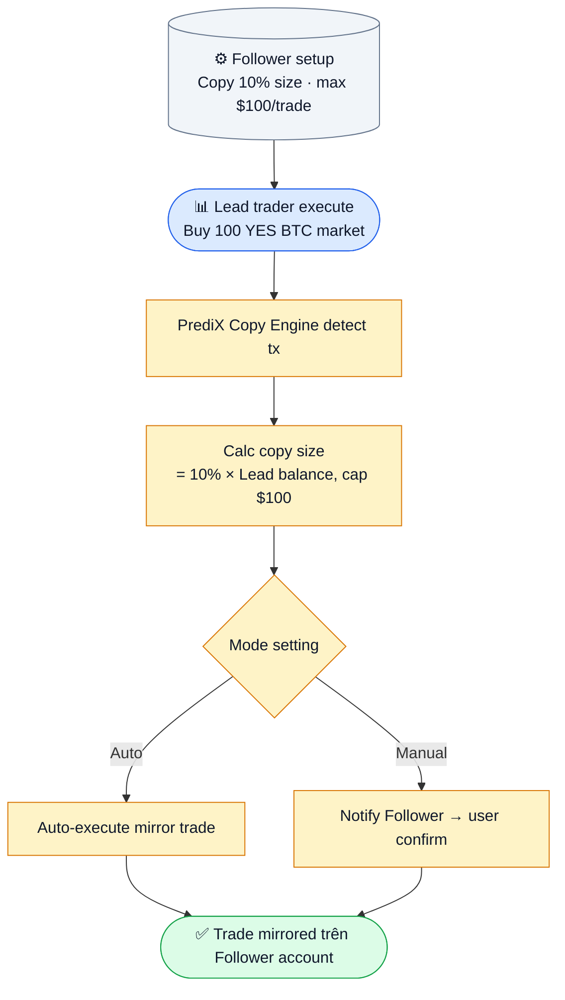

# Leaderboard & traders

Khám phá top traders, follow profile public, học từ portfolio của họ.

## Leaderboard

Trang `/leaderboard`. Sort + filter theo metric:

| Metric | Mô tả | Update |
|---|---|---|
| **Realized P&L** | Lợi nhuận đã chốt (USDC) | Realtime |
| **Volume** | Tổng trade volume | Realtime |
| **Win rate** | % market thắng / tổng resolve | Daily |
| **Accuracy score** | Brier score đảo (cao = chính xác) | Daily |
| **Streak** | Chuỗi thắng liên tiếp | Realtime |

Filter:
- Period: 24h / 7d / 30d / 90d / all-time
- Min trades: 5 / 10 / 50 (lọc out account ngẫu nhiên may mắn)
- Category: crypto / sports / politics / …

## Trader profile

Click vào tên trader → trang `/profile/[address]`:



### Public vs private

Mặc định trader profile **public**:
- Active positions visible (size, market, side, avg cost).
- History visible.
- Aggregate stats.

User có thể **opt out** trong [Settings](../tai-nguyen/settings-i18n.md) → Privacy:
- Hide active positions.
- Hide history.
- Hide identity (anonymous + pseudonym).

> **Note**: Even hidden, address vẫn public on-chain. App chỉ hide ở UI level. Người tech-savvy vẫn query indexer được.

## Follow trader

Click **Follow** trên profile:
- Notification khi trader này:
  - Mở vị thế mới (size > threshold bạn set)
  - Đóng vị thế lớn
  - Đạt milestone (badge, streak)
- Feed riêng trong app hiển thị activity follower.

## Copy trading



### Setup copy

1. Tìm trader bạn muốn copy.
2. Click **Copy Trading** → settings:
   - **Size %**: copy bao nhiêu % của size lead.
   - **Max per trade**: cap absolute (vd $100).
   - **Categories**: chỉ copy trade ở category bạn quan tâm (vd chỉ crypto).
   - **Auto vs manual**: auto-execute hay confirm từng lệnh.
3. Pre-fund USDC vào subaccount copy (tách khỏi main wallet để limit risk).
4. Active.

### Copy trading risks

- **Lead trader có thể tệ về sau** — past performance không guarantee future.
- **Slippage gap**: Lead vào lúc giá $0.50, bạn copy 30s sau giá đã $0.55.
- **Fee accumulation**: Copy nhiều lead nhỏ → mỗi lead 1 tx → fee gas tích luỹ (smart account user đủ điều kiện sponsor program → giảm đáng kể; còn lại pay normal).

Bắt đầu nhỏ ($50-100) test 1 tuần trước khi scale.

## Trader directory

Trang `/traders` — directory active traders + filter:
- Sort theo metric (như leaderboard).
- Filter category, lock period (active 24h/7d).
- Search theo address hoặc pseudonym.

Card mỗi trader hiện:
- Avatar (gravatar hoặc custom)
- Pseudonym (tự set) hoặc address rút gọn
- Top metric (e.g. +$12k 30d)
- Win rate / Accuracy badge
- Quick action: Follow / Copy / View profile

## Verified traders

Trader có:
- ENS / Lens / Farcaster verified.
- Twitter linked.
- KYC optional (cho institutional).

Verified badge (✓) cạnh tên — chống impersonation. Verify trong [Settings](../tai-nguyen/settings-i18n.md).

## Privacy & data

- Trader stats compute từ on-chain data → public by default.
- App overlay: pseudonym, avatar, follow graph (off-chain Mongo).
- Bạn opt out → app **không expose**, nhưng on-chain data vẫn public.
- GDPR / CCPA: right to be forgotten chỉ apply off-chain data (pseudonym, avatar). On-chain immutable.

## Anti-sybil

Để leaderboard không bị spam bot:
- **Min activity**: > 5 markets resolve mới lên leaderboard.
- **Stake gate**: Top 100 leaderboard yêu cầu stake ≥ 100 PRX.
- **Behavior detection**: Pattern wash trade, copy bot bị flag và filter.

## API

```
GET /api/v2/leaderboard?metric=pnl&period=30d&limit=100
GET /api/v2/users/:address/profile
GET /api/v2/users/:address/follows  (followed by who)
GET /api/v2/users/:address/following (following who)
```

Chi tiết: [Backend API](../developers/backend-api.md).
