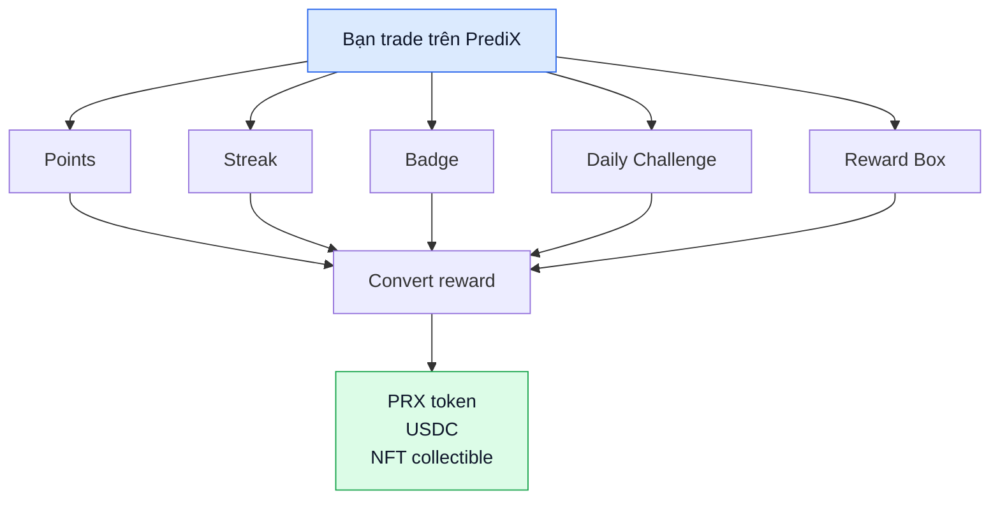
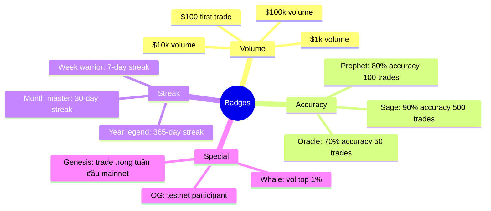
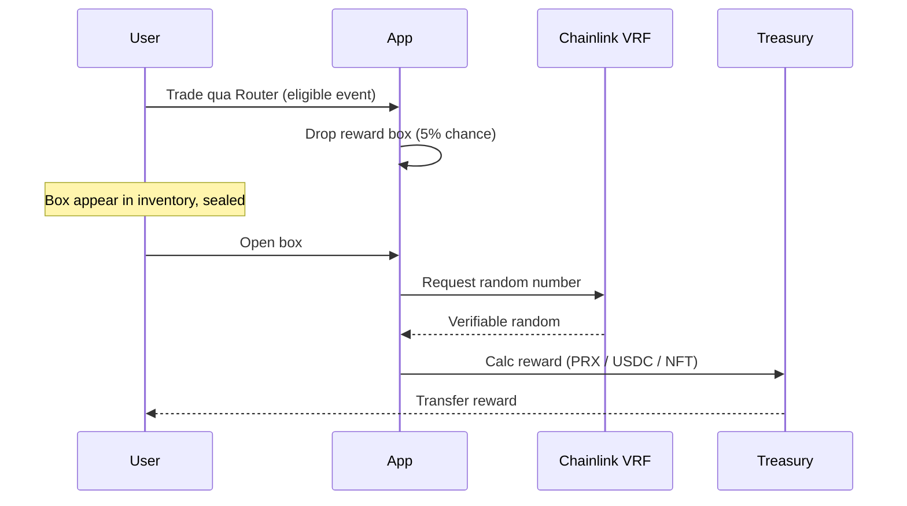

# Rewards & gamification

PrediX có 5 cơ chế reward chồng lên nhau, đều cùng mục đích: incentive trading + accuracy.



## 1. Points

Earn points cho mọi action có giá trị trên protocol:

| Action | Points |
|---|---|
| Trade volume | 1 pt / $1 USDC volume |
| Resolve correct (YES wins khi bạn buy YES) | 100 pt × confidence (giá bạn mua càng thấp → confidence cao → pt cao) |
| Place limit order (provide liquidity) | 5 pt / $1 USDC lock |
| LP fee earned | 10 pt / $1 fee |
| Stake PRX | 1 pt / day / 100 PRX staked |
| Follow trader | 5 pt one-time |
| Bridge to Unichain | 50 pt one-time per source chain |

**Convert**: Points → PRX rewards qua weekly distribution. Tỷ lệ float theo total points trong tuần.

Track points: Profile → **Points** tab.

## 2. Streak

Chuỗi hành động liên tục:

| Streak type | Tiêu chí | Reward |
|---|---|---|
| **Daily login** | Login mỗi ngày liên tiếp | 5/10/25/50 pt @ 7/30/100/365 days |
| **Win streak** | Trade thắng liên tiếp (>$10) | Multiplier 1.1× → 2.0× points cho trade tiếp theo |
| **Trading streak** | Trade ≥ 1 mỗi ngày | Daily bonus + badge |

Mất streak nếu skip day. Restart từ 0.

## 3. Badges

NFT badge (ERC-1155 trên Unichain) earn khi đạt milestone:



- Badges là NFT — transferrable (đến khi locked).
- Hiển thị trên profile, leaderboard.
- Một số badge **lock** (không transfer được) để tránh wash.

## 4. Daily challenges

Mỗi ngày có 3 challenges random:

| Ví dụ challenge | Reward |
|---|---|
| Trade volume ≥ $50 hôm nay | 100 pt |
| Place 1 limit order | 50 pt |
| Hold position ít nhất 4 giờ | 75 pt |
| Try 3 markets khác nhau | 100 pt |
| Refer 1 bạn | 200 pt + $5 USDC khi friend trade lần đầu |

Reset 00:00 UTC mỗi ngày.

## 5. Reward boxes

Sealed box mở lúc resolve, content random PRX / USDC / NFT.



- **Drop rate**: ~5% mỗi trade > $10.
- **Pool**: 80% PRX, 15% USDC, 5% rare NFT.
- **Range**: 1-1000 PRX (median ~10), $0.10-$50 USDC (median $1), NFT special edition.
- **Randomness**: Chainlink VRF — verifiable, không manipulate được.

## Convert points → PRX

Weekly distribution Sunday 00:00 UTC:

```
Your PRX = (your points / total points week) × weekly PRX pool
```

Weekly pool: TBA — set bởi governance, dao động theo treasury budget.

Claim manual hoặc auto-compound (re-stake vào vault).

## Anti-sybil

Để reward không bị bot farm:

- **Min stake**: Tài khoản cần stake ≥ 10 PRX (sau TGE) để earn reward >$X.
- **Verification**: Email + (optional) phone giảm rate cho un-verified.
- **Behavior pattern**: Wash trade detector — nếu bạn mua + bán ngay nhiều lần, points trade volume giảm hoặc 0.
- **Cap per wallet**: Tier reward có cap absolute (vd max 10,000 pt / day).

## Referral

Mỗi user có **referral link** unique:

- Friend trade lần đầu → bạn nhận **5% commission** trong 3 tháng đầu của friend (paid USDC).
- Friend earn rewards → bạn nhận **10% bonus points**.
- Cap: $1000 USDC commission / referrer / friend.

Track: Profile → **Referrals** tab.

## Roadmap (TBA)

- **Tournament mode**: Weekly competition, prize pool $10k+ USDC + NFT.
- **Quest line**: Complete chain quests theo theme (e.g. "Crypto whale month").
- **Guild system**: Tham gia guild, share leaderboard, group reward.
- **Seasons**: Reset reward stats mỗi quarter, top players limited NFT trophy.

## API & integration

```
GET /api/v2/users/:address/rewards
GET /api/v2/users/:address/badges
GET /api/v2/users/:address/streaks
GET /api/v2/daily-challenges
GET /api/v2/leaderboard/rewards
```

Chi tiết: [Backend API](../developers/backend-api.md).
