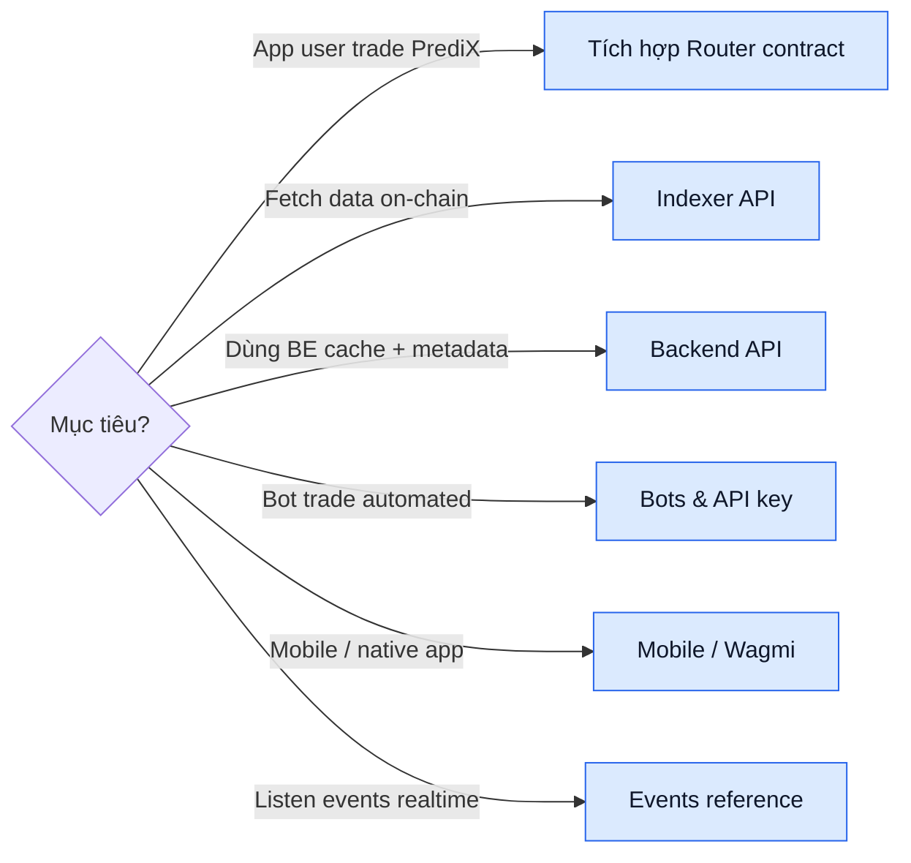

# Developers

Tích hợp PrediX vào app, bot, data pipeline.

## Đường tích hợp



| Tôi muốn… | Đi tới |
|---|---|
| Cho user app trade PrediX markets | [Tích hợp Router](router-integration.md) |
| Fetch market list / portfolio / history | [Indexer API](indexer-api.md) |
| Dùng BE cache + metadata | [Backend API](backend-api.md) |
| Listen events realtime | [Events reference](events-reference.md) |
| Build trading bot | [Bots & API key](bots-api.md) |
| Tích hợp mobile / native | [Mobile / Wagmi](mobile-integration.md) |
| Test integrate trước mainnet | [Testnet info](testnet.md) |

## Quickstart — first call

```typescript
import { createPublicClient, http } from 'viem';
import { unichain } from 'viem/chains';

const client = createPublicClient({
  chain: unichain,
  transport: http('https://mainnet.unichain.org'),
});

// Fetch market list từ Indexer
const res = await fetch('https://api.predix.app/v2/markets?limit=10');
const { data: markets } = await res.json();

console.log(markets.map(m => `${m.question} — YES @ ${m.yesPrice}`));
```

Chi tiết integration step-by-step: [Tích hợp Router](router-integration.md).

## Stack overview

| Layer | Stack | Language |
|---|---|---|
| Smart contracts | Foundry + Solidity 0.8.30 | Solidity |
| Indexer | Ponder + PostgreSQL + Hono | TypeScript |
| Backend | NestJS + Fastify + MongoDB + zod | TypeScript |
| Frontend | Next.js + React + Tailwind + viem + wagmi | TypeScript |
| Paymaster | ERC-4337 v0.7 + Pimlico bundler | Solidity + TS off-chain signer |

## API environments

| Env | Indexer API | Backend API |
|---|---|---|
| **Mainnet** | `https://indexer.predix.app` | `https://api.predix.app` |
| **Testnet** | TBA (xem [Testnet info](testnet.md)) | TBA |

## Chain info

| | Mainnet | Testnet |
|---|---|---|
| **Network** | Unichain | Unichain Sepolia |
| **Chain ID** | 130 | 1301 |
| **RPC public** | `https://mainnet.unichain.org` | `https://sepolia.unichain.org` |
| **Explorer** | [uniscan.xyz](https://uniscan.xyz) | [sepolia.uniscan.xyz](https://sepolia.uniscan.xyz) |

## Rate limits

| Tier | Public | Authenticated | Notes |
|---|---|---|---|
| Free | 60 req/min/IP | 300 req/min/user | Default |
| Pro | 600 req/min | 3000 req/min | $20/month, API key |
| Enterprise | Custom | Custom | Contact |

WebSocket: 10 conn/IP, unlimited messages.

## SDK (TBA)

Official SDK roadmap:

```bash
npm install @predix/sdk        # TypeScript / JavaScript
pip install predix-sdk         # Python
cargo add predix-sdk           # Rust
```

Pre-launch: dùng REST API + viem trực tiếp.

## Support

- **Bug bảo mật contract**: [security@predix.app](mailto:security@predix.app), bug bounty active.
- **API question**: Discord #dev-support.
- **Feature request**: GitHub issue [predix-protocol](https://github.com/predix-protocol).
- **Enterprise**: [business@predix.app](mailto:business@predix.app).

## Licensing

| Component | License | Note |
|---|---|---|
| Smart contracts | BUSL-1.1 → GPLv3 sau 2 năm | Business Source License, non-commercial |
| Indexer | MIT | Open source |
| Backend | MIT | Open source |
| Frontend | MIT | Open source |
| SDK | MIT | Open source |
