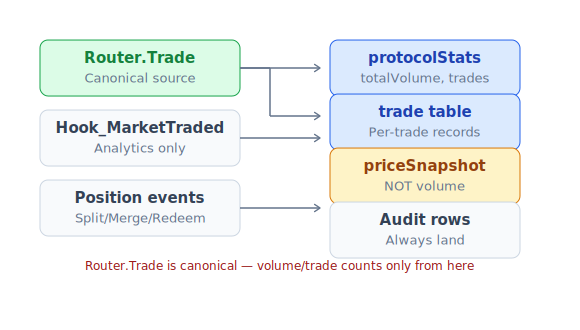

# API reference

PrediX expose 3 layer cho dev:

| Layer | Mục đích | Khi nào dùng |
|---|---|---|
| **Indexer API** (Ponder + PostgreSQL + Hono) | Raw on-chain data: market, position, trade, OHLC | Bot, analytics, raw data |
| **Backend API** (NestJS v2) | View model cho FE/app: cache + metadata + i18n + auth + comments | FE / mobile app user-facing |
| **Smart contract events** | Canonical source of truth on-chain | Custom subgraph, monitor, listener |

Khi nào BE vs Indexer:

| Cần | Indexer | Backend |
|---|---|---|
| Raw on-chain data | ✅ | wrap |
| Display metadata (title, category, icon) | ❌ | ✅ MongoDB |
| Localized i18n | ❌ | ✅ |
| Auth session (SIWE) | ❌ | ✅ |
| Cache (2s hot / 60s warm) | ❌ | ✅ |
| Notifications / comments | ❌ | ✅ |

Bot/analytics raw → Indexer. FE/app user → Backend.

## Base URL

| Env | Indexer | Backend |
|---|---|---|
| **Testnet** (live) | Gated — xem [Testnet info](testnet.md) | Gated — xem [Testnet info](testnet.md) |
| **Mainnet** (TBA) | `https://indexer.predix.app` | `https://api.predix.app` |

Schema giống nhau cả 2 environment — chuyển testnet → mainnet chỉ đổi base URL.

## Authentication

- **Indexer**: public read-only. Pro tier (high rate limit) cần API key — xem [Bots & mobile](bots-and-mobile.md).
- **Backend**: public + auth qua SIWE cookie session (chi tiết §SIWE auth flow bên dưới).

## Response envelope

Indexer success:
```json
{
  "data": <payload>,
  "meta": { "limit": 20, "offset": 0, "count": 150 }
}
```

Backend success:
```json
{
  "data": <payload>,
  "meta": { "timestamp": 1740100000, "version": "v2", "reqId": "uuid-optional" }
}
```

Single item: `"meta": null` (Indexer) hoặc bỏ meta.list fields (BE).

Error (cả 2):
```json
{
  "error": "MarketNotFound",
  "message": "Market 0xabc... not found"
}
```

BE thêm `details: [{path, message}]` cho validation errors + `code` enum (xem §Error codes).

---

## Indexer endpoints

### Markets

```
GET /api/markets                       list (status, limit, offset, sort, category, featured)
GET /api/markets/:id                   single (id = decimal string)
GET /api/markets/:id/trades            Union Router trades + CLOB taker fills
GET /api/markets/:id/positions         per-user positions (filter by address)
GET /api/markets/:id/orders            CLOB orders (status, side)
GET /api/markets/:id/orderbook         current snapshot grouped by tick
GET /api/markets/:id/holders           top YES + NO holders
```

Markets list response:
```json
{
  "data": [{
    "id": "1",
    "marketIdHex": "0x000...01",
    "question": "BTC > $100k trước 2027?",
    "endTime": 1798752000,
    "yesPrice": "0.62",
    "totalCollateral": "125000.000000",
    "volume": "523000.000000",
    "tradeCount": 2341,
    "isResolved": false,
    "outcome": null,
    "creator": "0xfad5...",
    "oracle": "0x7887...",
    "createdAt": 1740000000,
    "createdBlock": 49800000
  }],
  "meta": { "limit": 20, "offset": 0, "count": 150 }
}
```

### Pricing

```
GET /api/markets/:id/amm-state                    Uniswap v4 pool state
GET /api/markets/:id/price-delta?window=24        price change (1-720h window)
GET /api/markets/:id/volume-window?window=24      volume window
GET /api/markets/:id/candles?timeframe=1h&from=&to=  OHLC
```

Timeframes: `1m`, `5m`, `15m`, `1h`, `4h`, `1d`, `1w`.

### Events (multi-outcome)

```
GET /api/events
GET /api/events/:id              detail với marketIds + winningIndex
```

### Portfolio

```
GET /api/users/:address/portfolio?includeResolved=true
GET /api/users/:address/stats              aggregated PnL, accuracy, volume
GET /api/users                             leaderboard (sort=pnl|volume|accuracy)
GET /api/users/:address/lp-positions       LP NFTs
GET /api/users/:address/badges             earned badges
```

### Protocol stats

```
GET /api/stats                  totalMarkets, totalVolume, totalTrades, totalUsers, etc
```

### System

```
GET /api/health                 latestIndexedBlock, lagBlocks
GET /api/doc                    OpenAPI JSON
GET /api/docs                   Swagger UI
```

---

## Backend endpoints (v2)

### Primitives — wire format strict

| Type | Format | Example |
|---|---|---|
| Address | lowercase `0x[a-f0-9]{40}` | `"0xfad5..."` |
| MarketId | lowercase `0x[a-f0-9]{64}` | `"0xabc...64hex"` |
| Price | decimal string | `"0.524"` |
| Money | object | `{decimal:"10.5", raw:"10500000", decimals:6, unit:"USDC"}` |
| Timestamp | unix seconds int | `1740100000` |
| User string | object | `{key:"market.0xabc.title", fallback:"Will BTC..."}` |

### Market discriminator (Stripe pattern)

```typescript
type Market =
  | { kind: 'binary', binary: BinaryData, /* ... */ }
  | { kind: 'scalar', scalar: ScalarData, /* ... */ }
  | { kind: 'multi', multi: MultiData, /* ... */ }
  | { kind: 'sports', sports: SportsData, /* ... */ }
  | { kind: 'grouped', grouped: GroupedData, /* ... */ };
```

FE: `market[market.kind]` — exhaustive switch.

### Markets & events

```
GET  /api/v2/markets                  list with filters + pagination
GET  /api/v2/markets/:id              single (id = hex bytes32)
GET  /api/v2/markets/:id/orderbook
GET  /api/v2/markets/:id/trades
GET  /api/v2/markets/:id/holders
GET  /api/v2/markets/:id/comments
GET  /api/v2/events
GET  /api/v2/events/:id
```

### Pricing

```
POST /api/v2/markets/:id/pricing/quote     quote trước swap
GET  /api/v2/markets/:id/pricing/view      combined CLOB + AMM view
POST /api/v2/markets-batch/price-views     batch up to 50
GET  /api/v2/markets/:id/candles           OHLC
```

### User & portfolio

```
GET  /api/v2/users/:address/orders
GET  /api/v2/users/:address/portfolio
GET  /api/v2/users/:address/trades
GET  /api/v2/users/:address/pnl
GET  /api/v2/users/:address/profile
GET  /api/v2/users/:address/lp-positions
GET  /api/v2/users/:address/badges
GET  /api/v2/users/:address/calibration
GET  /api/v2/users/:address/follows
GET  /api/v2/users/:address/following
```

### Auth (SIWE)

```
GET  /api/v2/auth/challenge?address=0x...
POST /api/v2/auth/verify
GET  /api/v2/auth/me            [auth required]
PATCH /api/v2/auth/me           [auth required]
POST /api/v2/auth/logout
```

### Account abstraction

```
POST /api/v2/aa/auth/passkey/register/challenge
POST /api/v2/aa/auth/passkey/register/verify
POST /api/v2/aa/auth/passkey/login
POST /api/v2/aa/bundler                 Pimlico bundler proxy
POST /api/v2/aa/paymaster/sponsor       sponsor UserOp
```

### Notifications & alerts

```
GET    /api/v2/users/:address/notifications?unread=true
POST   /api/v2/users/:address/notifications/:id/read
GET    /api/v2/users/:address/alerts
POST   /api/v2/users/:address/alerts
DELETE /api/v2/users/:address/alerts/:id
```

### Rewards & gamification

```
GET  /api/v2/users/:address/rewards
GET  /api/v2/users/:address/badges
GET  /api/v2/users/:address/streaks
GET  /api/v2/daily-challenges
GET  /api/v2/leaderboard
GET  /api/v2/leaderboard/rewards
```

### Comments & social

```
GET  /api/v2/markets/:id/comments?sort=top|new&limit=50
POST /api/v2/markets/:id/comments        [auth]
GET  /api/v2/users/:address/posts
POST /api/v2/posts                        [auth]
GET  /api/v2/feed?filter=following|trending|latest
```

### Bots / API key

```
POST   /api/v2/api-keys                   create (Pro tier)
GET    /api/v2/api-keys                   list
DELETE /api/v2/api-keys/:id
POST   /api/v2/bots/orders                place order via API key
```

### Governance

```
GET  /api/v2/governance/proposals
GET  /api/v2/gauges
POST /api/v2/governance/vote              returns calldata
```

### System

```
GET /health                               mongo + indexer probe
GET /api/v2/openapi.json                  OpenAPI 3.1 spec
GET /api/v2/capabilities                  enum describe list
```

### SIWE auth flow


```typescript
// 1. Challenge
const { message } = await fetch(`${API}/auth/challenge?address=${addr}`).then(r => r.json());

// 2. Sign
const signature = await walletClient.signMessage({ message });

// 3. Verify
await fetch(`${API}/auth/verify`, {
  method: 'POST',
  credentials: 'include',
  headers: { 'Content-Type': 'application/json' },
  body: JSON.stringify({ address: addr, signature }),
});
```

### Cache headers

BE 2 tier: **hot 2s** (markets list/detail, orderbook, trades) · **warm 60s** (user profile, category, stats).

Response: `X-Cache: HIT | MISS`, `X-Cache-Tier: hot | warm`.

### Error codes (closed set)

| Code | HTTP | Ý nghĩa |
|---|---|---|
| `MARKET_NOT_FOUND` | 404 | Market id không tồn tại |
| `MARKET_PAUSED` | 400 | Market đang paused |
| `INDEXER_UNAVAILABLE` | 503 | Indexer circuit breaker tripped |
| `INVALID_ADDRESS` | 400 | Address malformed |
| `INVALID_MARKET_ID` | 400 | MarketId malformed |
| `AUTH_REQUIRED` | 401 | Endpoint cần session |
| `AUTH_INVALID` | 401 | Session expired hoặc invalid |
| `FORBIDDEN` | 403 | Không đủ role |
| `VALIDATION_FAILED` | 400 | Request body không pass validation |
| `RATE_LIMIT_EXCEEDED` | 429 | Vượt rate limit |
| `INSUFFICIENT_BALANCE` | 400 | Ví thiếu balance |
| `SLIPPAGE_EXCEEDED` | 400 | On-chain revert do slippage |

Full list: `GET /api/v2/capabilities`.

### OpenAPI typed client

BE publish OpenAPI 3.1. FE generate types tự động:

```bash
npm run sync:schemas
npm run check:schemas-sync
```

```typescript
import type { paths } from '@predix/api-types';
import createClient from 'openapi-fetch';

const api = createClient<paths>({ baseUrl: 'https://api.predix.app' });
const { data } = await api.GET('/markets/{id}', {
  params: { path: { id: '0x0001...' } },
});
```

---

## Smart contract events

Source of truth on-chain — bot listener, custom subgraph, monitoring service nên consume từ đây.



- **Canonical trade**: `Router.Trade` — `protocolStats.totalVolume / totalTrades` **chỉ** tăng từ đây.
- **AMM swap analytics**: `Hook_MarketTraded` — priceSnapshot only, không count volume (tránh double-count).
- **Audit rows luôn land**: `PositionSplit`, `PositionMerged`, `TokensRedeemed`, `MarketRefunded` — ghi bất kể recipient.

### Router events

```solidity
event Trade(
    address indexed trader,
    address indexed recipient,
    bytes32 indexed marketId,
    uint8 tradeType,        // 0=BUY_YES, 1=SELL_YES, 2=BUY_NO, 3=SELL_NO
    uint256 amountIn,
    uint256 amountOut,
    uint256 yesPrice,       // 6 decimals
    uint256 clobFilled,
    uint256 ammFilled
);
event DustRefunded(address indexed trader, uint256 amount);
event ClobSkipped(bytes32 indexed marketId, bytes4 selector);
```

`Trade` → tables: `trade`, `position` (if recipient ≠ protocol contract), `market.volume`, `market.tradeCount`, `priceSnapshot` (source="router"), `protocolStats`, `user`, `userStats`.

### Exchange events

```solidity
event OrderPlaced(uint256 indexed orderId, address indexed owner, bytes32 indexed marketId, uint8 side, uint32 price, uint128 amount);
event OrderMatched(uint256 indexed takerOrderId, uint256 indexed makerOrderId, bytes32 indexed marketId, uint8 matchType, uint128 fillAmount, uint32 fillPrice);
event OrderCancelled(uint256 indexed orderId);
event OrderFilled(uint256 indexed orderId);
```

Tables: `exchangeOrder`, `orderMatch`, `takerFill`, `position` (non-protocol).

### MarketFacet events

```solidity
event MarketCreated(bytes32 indexed marketId, address indexed creator, string question, uint256 endTime, address oracle, address yesToken, address noToken, uint256 eventId, uint32 redemptionFeeBps);
event PositionSplit(bytes32 indexed marketId, address indexed user, uint256 amount);
event PositionMerged(bytes32 indexed marketId, address indexed user, uint256 amount);
event MarketResolved(bytes32 indexed marketId, bool outcome, uint256 resolvedAt);
event TokensRedeemed(bytes32 indexed marketId, address indexed user, uint256 winningBurned, uint256 losingBurned, uint256 payout, uint256 fee);
event MarketRefunded(bytes32 indexed marketId, address indexed user, uint256 yesBurned, uint256 noBurned, uint256 payout);
event MarketEmergencyResolved(bytes32 indexed marketId, bool outcome);
event RefundModeEnabled(bytes32 indexed marketId);
event PerMarketRedemptionFeeUpdated(bytes32 indexed marketId, uint32 newFeeBps);
```

Tables: `market`, `outcomeToken`, `positionSplit`, `positionMerge`, `redemption`, `refundClaim`, `feeConfigChange`.

### EventFacet events

```solidity
event EventGroupCreated(uint256 indexed eventId, string name, uint256 endTime, bytes32[] marketIds);
event EventGroupResolved(uint256 indexed eventId, uint8 winningIndex);
event EventRefundModeEnabled(uint256 indexed eventId);
```

Table: `eventGroup`.

### Hook events

```solidity
event Hook_PoolRegistered(bytes32 indexed poolId, bytes32 indexed marketId, bool yesIsCurrency0);
event Hook_MarketTraded(bytes32 indexed marketId, address indexed trader, uint256 yesPrice, uint256 volume, bool isBuyYes);
event Hook_PauseStatusChanged(...);
```

`Hook_PoolRegistered` → `hookPoolBinding` (essential lookup cho filter PoolManager events).
`Hook_MarketTraded` → `priceSnapshot` (source="hook_amm"), `market.lastTradeAt`. **KHÔNG** count volume.

### Oracle events

```solidity
// ManualOracle
event OracleReportCreated(bytes32 indexed marketId, bool outcome, address reporter);
event OracleReportRevoked(bytes32 indexed marketId, address operator);

// ChainlinkOracle
event OracleMarketRegistered(bytes32 indexed marketId, address feed, uint256 threshold, bool gte, uint256 snapshotAt);
event OracleMarketResolved(bytes32 indexed marketId, bool outcome);
```

### Diamond admin events

```solidity
event RoleGranted(bytes32 indexed role, address indexed account, address sender);
event RoleRevoked(bytes32 indexed role, address indexed account, address sender);
event DiamondCut(FacetCut[] cuts, address init, bytes data);
event GlobalPaused(address account);
event ModulePaused(bytes32 module, address account);
```

### OutcomeToken (ERC-20)

```solidity
event Transfer(address indexed from, address indexed to, uint256 value);
event Approval(address indexed owner, address indexed spender, uint256 value);
```

Mỗi market 1 YES + 1 NO token. Table: `holder` — canonical balance view.

### PoolManager (Uniswap v4)

Filter by `hookPoolBinding` membership trước:
- `Initialize` → insert `ammPoolState`
- `Swap` → update `sqrtPriceX96`, `liquidity`, `tick`
- `ModifyLiquidity` → update `liquidity += delta`

---

## Common patterns

### Fetch top 10 markets by volume

```typescript
const res = await fetch('https://indexer.predix.app/api/markets?sort=volume&limit=10');
const { data: markets } = await res.json();
markets.forEach(m => console.log(`${m.question} — $${m.volume}`));
```

### Listen `Trade` events realtime

```typescript
import { createPublicClient, http } from 'viem';
import { unichainSepolia } from 'viem/chains';

const client = createPublicClient({ chain: unichainSepolia, transport: http() });

client.watchContractEvent({
  address: ROUTER,
  abi: routerAbi,
  eventName: 'Trade',
  args: { marketId },
  onLogs: (logs) => logs.forEach(log => console.log(log.args)),
});
```

### Subscribe BE WebSocket

```typescript
const ws = new WebSocket('wss://api.predix.app/v2/ws');

ws.send(JSON.stringify({
  type: 'subscribe',
  channels: [
    'market:0xabc...:trades',
    'user:0xdef...:notifications',
    'feed:trending',
  ],
}));

ws.onmessage = (e) => {
  const msg = JSON.parse(e.data);
  // { channel, type, data, timestamp }
};
```

Auth: include cookie hoặc API key header.

## Limits

| Tier | Public | Auth | Quota |
|---|---|---|---|
| Free | 60 req/min/IP | 300 req/min/user | 10,000 req/day |
| Pro ($20/month) | 600 req/min | 3000 req/min | 1M req/day |
| Enterprise | Custom | Custom | Custom |

Auth endpoint (challenge/verify): 5/min Free, 30/min Pro.
WebSocket: 10 connections/IP, unlimited messages.

API key: [Bots & mobile](bots-and-mobile.md).

## BigInt serialization

Mọi amount on-chain là `uint256` → serialize thành **decimal string** ở boundary (`"125000.000000"` thay vì number, tránh precision loss). Parse client-side: `BigInt(stripDecimal(str))`.

## Indexer lag

- **L2 finality**: ~12-15 min trên Unichain.
- **Indexer lag** từ head: thường < 60s (`/api/health`).
- Vừa trade chưa thấy → wait 10-30s, retry.

Ponder handle reorg automatic — chain reorg → indexer revert + replay. Client không cần custom logic.
