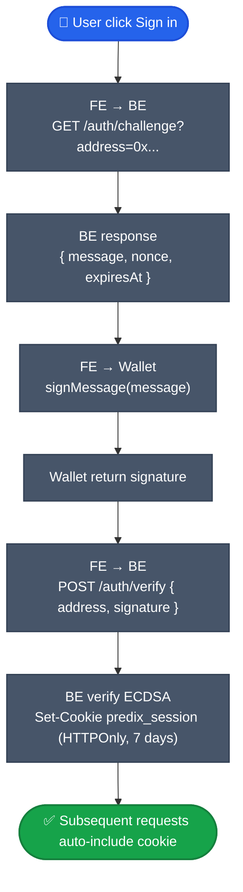

# Backend API

NestJS API v2 — view model cho FE / app. Wrap Indexer + overlay metadata từ MongoDB.

## Base URL

- **Testnet** (live now): Gated access — xem [Testnet info](testnet.md) để get endpoint qua Discord #testnet-access.
- **Mainnet** (sau launch): `https://api.predix.app`

Schema + endpoint shape giống nhau cả 2 environment — chuyển từ testnet → mainnet chỉ đổi base URL.

## Khi nào dùng BE thay vì Indexer

| | Indexer (Ponder) | Backend (BE v2) |
|---|---|---|
| Raw on-chain data | ✅ | Wrap |
| Display metadata (title, category, icon) | ❌ | ✅ from MongoDB |
| Computed status + capabilities | ❌ | ✅ server-side |
| LocalizedString i18n key | ❌ | ✅ |
| Discriminator union market | ❌ | ✅ (binary/scalar/multi/sports/grouped) |
| Auth session (SIWE) | ❌ | ✅ |
| Admin actions | ❌ | ✅ |
| Cache (2s hot, 60s warm) | ❌ | ✅ |
| Notifications | ❌ | ✅ |
| Comments / social | ❌ | ✅ |

Tóm: **FE / app user** dùng BE. **Bot / analytics raw** dùng Indexer.

## Response envelope

Success:
```json
{
  "data": <payload>,
  "meta": {
    "timestamp": 1740100000,
    "version": "v2",
    "reqId": "uuid-optional"
  }
}
```

Error:
```json
{
  "error": {
    "code": "MARKET_NOT_FOUND",
    "message": "Market ... not found",
    "details": [{ "path": "marketId", "message": "not a valid bytes32" }]
  },
  "meta": { "timestamp": 1740100000, "version": "v2" }
}
```

## Primitives

Wire format strict:

| Type | Format | Example |
|---|---|---|
| Address | lowercase `0x[a-f0-9]{40}` | `"0xfad5..."` |
| MarketId | lowercase `0x[a-f0-9]{64}` | `"0xabc...64hex"` |
| Price | decimal string | `"0.524"` |
| Money | object | `{decimal:"10.5", raw:"10500000", decimals:6, unit:"USDC"}` |
| Timestamp | unix seconds integer | `1740100000` |
| User string | object | `{key:"market.0xabc.title", fallback:"Will BTC..."}` |
| Color/icon | object | `{tokenKey:"semantic.positive"}` |

## Market discriminator

```typescript
type Market =
  | { kind: 'binary', binary: BinaryData, /* ... */ }
  | { kind: 'scalar', scalar: ScalarData, /* ... */ }
  | { kind: 'multi', multi: MultiData, /* ... */ }
  | { kind: 'sports', sports: SportsData, /* ... */ }
  | { kind: 'grouped', grouped: GroupedData, /* ... */ };
```

FE code: `market[market.kind]` — exhaustive switch, không flat field.

## Endpoints chính

### Markets & Events

```
GET  /api/v2/markets                       list with filters + pagination
GET  /api/v2/markets/:id                   single (id = hex bytes32)
GET  /api/v2/markets/:id/orderbook
GET  /api/v2/markets/:id/trades
GET  /api/v2/markets/:id/holders
GET  /api/v2/markets/:id/comments
GET  /api/v2/events
GET  /api/v2/events/:id                    event detail với members
```

### Pricing

```
POST /api/v2/markets/:id/pricing/quote     quote trước swap
GET  /api/v2/markets/:id/pricing/view      combined CLOB + AMM view
POST /api/v2/markets-batch/price-views     batch up to 50
GET  /api/v2/markets/:id/candles           OHLC chart data
```

### User & Portfolio

```
GET  /api/v2/users/:address/orders         CLOB orders
GET  /api/v2/users/:address/portfolio
GET  /api/v2/users/:address/trades
GET  /api/v2/users/:address/pnl
GET  /api/v2/users/:address/profile
GET  /api/v2/users/:address/lp-positions
GET  /api/v2/users/:address/badges
GET  /api/v2/users/:address/calibration
GET  /api/v2/users/:address/follows
GET  /api/v2/users/:address/following
```

### Auth (SIWE)

```
GET  /api/v2/auth/challenge?address=0x...
POST /api/v2/auth/verify
GET  /api/v2/auth/me                       [auth required]
PATCH /api/v2/auth/me                      [auth required]
POST /api/v2/auth/logout
```

### AA (Account Abstraction)

```
POST /api/v2/aa/auth/passkey/register/challenge
POST /api/v2/aa/auth/passkey/register/verify
POST /api/v2/aa/auth/passkey/login
POST /api/v2/aa/bundler                    Pimlico bundler proxy
POST /api/v2/aa/paymaster/sponsor          sponsor UserOp
```

### Notifications & alerts

```
GET  /api/v2/users/:address/notifications?unread=true
POST /api/v2/users/:address/notifications/:id/read
GET  /api/v2/users/:address/alerts
POST /api/v2/users/:address/alerts
DELETE /api/v2/users/:address/alerts/:id
```

### Rewards & gamification

```
GET  /api/v2/users/:address/rewards
GET  /api/v2/users/:address/badges
GET  /api/v2/users/:address/streaks
GET  /api/v2/daily-challenges
GET  /api/v2/leaderboard
GET  /api/v2/leaderboard/rewards
```

### Comments & social

```
GET  /api/v2/markets/:id/comments?sort=top|new&limit=50
POST /api/v2/markets/:id/comments          [auth]
GET  /api/v2/users/:address/posts
POST /api/v2/posts                         [auth]
GET  /api/v2/feed?filter=following|trending|latest
```

### Bots / API key

```
POST /api/v2/api-keys                      create new (Pro tier)
GET  /api/v2/api-keys                      list
DELETE /api/v2/api-keys/:id
POST /api/v2/bots/orders                   place order via API key
```

### Governance

```
GET  /api/v2/governance/proposals
GET  /api/v2/gauges
POST /api/v2/governance/vote               returns calldata
```

### System

```
GET  /health                               mongo + indexer probe
GET  /api/v2/openapi.json                  OpenAPI 3.1 spec
GET  /api/v2/capabilities                  enum describe list
```

## Auth flow SIWE



```typescript
// 1. Challenge
const chRes = await fetch(`${API}/auth/challenge?address=${addr}`);
const { message } = await chRes.json();

// 2. Sign
const signature = await walletClient.signMessage({ message });

// 3. Verify
await fetch(`${API}/auth/verify`, {
  method: 'POST',
  credentials: 'include',
  headers: { 'Content-Type': 'application/json' },
  body: JSON.stringify({ address: addr, signature }),
});
```

## Rate limit

| Tier | Public | Auth | Auth endpoint (challenge/verify) |
|---|---|---|---|
| Free | 60/min/IP | 300/min/user | 5/min |
| Pro | 600/min | 3000/min | 30/min |
| Enterprise | Custom | Custom | Custom |

## Cache

BE 2 tier:
- **Hot** 2s — markets list/detail, orderbook, trades.
- **Warm** 60s — user profile, category, stats.

Response header `X-Cache: HIT | MISS`, `X-Cache-Tier: hot | warm`.

## OpenAPI generated types

BE publish OpenAPI 3.1 spec. FE generate types tự động:

```bash
npm run sync:schemas    # copy from BE
npm run check:schemas-sync
```

```typescript
import type { paths } from '@predix/api-types';
import createClient from 'openapi-fetch';

const api = createClient<paths>({ baseUrl: 'https://api.predix.app' });
const { data } = await api.GET('/markets/{id}', {
  params: { path: { id: '0x0001...' } },
});
```

## Error codes (closed set)

| Code | HTTP | Ý nghĩa |
|---|---|---|
| `MARKET_NOT_FOUND` | 404 | Market id không tồn tại |
| `MARKET_PAUSED` | 400 | Market đang paused |
| `INDEXER_UNAVAILABLE` | 503 | Indexer circuit breaker tripped |
| `INVALID_ADDRESS` | 400 | Address malformed |
| `INVALID_MARKET_ID` | 400 | MarketId malformed |
| `AUTH_REQUIRED` | 401 | Endpoint cần session |
| `AUTH_INVALID` | 401 | Session expired hoặc invalid |
| `FORBIDDEN` | 403 | Không đủ role |
| `VALIDATION_FAILED` | 400 | Request body không pass validation |
| `RATE_LIMIT_EXCEEDED` | 429 | Vượt rate limit |
| `INSUFFICIENT_BALANCE` | 400 | Ví thiếu balance |
| `SLIPPAGE_EXCEEDED` | 400 | On-chain revert do slippage |

Full list: `GET /api/v2/capabilities`.

## WebSocket

Realtime events:

```typescript
const ws = new WebSocket('wss://api.predix.app/v2/ws');

ws.send(JSON.stringify({
  type: 'subscribe',
  channels: [
    'market:0xabc...:trades',
    'user:0xdef...:notifications',
    'feed:trending',
  ],
}));

ws.onmessage = (e) => {
  const msg = JSON.parse(e.data);
  // { channel, type, data, timestamp }
};
```

Auth: include cookie hoặc API key header.
