# Bots & mobile / Wagmi

Hai use case khác nhau dùng chung infra: API key auth + Router contract.

| Use case | Stack chính |
|---|---|
| **Trading bot / market maker** | API key + REST/WebSocket + `@predix/bot-sdk` (TBA) |
| **Mobile app native** | Swift / Kotlin / RN + WalletConnect + viem |
| **Web app custom** | wagmi + viem + RainbowKit |

---

## Trading bots

### Đăng ký API key

```mermaid
flowchart LR
    Sign[Sign in qua SIWE] --> Create[Tạo API key in Settings]
    Create --> Scope[Chọn scope:<br/>read-only / trade / withdraw]
    Scope --> Limit[Set rate limit + IP whitelist]
    Limit --> Issue[Receive key + secret]
    Issue --> Use[Use trong header API request]

    classDef st fill:#2563eb,stroke:#1d4ed8,color:#fff,stroke-width:2px
    classDef step fill:#475569,stroke:#334155,color:#fff,stroke-width:1.5px
    classDef ok fill:#16a34a,stroke:#15803d,color:#fff,stroke-width:2px
    class Sign st
    class Create,Scope,Limit step
    class Issue,Use ok
```



1. Sign in PrediX qua SIWE.
2. **Settings → Developer → API keys** → **Create new key**.
3. Chọn scope (read-only / trade / full), IP whitelist (optional), expiry (30/90/365 ngày).
4. Lưu **API key** + **secret** — secret không hiện lại.

### Authentication

```
X-API-Key: pk_live_abc123...
X-API-Signature: <HMAC SHA256 của body với secret>
```

Read-only chỉ cần `Authorization: Bearer pk_live_abc123...`.

### Rate limits & tier

| Tier | Rate | Quota | Concurrent | Cost |
|---|---|---|---|---|
| **Free** | 60 req/min | 10k req/day | 5 | $0 |
| **Pro** | 600 req/min | 1M req/day | 50 | $20/month |
| **Enterprise** | Custom | Unlimited | Custom | Contact |

Stake PRX để upgrade tier free:
- 1k PRX → 200 req/min
- 10k PRX → Pro tier free
- 100k PRX → Enterprise free

### Endpoints

Read endpoints: tất cả Indexer + BE đều available với API key (xem [API reference](api-reference.md)).

**Place order**:
```
POST /api/v2/bots/orders
{
  "marketId": "0x...",
  "side": "BUY_YES",
  "type": "limit",        // limit | market
  "price": "0.45",        // required nếu limit
  "amount": "100.00",
  "deadline": 1740100000,
  "slippageBps": 50,      // optional, market only
  "clientOrderId": "uuid" // idempotency
}
→ { orderId, txHash, status: "pending" }
```

API tự sign + submit qua paymaster (sponsor cho user đủ điều kiện chương trình). Không expose private key. Scope `trade` mới place được.

**Bulk place** (atomic, max 50): `POST /api/v2/bots/orders/bulk`.

**Cancel**: `DELETE /api/v2/bots/orders/:orderId`.

**Position management**:
```
GET    /api/v2/bots/positions
DELETE /api/v2/bots/positions/:id    # close = sell market order
```

### Webhooks

```json
POST /api/v2/webhooks
{
  "url": "https://your-server.com/webhook",
  "events": ["order.filled", "order.cancelled", "market.resolve"],
  "secret": "your-webhook-secret"
}
```

Payload:
```json
{
  "event": "order.filled",
  "timestamp": 1740100000,
  "data": { "orderId": "...", "marketId": "...", "fillPrice": "0.48", "fillAmount": "100.0", "side": "BUY_YES" }
}
```

Verify HMAC:
```typescript
import { createHmac } from 'crypto';
const sig = req.headers['x-predix-signature'];
const expected = createHmac('sha256', WEBHOOK_SECRET).update(req.rawBody).digest('hex');
if (sig !== expected) return res.status(401).end();
```

### Bot examples

**Market maker** quanh mid price:
```typescript
import { PrediXBot } from '@predix/bot-sdk';

const bot = new PrediXBot({ apiKey: process.env.PREDIX_API_KEY, secret: process.env.PREDIX_SECRET });

async function makeMarket(marketId: string) {
  const orderbook = await bot.getOrderbook(marketId);
  const mid = (orderbook.bestBid + orderbook.bestAsk) / 2;
  await bot.cancelMyOrders(marketId);
  await bot.bulkPlace([
    { marketId, side: 'BUY_YES',  type: 'limit', price: mid - 0.02, amount: '100' },
    { marketId, side: 'SELL_YES', type: 'limit', price: mid + 0.02, amount: '100' },
  ]);
}

setInterval(() => makeMarket('0x...'), 30_000);
```

**Arbitrage** khi YES + NO > $1:
```typescript
async function checkArb(marketId: string) {
  const view = await bot.getPriceView(marketId);
  const spread = parseFloat(view.yesPrice) + parseFloat(view.noPrice);
  if (spread > 1.005) {
    await bot.split(marketId, '100');
    await bot.placeMarket(marketId, 'SELL_YES', '100');
    await bot.placeMarket(marketId, 'SELL_NO',  '100');
  }
}
```

### Best practices

- **Idempotency**: every place order có `clientOrderId` unique → replay safe.
- **Retry**: 5xx → exponential backoff. 429 → respect `Retry-After`. 4xx → don't retry.
- **Position size**: cap per-trade ≤ 5% balance. Keep buffer cho gas + slippage.
- **Monitor**: log mọi order + fill. Alert PnL drop > 10% trong 1h.

### Security

- **Never** commit key vào git. Env var / secret manager only.
- Rotate key 90 ngày. IP whitelist nếu fixed-IP server.
- Scope minimization: read-only cho analytics, trade cho bot, full chỉ khi cần withdraw + 2FA.
- Audit: `/api/v2/bots/audit` — review weekly.

### Open-source bot templates

[github.com/predix-protocol/bot-templates](https://github.com/predix-protocol/bot-templates):
- `market-maker/`, `arbitrage/`, `oracle-resolver/`, `lp-manager/` (TS)
- `scanner-py/` (Python)

---

## Mobile / Wagmi integration

### Tech stack support

| Platform | Recommended |
|---|---|
| iOS | Swift + WalletConnect SDK + viem-swift (TBA) |
| Android | Kotlin + WalletConnect SDK + ethers-android |
| React Native | wagmi/connectors + RainbowKit Mobile |
| Flutter | walletconnect_flutter + custom contract integration |
| Web (custom) | wagmi + viem + RainbowKit |

### Web app — Wagmi / RainbowKit

```typescript
import { WagmiConfig } from 'wagmi';
import { unichain } from 'wagmi/chains';
import { RainbowKitProvider, getDefaultConfig } from '@rainbow-me/rainbowkit';

const config = getDefaultConfig({
  appName: 'My PrediX App',
  projectId: 'YOUR_WALLETCONNECT_PROJECT_ID',
  chains: [unichain],
});

function App() {
  return (
    <WagmiConfig config={config}>
      <RainbowKitProvider><YourApp /></RainbowKitProvider>
    </WagmiConfig>
  );
}
```

Trade hook:
```typescript
import { useWriteContract, useWaitForTransactionReceipt } from 'wagmi';
import { routerAbi } from '@predix/abi';

function BuyYesButton({ marketId, usdcIn, minOut }) {
  const { writeContract, data: hash } = useWriteContract();
  const { isLoading } = useWaitForTransactionReceipt({ hash });

  return (
    <button
      onClick={() => writeContract({
        address: ROUTER_ADDRESS,
        abi: routerAbi,
        functionName: 'buyYes',
        args: [marketId, usdcIn, minOut, account, 10n, deadline],
      })}
      disabled={isLoading}
    >
      {isLoading ? 'Confirming...' : 'Buy YES'}
    </button>
  );
}
```

### Mobile native — WalletConnect

**iOS Swift**:
```swift
import WalletConnectSwift

let tx = SwapTx(
    to: routerAddress,
    data: encodeBuyYes(marketId: marketId, usdcIn: 100, minOut: 200, ...),
    value: 0,
    gas: 500_000
)

session.sendTransaction(tx) { result in
    switch result {
    case .success(let txHash): print("Tx: \(txHash)")
    case .failure(let error):  print("Error: \(error)")
    }
}
```

**Android Kotlin**:
```kotlin
import com.walletconnect.sign.client.*

val tx = mapOf(
    "from" to userAddress,
    "to" to routerAddress,
    "data" to encodeBuyYes(...),
    "value" to "0x0",
    "gas" to "0x7A120"
)

SignClient.request(
    Sign.Params.Request(
        sessionTopic = sessionTopic,
        method = "eth_sendTransaction",
        params = Json.encodeToString(tx),
        chainId = "eip155:130"
    )
) { error -> /* handle */ }
```

### React Native — RainbowKit Mobile

```typescript
import { RainbowKitMobileProvider } from '@rainbow-me/rainbowkit-mobile';
import { unichain } from '@wagmi/core/chains';

<RainbowKitMobileProvider chains={[unichain]} walletConnectProjectId="YOUR_ID">
  <App />
</RainbowKitMobileProvider>
```

Same hooks API như web wagmi.

### Account abstraction trên mobile

```typescript
import { createKernelClient } from '@zerodev/sdk';
import { createPublicClient, http } from 'viem';
import { unichainSepolia } from 'viem/chains';  // testnet hiện tại
// import { unichain } from 'viem/chains';      // mainnet sau launch

const publicClient = createPublicClient({
  chain: unichainSepolia,
  transport: http('https://sepolia.unichain.org'),
});

const kernelClient = createKernelClient({
  publicClient,
  bundlerTransport:    http(`${TESTNET_BE_URL}/v2/aa/bundler`),
  paymasterTransport:  http(`${TESTNET_BE_URL}/v2/aa/paymaster/sponsor`),
  validator: passkeyValidator,
});

const userOpHash = await kernelClient.sendUserOperation({
  callData: await kernelClient.encodeCalls([
    { to: USDC,   data: approveCalldata },
    { to: ROUTER, data: buyYesCalldata },
  ]),
});
```

### Passkey native

**iOS** — `ASAuthorizationPlatformPublicKeyCredentialProvider`:
```swift
import AuthenticationServices

let provider = ASAuthorizationPlatformPublicKeyCredentialProvider(
    relyingPartyIdentifier: "predix.app"
)
let request = provider.createCredentialRegistrationRequest(
    challenge: challengeData, name: "user@predix.app", userID: userIdData
)
ASAuthorizationController(authorizationRequests: [request]).performRequests()
```

**Android** — Credential Manager API:
```kotlin
import androidx.credentials.*

val request = CreatePublicKeyCredentialRequest(requestJson = passkeyRequestJson)
credentialManager.createCredentialAsync(request, activity, null, executor, callback)
```

Smart account address derive từ passkey public key — same address giữa các thiết bị nếu cloud sync.

### Performance tips

- **Caching**: wagmi auto-cache 60s default. User-specific data (portfolio): 30s. SWR / React Query revalidate-on-focus pattern.
- **RPC efficiency**: Multicall3 (`0xcA11bde05977b3631167028862bE2a173976CA11`) batch reads. WebSocket thay vì poll. Indexer API thay vì RPC `getLogs` cho historical.
- **Gas estimation**: thêm 20% buffer.
  ```typescript
  const estimatedGas = await publicClient.estimateContractGas({...});
  const gasLimit = (estimatedGas * 120n) / 100n;
  ```

### Common errors

| Error | Cause | Fix |
|---|---|---|
| `User rejected request` | User cancel ví | Show retry UI |
| `Insufficient funds for gas` | EOA thiếu ETH, hoặc smart account không balance + tx không sponsored | Bridge ETH (EOA), hoặc check sponsor eligibility (cả 2 account types) |
| `Internal JSON-RPC error` | RPC down hoặc rate limit | Fallback RPC, retry |
| `Network mismatch` | Ví chưa connect Unichain | Auto switch via `wallet_switchEthereumChain` |
| `Nonce too low` | Tx race condition | Refresh nonce, retry |

### Auto-add Unichain

```typescript
// Testnet — Unichain Sepolia (live)
await window.ethereum.request({
  method: 'wallet_addEthereumChain',
  params: [{
    chainId: '0x515', // 1301 hex
    chainName: 'Unichain Sepolia',
    rpcUrls: ['https://sepolia.unichain.org'],
    blockExplorerUrls: ['https://sepolia.uniscan.xyz'],
    nativeCurrency: { name: 'Ether', symbol: 'ETH', decimals: 18 },
  }],
});

// Mainnet — Unichain (sau launch)
// chainId: '0x82' (130), rpcUrls: ['https://mainnet.unichain.org'], explorer: uniscan.xyz
```

### Mobile push notifications

- iOS APNs: register device token vào BE qua `/api/v2/users/:address/push/ios`.
- Android FCM: `/api/v2/users/:address/push/android`.
- Backend push qua Firebase / APNs khi event match alert criteria.

Setup detail: [Notifications](../huong-dan/notifications.md).

### Examples open-source

- [github.com/predix-protocol/mobile-app-rn](https://github.com/predix-protocol/mobile-app-rn) — React Native reference app.
- [github.com/predix-protocol/ios-example](https://github.com/predix-protocol/ios-example) — Swift native demo.
- [github.com/predix-protocol/android-example](https://github.com/predix-protocol/android-example) — Kotlin native demo.

## Support

- API / bot issue: Discord #api-support hoặc #mobile-dev.
- Bug bounty bot endpoint: [security@predix.app](mailto:security@predix.app).
- Enterprise: [business@predix.app](mailto:business@predix.app).
