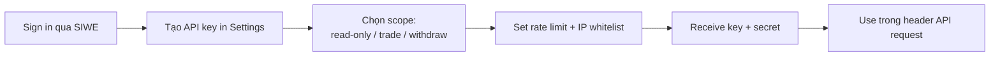

# Bots & API key

Build trading bot, analytics service, market maker tự động.

## Đăng ký API key



1. Sign in app PrediX qua SIWE.
2. **Settings → Developer → API keys** → **Create new key**.
3. Chọn:
   - **Scope** — read-only / trade / full.
   - **IP whitelist** (optional) — chỉ accept request từ IP cụ thể.
   - **Expiry** — 30/90/365 ngày, hoặc no expiry.
4. Receive **API key** + **secret**. Lưu kỹ — secret không hiện lại.

## Authentication

Include header trong mọi request:

```
X-API-Key: pk_live_abc123...
X-API-Signature: <HMAC SHA256 của body với secret>
```

Hoặc cho read-only chỉ cần:
```
Authorization: Bearer pk_live_abc123...
```

## Rate limits

| Tier | Rate limit | Quota | Concurrent | Cost |
|---|---|---|---|---|
| **Free** | 60 req/min | 10k req/day | 5 | $0 |
| **Pro** | 600 req/min | 1M req/day | 50 | $20/month |
| **Enterprise** | Custom | Unlimited | Custom | Contact |

Stake PRX để upgrade tier free → tier cao hơn:
- Stake 1k PRX → 200 req/min
- Stake 10k PRX → Pro tier free
- Stake 100k PRX → Enterprise tier free

## Endpoints cho bots

### Read endpoints

Tất cả endpoint Indexer + BE đều available với API key. Xem [Indexer API](indexer-api.md), [Backend API](backend-api.md).

### Place order via API

```
POST /api/v2/bots/orders

{
  "marketId": "0x...",
  "side": "BUY_YES",
  "type": "limit",       // limit | market
  "price": "0.45",       // required nếu limit
  "amount": "100.00",    // USDC
  "deadline": 1740100000,
  "slippageBps": 50      // optional, market only
}

Response:
{
  "orderId": "...",
  "txHash": "0x...",
  "status": "pending"
}
```

API tự sign và submit tx qua paymaster (sponsor gas). Không cần expose private key.

> **Quan trọng**: API key có scope `trade` mới place được order. Read-only key sẽ reject.

### Cancel order

```
DELETE /api/v2/bots/orders/:orderId
```

### Bulk place

```
POST /api/v2/bots/orders/bulk

{
  "orders": [
    { marketId, side, type, price, amount },
    ...max 50 orders
  ]
}
```

Atomic — all or nothing.

### Position management

```
GET    /api/v2/bots/positions
DELETE /api/v2/bots/positions/:id   # close position (sell market order)
```

## Webhook setup

Push notifications về events:

```
POST /api/v2/webhooks
{
  "url": "https://your-server.com/webhook",
  "events": ["order.filled", "order.cancelled", "market.resolve"],
  "secret": "your-webhook-secret"  # for HMAC verify
}
```

Webhook payload:
```json
{
  "event": "order.filled",
  "timestamp": 1740100000,
  "data": {
    "orderId": "...",
    "marketId": "...",
    "fillPrice": "0.48",
    "fillAmount": "100.0",
    "side": "BUY_YES"
  }
}
```

Verify HMAC trong webhook handler:
```typescript
import { createHmac } from 'crypto';

const sig = req.headers['x-predix-signature'];
const expected = createHmac('sha256', WEBHOOK_SECRET)
  .update(req.rawBody)
  .digest('hex');
if (sig !== expected) return res.status(401).end();
```

## Bot examples

### Market making bot

```typescript
import { PrediXBot } from '@predix/bot-sdk';

const bot = new PrediXBot({
  apiKey: process.env.PREDIX_API_KEY,
  secret: process.env.PREDIX_SECRET,
});

async function makeMarket(marketId: string) {
  const orderbook = await bot.getOrderbook(marketId);
  const mid = (orderbook.bestBid + orderbook.bestAsk) / 2;

  // Cancel existing orders
  await bot.cancelMyOrders(marketId);

  // Place new orders quanh mid
  await bot.bulkPlace([
    { marketId, side: 'BUY_YES', type: 'limit', price: mid - 0.02, amount: '100' },
    { marketId, side: 'SELL_YES', type: 'limit', price: mid + 0.02, amount: '100' },
  ]);
}

setInterval(() => makeMarket('0x...'), 30_000);
```

### Arbitrage bot — split khi YES + NO > $1

```typescript
async function checkArb(marketId: string) {
  const view = await bot.getPriceView(marketId);
  const spread = parseFloat(view.yesPrice) + parseFloat(view.noPrice);

  if (spread > 1.005) {  // > 0.5% above $1
    // Split USDC, sell both
    await bot.split(marketId, '100');
    await bot.placeMarket(marketId, 'SELL_YES', '100');
    await bot.placeMarket(marketId, 'SELL_NO', '100');
    console.log(`Arb profit: ~$${(spread - 1) * 100}`);
  }
}
```

### Calibration scanner

```typescript
async function scanCalibrationOpportunities() {
  const markets = await bot.listMarkets({ status: 'active' });

  for (const m of markets) {
    const myCalibration = await bot.getMyCalibration(m.category);
    const impliedProb = parseFloat(m.yesPrice);

    // Edge nếu cho rằng giá market lệch khỏi true probability
    if (myCalibration.expected[m.category] < impliedProb - 0.05) {
      // Market over-priced YES — sell or buy NO
      await bot.placeMarket(m.id, 'BUY_NO', '50');
    }
  }
}
```

## Best practices

### Idempotency

Mỗi place order nên có `clientOrderId` unique:

```json
POST /api/v2/bots/orders
{
  "clientOrderId": "my-uuid-123",
  ...
}
```

API trả lại order cũ nếu `clientOrderId` đã exist (replay safe).

### Error handling

Retry strategy:
- 5xx error: exponential backoff (1s, 2s, 4s, 8s).
- 429 rate limit: respect `Retry-After` header.
- 4xx other: don't retry, log + investigate.

### Position size

- Don't fully size trade size theo balance — keep buffer cho gas + slippage.
- Cap per-trade size = 5% account balance.

### Monitoring

- Log every order placed + fill.
- Alert nếu PnL drops > 10% trong 1h.
- Health check / heartbeat to your monitoring service.

## Security

### Key storage

- **NEVER** commit API key vào git.
- Store trong env var hoặc secret manager (AWS Secrets Manager, Doppler, Vault).
- Rotate key 90 ngày.
- Use IP whitelist nếu bot run từ server fixed IP.

### Scope minimization

- Bot chỉ trade → dùng `trade` scope, không `full`.
- Analytics chỉ đọc → dùng `read-only`.
- Withdraw scope chỉ cấp cho key đặc biệt + 2FA confirm.

### Audit log

`/api/v2/bots/audit` — list mọi action via your API key. Review weekly.

## Open-source bot templates

[github.com/predix-protocol/bot-templates](https://github.com/predix-protocol/bot-templates):

- `market-maker/` — basic spread market maker (TS).
- `arbitrage/` — split/merge arb (TS).
- `oracle-resolver/` — auto-call resolve cho ChainlinkOracle market (TS).
- `lp-manager/` — auto-rebalance LP positions (TS).
- `scanner-py/` — Python opportunity scanner.

Fork, customize, deploy.

## Support

- API issue: Discord #api-support.
- Bug bounty bot endpoint: [security@predix.app](mailto:security@predix.app).
- Custom enterprise integration: [business@predix.app](mailto:business@predix.app).
