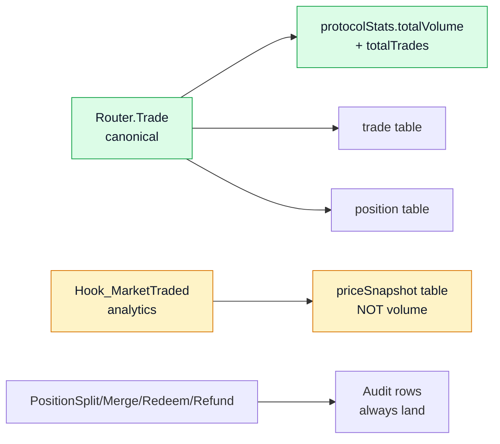

# Events reference

Danh sách event smart contract emit, mapping sang table indexer. Cho bot off-chain, subgraph, monitor.

## Source of truth



- **Canonical trade**: `Router.Trade` — `protocolStats.totalVolume / totalTrades` **chỉ** tăng từ đây.
- **AMM swap analytics**: `Hook_MarketTraded` — priceSnapshot only, không count volume (tránh double-count).
- **Audit rows luôn land**: `PositionSplit`, `PositionMerged`, `TokensRedeemed`, `MarketRefunded` — ghi bất kể user là protocol contract hay EOA.

## Router events

### `Trade`

```solidity
event Trade(
    address indexed trader,
    address indexed recipient,
    bytes32 indexed marketId,
    uint8 tradeType,        // 0=BUY_YES, 1=SELL_YES, 2=BUY_NO, 3=SELL_NO
    uint256 amountIn,
    uint256 amountOut,
    uint256 yesPrice,       // 6 decimals
    uint256 clobFilled,
    uint256 ammFilled
);
```

**Indexer tables**: `trade`, `position` (if recipient ≠ protocol contract), `market.volume`, `market.tradeCount`, `priceSnapshot` (source="router"), `protocolStats`, `user`, `userStats`.

### `DustRefunded`

```solidity
event DustRefunded(address indexed trader, uint256 amount);
```

No-op trong indexer — info đã có trong `Trade`.

### `ClobSkipped`

```solidity
event ClobSkipped(bytes32 indexed marketId, bytes4 selector);
```

Emit khi CLOB revert, Router fall back AMM-only. `selector` = 4-byte custom error để debug.

## Exchange events

### `OrderPlaced`

```solidity
event OrderPlaced(
    uint256 indexed orderId,
    address indexed owner,
    bytes32 indexed marketId,
    uint8 side,
    uint32 price,
    uint128 amount
);
```

Table: `exchangeOrder` (status=PENDING).

### `OrderMatched`

```solidity
event OrderMatched(
    uint256 indexed takerOrderId,
    uint256 indexed makerOrderId,
    bytes32 indexed marketId,
    uint8 matchType,        // 0=COMPLEMENTARY, 1=MINT, 2=MERGE
    uint128 fillAmount,
    uint32 fillPrice
);
```

Tables: `exchangeOrder` (update filled), `orderMatch`, `takerFill`, `position` (non-protocol).

### `OrderCancelled`, `OrderFilled`

Update `exchangeOrder.status`.

## MarketFacet events

### `MarketCreated`

```solidity
event MarketCreated(
    bytes32 indexed marketId,
    address indexed creator,
    string question,
    uint256 endTime,
    address oracle,
    address yesToken,
    address noToken,
    uint256 eventId,
    uint32 redemptionFeeBps
);
```

Tables: `market`, `outcomeToken`, `protocolStats`, `user`.

### `PositionSplit` / `PositionMerged`

```solidity
event PositionSplit(bytes32 indexed marketId, address indexed user, uint256 amount);
event PositionMerged(bytes32 indexed marketId, address indexed user, uint256 amount);
```

Tables: `positionSplit` / `positionMerge` (ALWAYS), `position` (if !isProtocolContract), `market.totalCollateral`, `protocolStats`.

### `MarketResolved`

```solidity
event MarketResolved(bytes32 indexed marketId, bool outcome, uint256 resolvedAt);
```

Tables: `market.isResolved`, `market.outcome`, `position.outcomeAtResolve`, `protocolStats`, `userStats.accuracyScore`.

### `TokensRedeemed`

```solidity
event TokensRedeemed(
    bytes32 indexed marketId,
    address indexed user,
    uint256 winningBurned,
    uint256 losingBurned,
    uint256 payout,
    uint256 fee
);
```

Table: `redemption`.

### `MarketRefunded`

```solidity
event MarketRefunded(
    bytes32 indexed marketId,
    address indexed user,
    uint256 yesBurned,    // == noBurned (pair refund)
    uint256 noBurned,
    uint256 payout
);
```

Table: `refundClaim`.

### `MarketEmergencyResolved`

Tương tự `MarketResolved` + emergency flag.

### `RefundModeEnabled`

Update `market.refundModeActive = true`.

### `PerMarketRedemptionFeeUpdated`

Update `market.perMarketRedemptionFeeBps`, log `feeConfigChange`.

## EventFacet events

```solidity
event EventGroupCreated(uint256 indexed eventId, string name, uint256 endTime, bytes32[] marketIds);
event EventGroupResolved(uint256 indexed eventId, uint8 winningIndex);
event EventRefundModeEnabled(uint256 indexed eventId);
```

Table: `eventGroup`.

## Hook events

### `Hook_PoolRegistered`

```solidity
event Hook_PoolRegistered(bytes32 indexed poolId, bytes32 indexed marketId, bool yesIsCurrency0);
```

Table: `hookPoolBinding` — essential lookup cho filter PoolManager events.

### `Hook_MarketTraded`

```solidity
event Hook_MarketTraded(
    bytes32 indexed marketId,
    address indexed trader,
    uint256 yesPrice,
    uint256 volume,
    bool isBuyYes
);
```

Table: `priceSnapshot` (source="hook_amm"), `market.lastTradeAt`. **KHÔNG** count volume — Router canonical.

### `Hook_PauseStatusChanged`, admin/upgrade events

Tables: `pauseEvent`, `hookAdminChange`, `hookProxyUpgrade`.

## Oracle events

### ManualOracle

```solidity
event OracleReportCreated(bytes32 indexed marketId, bool outcome, address reporter);
event OracleReportRevoked(bytes32 indexed marketId, address operator);
```

Table: `manualOracleReport`.

### ChainlinkOracle

```solidity
event OracleMarketRegistered(bytes32 indexed marketId, address feed, uint256 threshold, bool gte, uint256 snapshotAt);
event OracleMarketResolved(bytes32 indexed marketId, bool outcome);
```

Table: `chainlinkOracleMarket`.

## Diamond admin events

```solidity
// AccessControl
event RoleGranted(bytes32 indexed role, address indexed account, address sender);
event RoleRevoked(bytes32 indexed role, address indexed account, address sender);

// DiamondCut
event DiamondCut(FacetCut[] cuts, address init, bytes data);

// Pausable
event GlobalPaused(address account);
event ModulePaused(bytes32 module, address account);
```

Tables: `roleChange`, `diamondCutLog`, `pauseEvent`.

## OutcomeToken (ERC-20 factory)

```solidity
event Transfer(address indexed from, address indexed to, uint256 value);
event Approval(address indexed owner, address indexed spender, uint256 value);
```

Table: `holder` — canonical balance view. Mỗi market 1 YES + 1 NO token.

## PoolManager (Uniswap v4)

Handler filter by `hookPoolBinding` membership trước:

- `Initialize` → insert `ammPoolState`
- `Swap` → update `sqrtPriceX96`, `liquidity`, `tick`
- `ModifyLiquidity` → update `liquidity += delta`

Events khác (Donate, …) → ignore.

## Usage patterns

### Listen Trade events cho market

```typescript
import { createPublicClient, http } from 'viem';
import { unichain } from 'viem/chains';

const client = createPublicClient({ chain: unichain, transport: http() });

client.watchContractEvent({
  address: ROUTER,
  abi: routerAbi,
  eventName: 'Trade',
  args: { marketId },
  onLogs: (logs) => {
    logs.forEach(log => console.log(log.args));
  },
});
```

### Query historical trades

```typescript
const logs = await client.getContractEvents({
  address: ROUTER,
  abi: routerAbi,
  eventName: 'Trade',
  args: { marketId },
  fromBlock: DEPLOY_BLOCK,
  toBlock: 'latest',
});
```

Hoặc dùng [Indexer REST API](indexer-api.md) cho query history (limit block range của RPC).

### Listen tất cả events một market

```typescript
const blockFilter = await client.createBlockFilter();

setInterval(async () => {
  const logs = await client.getFilterLogs({
    filter: blockFilter,
  });
  const marketLogs = logs.filter(l =>
    l.topics[1] === marketId  // bytes32 indexed
  );
  marketLogs.forEach(processEvent);
}, 2000);
```
