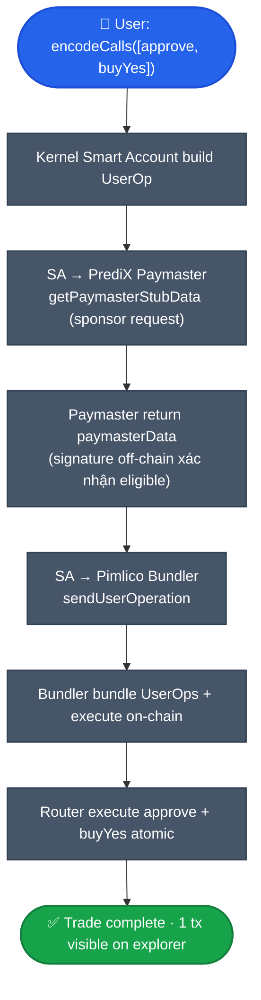

# Tích hợp Router

Router là single entry cho mọi swap. Cho user trade qua app của bạn bằng cách call Router contract.

## ABI

Router address:
- **Testnet** (Unichain Sepolia, live): `0x6698253F38F4A4bbBC4A223309B4E560d83D7ee0`
- **Mainnet** (TBA, sau launch)

Full address list: [Contract addresses](../giao-thuc/architecture.md#contract-addresses).

Core function:

```solidity
function buyYes(
    bytes32 marketId,
    uint256 usdcIn,
    uint256 minYesOut,
    address recipient,
    uint256 maxFills,
    uint256 deadline
) external returns (
    uint256 yesOut,
    uint256 clobFilled,
    uint256 ammFilled
);

function sellYes(
    bytes32 marketId,
    uint256 yesIn,
    uint256 minUsdcOut,
    address recipient,
    uint256 maxFills,
    uint256 deadline
) external returns (
    uint256 usdcOut,
    uint256 clobFilled,
    uint256 ammFilled
);

// buyNo, sellNo đối xứng
```

## Quote trước khi swap

```solidity
function quoteBuyYesExactIn(
    bytes32 marketId,
    uint256 usdcIn
) external view returns (
    uint256 expectedYesOut,
    uint256 priceImpactBps
);
```

View function, free. Dùng để show user preview trước khi ký.

## Viem / TypeScript example

```typescript
import { createPublicClient, createWalletClient, custom, http, parseUnits } from 'viem';
import { unichainSepolia } from 'viem/chains';  // testnet hiện tại
// import { unichain } from 'viem/chains';      // mainnet sau launch
import { routerAbi } from '@predix/abi';

const publicClient = createPublicClient({
  chain: unichainSepolia,
  transport: http('https://sepolia.unichain.org'),
});

const walletClient = createWalletClient({
  chain: unichainSepolia,
  transport: custom(window.ethereum),
});

// Testnet Router (mainnet TBA)
const ROUTER = '0x6698253F38F4A4bbBC4A223309B4E560d83D7ee0';
const marketId = '0x000000...0001'; // 32-byte hex

// 1. Quote
const [expectedOut, priceImpactBps] = await publicClient.readContract({
  address: ROUTER,
  abi: routerAbi,
  functionName: 'quoteBuyYesExactIn',
  args: [marketId, parseUnits('100', 6)], // 100 USDC
});

console.log(`Expected: ${expectedOut} YES, impact: ${priceImpactBps/100}%`);

// 2. Compute minOut với 0.5% slippage
const minOut = (expectedOut * 995n) / 1000n;

// 3. Execute (user ký tx)
const [account] = await walletClient.getAddresses();
const hash = await walletClient.writeContract({
  address: ROUTER,
  abi: routerAbi,
  functionName: 'buyYes',
  args: [
    marketId,
    parseUnits('100', 6),     // usdcIn
    minOut,                    // minYesOut
    account,                   // recipient
    10n,                       // maxFills (CLOB depth)
    BigInt(Math.floor(Date.now()/1000) + 300), // deadline 5min
  ],
  account,
});

const receipt = await publicClient.waitForTransactionReceipt({ hash });
console.log('Trade complete:', receipt.transactionHash);
```

## Approve USDC

Router cần pull USDC từ user qua **Permit2** (gasless approve).

### Option 1: ERC-20 approve + Permit2 pull

```typescript
// 1. User approve USDC cho Permit2 (one-time per token)
await walletClient.writeContract({
  address: USDC,
  abi: erc20Abi,
  functionName: 'approve',
  args: [PERMIT2, MAX_UINT256],
});

// 2. Permit2 sign off-chain, include trong Router call
// Xem @uniswap/permit2-sdk docs chi tiết encode
```

### Option 2: Trực tiếp approve Router (ít recommend — không gasless)

```typescript
await walletClient.writeContract({
  address: USDC,
  abi: erc20Abi,
  functionName: 'approve',
  args: [ROUTER, MAX_UINT256],
});
```

## Permit2 signed approve (giảm gas)

Thay vì 2 tx (approve + swap), user ký Permit2 offline rồi include signature vào 1 tx swap:

```typescript
import { SignatureTransfer } from '@uniswap/permit2-sdk';

const permit = SignatureTransfer.createPermit(
  USDC, amount, spender: ROUTER, deadline
);
const signature = await walletClient.signTypedData(permit);

await walletClient.writeContract({
  address: ROUTER,
  abi: routerAbi,
  functionName: 'buyYesWithPermit',
  args: [marketId, usdcIn, minOut, recipient, permit, signature, ...],
});
```

Chi tiết Permit2: [docs.uniswap.org/contracts/permit2](https://docs.uniswap.org/contracts/permit2/overview).

## Encode marketId

Market ID là **bytes32 hex** (64 chars sau `0x`). Indexer và FE dùng **decimal string** cho URL.

```typescript
// Decimal → hex (BE wire format → contract input)
const marketIdHex = '0x' + BigInt(decimalString).toString(16).padStart(64, '0');

// Ngược lại
const decimal = BigInt(marketIdHex).toString();
```

## Handle errors

Router revert với custom errors. Decode bằng 4-byte selector:

```solidity
error SlippageExceeded(uint256 actual, uint256 min);
error DeadlineExpired();
error MarketPaused();
error MarketNotActive();
error InsufficientLiquidity(uint256 requested, uint256 available);
error FinalizeBalanceNonZero(); // bug internal, report nếu gặp
```

Trong viem:

```typescript
try {
  await walletClient.writeContract({ ... });
} catch (err: any) {
  if (err.cause?.data?.errorName === 'SlippageExceeded') {
    // handle slippage
  }
}
```

## Event emit

Sau khi swap, Router emit:

```solidity
event Trade(
    address indexed trader,
    address indexed recipient,
    bytes32 indexed marketId,
    uint8 tradeType,        // 0=BUY_YES, 1=SELL_YES, 2=BUY_NO, 3=SELL_NO
    uint256 amountIn,
    uint256 amountOut,
    uint256 yesPrice,       // 6 decimals
    uint256 clobFilled,
    uint256 ammFilled
);
```

Event này là **canonical source** cho indexer. Bạn listen để update UI sau khi tx confirm.

## Batch với Smart Account



```typescript
import { createKernelClient } from '@zerodev/sdk';

const kernelClient = createKernelClient({...});

const calls = [
  {
    to: USDC,
    data: encodeFunctionData({
      abi: erc20Abi, functionName: 'approve', args: [ROUTER, MAX]
    }),
  },
  {
    to: ROUTER,
    data: encodeFunctionData({
      abi: routerAbi, functionName: 'buyYes', args: [...]
    }),
  },
];

const userOpHash = await kernelClient.sendUserOperation({
  callData: await kernelClient.encodeCalls(calls),
});

const txHash = await kernelClient.waitForUserOperationReceipt({
  hash: userOpHash,
});
```

Gas paymaster sponsor nếu user đã session SIWE qua app PrediX.

## AMM-only hoặc CLOB-only

Router luôn hybrid. Nếu muốn:
- **AMM-only** (skip CLOB): call UniversalRouter của Uniswap v4 trực tiếp.
- **CLOB-only** (skip AMM): call `PrediXExchange.fillMarketOrder` hoặc `placeOrder`.

Mặc định nên dùng `PrediXRouter` — tối ưu giá hybrid.

## Test trên local fork

```bash
# Anvil fork Unichain Sepolia (testnet hiện tại)
anvil --fork-url https://sepolia.unichain.org

# Hoặc fork mainnet sau launch
# anvil --fork-url https://mainnet.unichain.org

# Deploy test contract hoặc direct call
forge script test/Integration.s.sol --fork-url http://localhost:8545
```

Examples đầy đủ: [github.com/predix-protocol/integration-examples](https://github.com/predix-protocol/integration-examples).

## Common patterns

### Auto-slippage

```typescript
async function smartSlippage(usdcIn: bigint): Promise<bigint> {
  // Try 0.5% first
  let slippage = 50n; // bps

  while (slippage <= 500n) {
    try {
      const [expected] = await quoteBuyYes(marketId, usdcIn);
      const minOut = (expected * (10000n - slippage)) / 10000n;
      return minOut;
    } catch (err) {
      slippage += 50n;
    }
  }
  throw new Error('Liquidity too thin');
}
```

### Multi-market batch

```typescript
const trades = [
  { marketId: 'm1', usdcIn: 100n },
  { marketId: 'm2', usdcIn: 50n },
];

const calls = trades.map(t => ({
  to: ROUTER,
  data: encodeFunctionData({
    abi: routerAbi,
    functionName: 'buyYes',
    args: [t.marketId, t.usdcIn, ...],
  }),
}));

await kernelClient.sendUserOperation({
  callData: await kernelClient.encodeCalls(calls),
});
```

1 UserOp execute N trades atomically.
