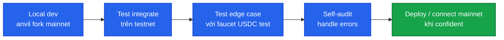

# Testnet info

PrediX có deploy testnet trên **Unichain Sepolia** cho dev integrate trước khi mainnet launch.

## Network

| | |
|---|---|
| **Network** | Unichain Sepolia |
| **Chain ID** | `1301` |
| **RPC public** | `https://sepolia.unichain.org` |
| **Explorer** | [sepolia.uniscan.xyz](https://sepolia.uniscan.xyz) |
| **Block time** | ~1s |

Add to MetaMask:

```javascript
await window.ethereum.request({
  method: 'wallet_addEthereumChain',
  params: [{
    chainId: '0x515', // 1301 hex
    chainName: 'Unichain Sepolia',
    rpcUrls: ['https://sepolia.unichain.org'],
    blockExplorerUrls: ['https://sepolia.uniscan.xyz'],
    nativeCurrency: { name: 'Ether', symbol: 'ETH', decimals: 18 },
  }],
});
```

## Faucet

PrediX có faucet relayed qua backend:

- **0.0005 ETH** Sepolia (cho gas EOA)
- **10,000 test-USDC**
- **Cooldown**: 1 lần / 24 giờ / ví

### Cách claim

#### Via app

1. Connect ví trên `app.testnet.predix.app`.
2. UI show banner faucet → click **Claim**.
3. Receive sau ~5s.

#### Via API

```bash
curl -X POST https://api.testnet.predix.app/v2/faucet \
  -H "Content-Type: application/json" \
  -d '{"address": "0x..."}'
```

Response:
```json
{
  "txHash": "0x...",
  "ethAmount": "0.0005",
  "usdcAmount": "10000",
  "nextClaimAt": 1740186400
}
```

#### Check cooldown

```
GET /v2/faucet/cooldown?address=0x...
```

## API endpoints (testnet)

| | URL |
|---|---|
| Indexer API | TBA — coordinates qua Discord #testnet-access |
| Backend API | TBA |
| WebSocket | TBA |

Schema và endpoint shape đồng nhất với mainnet — chuyển từ testnet sang mainnet chỉ đổi base URL.

## Contract addresses (testnet)

Latest deploy. Sync via API:

```bash
curl https://api.testnet.predix.app/v2/addresses
```

Response sample:
```json
{
  "diamond": "0x7689E9bf4b2107E2Fd0f1DDA940E2f1143434E39",
  "router": "0x6698253F38F4A4bbBC4A223309B4E560d83D7ee0",
  "exchange": "0xE425698e1835DA0A6086eEB85137A36275993F41",
  "hookProxy": "0x89830AC92Ff936f39C2D11D1fd821c6f977fAAE0",
  "manualOracle": "0x7887f07AF62CE0a4Cf836136135a61b59c36A9d2",
  "paymaster": "0x1637a7eB463b1b12906feF71eF23B76181340Cb7",
  "faucet": "0x7beD6B3D8397Bc9F77626f84D64BED8894C27350",
  "usdc": "0x2D56777Af1B52034068Af6864741a161dEE613Ac",
  "poolManager": "0x00b036b58a818b1bc34d502d3fe730db729e62ac",
  "permit2": "0x000000000022D473030F116dDEE9F6B43aC78BA3",
  "deployBlock": 49799033
}
```

## Sự khác biệt testnet vs mainnet

| | Testnet | Mainnet |
|---|---|---|
| USDC | Test-USDC từ faucet | Native USDC trên Unichain |
| ETH gas | Sepolia ETH (faucet) | Real ETH |
| PRX token | Chưa deploy | TBA sau TGE |
| Staking | Disabled | Live |
| Chainlink oracle | Disabled (no feed Sepolia) | Live |
| Bug bounty | Limited | Full $50k-500k |
| Persistence | Có thể reset trước mainnet | Permanent |

## Limits testnet

- **Faucet rate**: 1 claim / 24h / address.
- **Max test-USDC per address**: ~50,000 USDC (claim multiple lần qua nhiều ngày).
- **API rate limit**: cùng tier free mainnet (60 req/min/IP).

## Develop flow



### Recommended sequence

1. **Local fork**: `anvil --fork-url https://mainnet.unichain.org` cho unit test.
2. **Testnet integrate**: deploy bot/app trên Sepolia, test 1-2 tuần.
3. **Edge case**: trigger fail scenarios (slippage, market pause, oracle revert).
4. **Mainnet**: switch base URL + RPC, smoke test với amount nhỏ.

## Reset notice

Testnet **có thể reset** trong các trường hợp:

- Major contract upgrade incompatible với storage cũ.
- Pre-mainnet final cleanup.
- Critical bug fix yêu cầu fresh state.

Reset announce trước **2 tuần** qua Discord + Twitter. State cũ không migrate, balance reset về 0.

## Bug report testnet

- Bug logic / data: Discord #testnet-bugs.
- Bug bảo mật: cùng channel mainnet — [security@predix.app](mailto:security@predix.app). Bounty thấp hơn (10-20% mainnet rate) vì testnet không có real funds, nhưng vẫn payout.

## Get testnet access

API endpoint testnet không public hoàn toàn để chống abuse:

1. Join Discord.
2. Channel #testnet-access — share use case + GitHub.
3. Receive testnet API endpoint + key.

Free cho mọi use case dev hợp pháp (bot, integration test, learn).

## Dump testnet trước mainnet

Khi mainnet launch:

- Testnet endpoint vẫn live ít nhất 6 tháng cho dev test mainnet contract changes.
- Sau 6 tháng: testnet có thể migrate sang Sepolia mới hoặc deprecated, announce trước.

Backup data của bạn trước nếu cần:
- Export portfolio / order history qua API.
- Save contract events qua RPC `getLogs`.

## Mainnet readiness checklist

Trước switch mainnet, kiểm tra:

- [ ] Tested all happy paths trên testnet.
- [ ] Tested error handling (slippage, paused, oracle fail).
- [ ] API key scope minimized.
- [ ] Webhook + monitoring setup.
- [ ] Gas estimation buffer.
- [ ] Emergency stop button trong bot.
- [ ] Funded mainnet wallet với buffer.
- [ ] Reviewed audit reports + know risks.
- [ ] Liability + legal compliance khu vực bạn.
