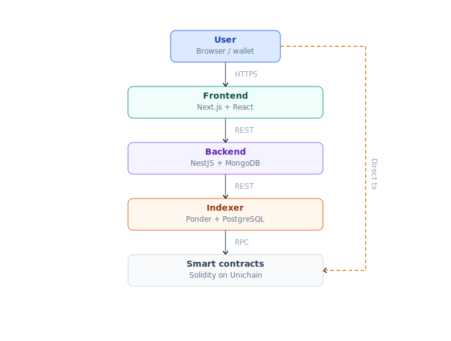
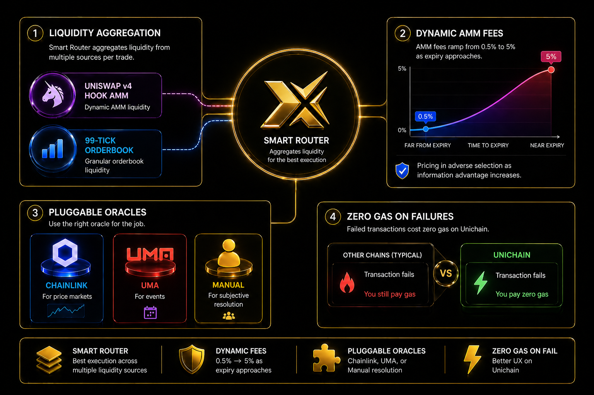

# Giao thức

Kiến trúc kỹ thuật của PrediX. Cho advanced user, researcher, developer muốn hiểu sâu.

## 4 lớp

Data flow **một chiều**: SC emit events → Indexer sync → BE serialize → FE render. BE không ghi ngược Indexer/SC. User ký tx trực tiếp với SC qua ví — không qua BE.

## Nguyên tắc thiết kế

1. **Non-custodial** — user luôn giữ private key. Protocol không giữ tiền trung gian.
2. **Router stateless** — `balanceOf(router) == 0` enforce on-chain sau mỗi call.
3. **Composable ERC-20** — outcome token là ERC-20 standard, plug được vào DeFi stack.
4. **Separation of concerns** — layer nào việc nấy, không cross-boundary import.
5. **Fail-loud** — không silent fallback. Bất biến sai → revert / throw.
6. **Upgrade qua timelock 48h** — không emergency bypass.

## 4 trụ cột kỹ thuật

## Đọc theo thứ tự

1. [Architecture & contracts](architecture.md) — packages, Diamond + facets, Hook, Exchange, Router, Paymaster, deployed addresses (testnet + mainnet)
2. [Oracle](oracle.md) — Manual, Chainlink, UMA, Committee
3. [Bảo mật & timelock](bao-mat.md) — Invariants, audit posture, 48h delay, incident response

Muốn integrate code → [Developers](../developers/README.md).
