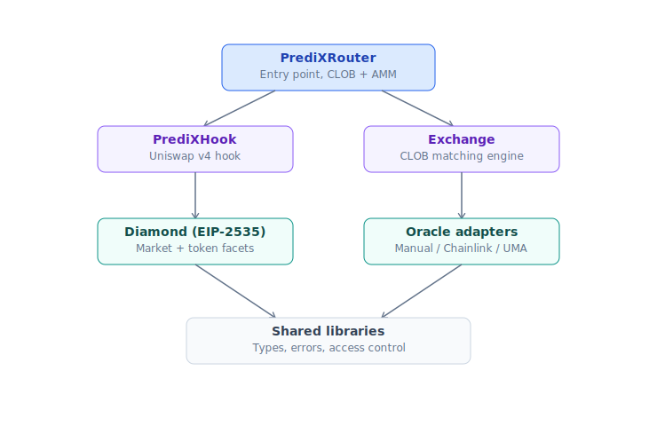
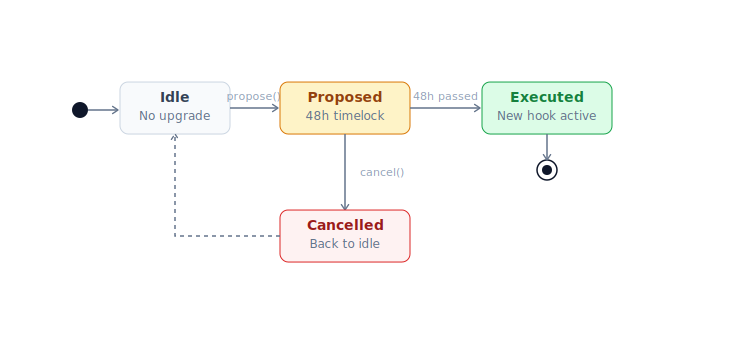

# Architecture & contracts

Solidity `0.8.30`, Foundry, EVM cancun (EIP-1153 transient storage). 7 package, monorepo. Cuối page: deployed addresses (testnet + mainnet TBA).

## Dependency graph



Rule: cross-package import **chỉ** qua `@predix/shared/interfaces/`. Không import implementation của package khác.

## Diamond (EIP-2535)

Single proxy `PrediX Diamond` với 6 facet. Mỗi facet upgrade được riêng.

| Facet | Chức năng |
|---|---|
| **MarketFacet** | createMarket · split · merge · resolve · redeem · emergencyResolve · refundMode · sweep |
| **EventFacet** | createEvent · resolveEvent · groupSplit · groupMerge · refundMode event |
| **AccessControlFacet** | grantRole · revokeRole · 6 role: DEFAULT_ADMIN · OPERATOR · PAUSER · CUT_EXECUTOR · CREATOR · REGISTRAR |
| **PausableFacet** | pause(module) · unpause(module) — pause theo module: MARKET · DIAMOND |
| **DiamondCutFacet** | diamondCut — thêm/sửa/xoá facet, gated bởi `CUT_EXECUTOR_ROLE` qua TimelockController 48h |
| **DiamondLoupeFacet** | facets() · facetAddresses() · facetFunctionSelectors() — introspection |

**Storage**: Diamond storage pattern. Mỗi facet có struct `Layout` tại slot `keccak256("predix.storage.<module>")`. **Append-only**, không reorder/remove field.

## Hook (Uniswap v4)

**Contract**: `PrediXHookV2` (implementation) + `PrediXHookProxyV2` (ERC1967 proxy).

**Callbacks** set theo permissions flag trong hook address (salt-mined):

| Callback | Chức năng |
|---|---|
| `beforeInitialize` | Set permission flag + init pool state |
| `beforeAddLiquidity` | Chặn add LP nếu market resolved / refunded |
| `beforeRemoveLiquidity` | Track pool registration (hookPoolBinding) |
| `beforeSwap` | Apply dynamic fee + verify anti-sandwich identity (EIP-1153 transient storage) |
| `afterSwap` | No-op |
| `beforeDonate` | Chặn donate sau endTime (chống brute-force payout attack) |

**Key functions**:
- `registerMarketPool(marketId, poolKey, yesIsCurrency0)` — bind market ↔ v4 pool, verify canonical PoolKey (lpFee + tickSpacing match)
- `commitSwapIdentityFor(...)` — Router commit identity trước swap, Hook verify trong `beforeSwap`
- `proposeTrustedRouter` / `executeTrustedRouter` — 2-step rotate Router (48h timelock)

### Hook proxy upgrade — 48h monotonic timelock



- `proposeUpgrade(newImpl)` → `readyAt = now + timelockDuration` (min 48h).
- Chờ ≥ timelockDuration → `executeUpgrade(newImpl, sig, readyAt)`.
- `timelockDuration` chỉ **tăng được** (monotonic), không giảm xuống dưới 48h.

## Exchange (CLOB)

**Contract**: `PrediXExchange`.

### Order struct (packed)

```solidity
struct Order {
  address owner;       // 20 bytes
  uint40 timestamp;    // 5 bytes
  uint8 side;          // BUY_YES/SELL_YES/BUY_NO/SELL_NO
  bool cancelled;
  bytes32 marketId;
  uint32 price;        // fixed-point 6 decimals, range 10_000-990_000
  uint128 amount;
  uint128 filled;
  uint256 depositLocked;
}
```

### Entry points

- `placeOrder(order)` + auto-match loop
- `cancelOrder(orderId)` — owner only
- `fillMarketOrder(marketId, side, amountIn, maxFills)` — permissionless, `taker == msg.sender` gate

### 3 match types

- **Complementary**: BUY_YES ↔ SELL_YES cùng market.
- **Mint** (synthetic): BUY_YES + BUY_NO ≥ $1. Diamond mint cặp, đưa YES cho buyer YES, NO cho buyer NO.
- **Merge** (synthetic): SELL_YES + SELL_NO ≤ $1. Diamond gom + burn, trả USDC.

Shared math library `MatchMath` đảm bảo preview/execute 1-wei parity.

## Router (stateless aggregator)

**Contract**: `PrediXRouter`. Bất biến `balanceOf(router) == 0` sau mỗi public call.

### Entry points (exact-in)

```solidity
buyYes(marketId, usdcIn, minYesOut, recipient, maxFills, deadline)
sellYes(marketId, yesIn, minUsdcOut, ...)
buyNo(...)
sellNo(...)
```

### Waterfall

1. Pull USDC từ Permit2.
2. **CLOB leg**: `exchange.fillMarketOrder(...)` — try ăn limit orders.
   - CLOB revert → emit `ClobSkipped(reason)` event, fall back AMM full.
3. **AMM leg**: `hook.commitSwapIdentityFor(...)` → `poolManager.swap(...)` → `unlockCallback(...)` extract amount.
4. **Virtual-NO two-pass**: nếu pool thiếu depth → reduce size với 3% safety margin.
5. **Cleanup**: refund dust, assert router balance = 0 (revert `FinalizeBalanceNonZero` nếu sai).

## Oracle (overview)

**Contracts**: `ManualOracle` + `ChainlinkOracle`. Plugin architecture — thêm oracle mới = deploy adapter, `approveOracle(addr)`. Detail per-source: [Oracle](oracle.md).

## Paymaster (ERC-4337)

**Contract**: `PrediXPaymaster`. Sponsor gas qua EntryPoint v0.7.

- Owner = Gnosis Safe 2-of-3 (mainnet).
- Signer off-chain (BE) ký verify UserOp eligibility.
- Policy: sponsor cho user đủ điều kiện chương trình (xem [Cấu trúc fee](../khai-niem/phi.md#gas)).

## Quality gates

- **Compile**: `forge build`, EVM cancun, `via_ir=true`, `optimizer_runs=200`, `bytecode_hash=none`.
- **Test**: `forge test` — unit + fuzz + invariant.
- **7 invariants critical** (chi tiết [Bảo mật](bao-mat.md)).
- **Format**: `forge fmt --check`.
- **Static analysis**: Slither 0 critical.

## Upgrade model

| Component | Mechanism | Delay |
|---|---|---|
| Diamond facets | `diamondCut` via `CUT_EXECUTOR_ROLE` (TimelockController) | 48h |
| Hook implementation | `propose/executeUpgrade` qua ERC1967 proxy | 48h monotonic |
| Oracle adapter | `approveOracle` instant (add), `revokeOracle` instant (remove cho market mới) | 0h |
| Exchange / Router | **Immutable**. Deploy mới, migrate off-chain | N/A |

Exchange và Router không có proxy. Thay đổi = redeploy + migrate (one-time event). Trade-off: simpler + immutable hơn proxy.

---

## Contract addresses

PrediX hiện ở **testnet beta** (deploy 2026-04-20). Mainnet sẽ deploy sau external audit hoàn tất — addresses fill khi có.

### Core PrediX

| Contract | Testnet (Unichain Sepolia, chain `1301`) | Mainnet (Unichain, chain `130`) |
|---|---|---|
| **Diamond** | `0x7689E9bf4b2107E2Fd0f1DDA940E2f1143434E39` | TBA |
| **Hook (proxy)** | `0x89830AC92Ff936f39C2D11D1fd821c6f977fAAE0` | TBA |
| **Hook (impl)** | `0x0dcB4624588316d9a8Dd7868EeFBF07532c29E02` | TBA |
| **Exchange** | `0xE425698e1835DA0A6086eEB85137A36275993F41` | TBA |
| **Router** | `0x6698253F38F4A4bbBC4A223309B4E560d83D7ee0` | TBA |
| **ManualOracle** | `0x7887f07AF62CE0a4Cf836136135a61b59c36A9d2` | TBA |
| **ChainlinkOracle** | Disabled (no feed Sepolia) | TBA |
| **TimelockController** | `0x578D2a308BB0aa5d30E6BC08A7975ccA7e88af61` | TBA |
| **Paymaster** | `0x1637a7eB463b1b12906feF71eF23B76181340Cb7` | TBA |
| **Faucet (relayed)** | `0x7beD6B3D8397Bc9F77626f84D64BED8894C27350` | N/A |

### Diamond facets

| Facet | Testnet | Mainnet |
|---|---|---|
| DiamondCutFacet | `0xBD5Af6FAdD6B2e3bd5A84B7fD27F34a6Dd0cAc42` | TBA |
| DiamondLoupeFacet | `0x61704bdFBC5c0D2995781E7288FDB36C33AC3F31` | TBA |
| AccessControlFacet | `0xfBA0e94Bd45aaE8256e42d95f9920267b54E63b2` | TBA |
| PausableFacet | `0x4b025374A920fE11285F5e823Be348F3a04f35A9` | TBA |
| MarketFacet | `0xDa9e084439c4C6232ad2ceD8AFdbCb06fAd79BE4` | TBA |
| EventFacet | `0xC28Af5a51424af22eD6d1EF444B1b1Dcd8406822` | TBA |

### External / infrastructure

| Contract | Testnet | Mainnet |
|---|---|---|
| **USDC** | `0x2D56777Af1B52034068Af6864741a161dEE613Ac` (test-USDC) | TBA |
| **PRX token** | Chưa deploy | TBA (mint sau TGE) |
| **Staking Vault** | Chưa deploy | TBA |
| **vePRX** | Chưa deploy | TBA |
| **Uniswap v4 PoolManager** | `0x00b036b58a818b1bc34d502d3fe730db729e62ac` | TBA |
| **Permit2** | `0x000000000022D473030F116dDEE9F6B43aC78BA3` | `0x000000000022D473030F116dDEE9F6B43aC78BA3` |
| **EntryPoint v0.7** | `0x0000000071727De22E5E9d8BAf0edAc6f37da032` | `0x0000000071727De22E5E9d8BAf0edAc6f37da032` |

> Permit2 + EntryPoint là canonical addresses — giống nhau across mọi chain.

### Chain config

| | Testnet | Mainnet |
|---|---|---|
| **Chain ID** | `1301` | `130` |
| **RPC public** | `https://sepolia.unichain.org` | `https://mainnet.unichain.org` |
| **Explorer** | [sepolia.uniscan.xyz](https://sepolia.uniscan.xyz) | [uniscan.xyz](https://uniscan.xyz) |
| **Block time** | ~1s | ~1s |
| **Finality** | ~12-15 min (L2) | ~12-15 min (L2) |

### Governance addresses

> **Testnet shortcut**: Mọi role testnet collapse vào 1 EOA cho dev test nhanh. Mainnet sẽ phân tách rõ với Gnosis Safe multisig.

| Role | Testnet (1 EOA collapse) | Mainnet setup |
|---|---|---|
| **MULTISIG_ADMIN** | `0x0eC2bFb36BB59C736d7b770eacaFAa43a184De34` | Gnosis Safe 3-of-5, addr TBA |
| **OPERATOR** | same | Gnosis Safe 2-of-3, addr TBA |
| **PAUSER** | same | Gnosis Safe 2-of-3, addr TBA |
| **REPORTER** (oracle) | same | Multisig 3/5, addr TBA |
| **REGISTRAR** | same | Admin multisig, addr TBA |
| **FEE_RECIPIENT** | same | Treasury Safe, addr TBA |
| **CUT_EXECUTOR** | `0x578D2a308BB0aa5d30E6BC08A7975ccA7e88af61` (TimelockController testnet) | TimelockController mainnet, addr TBA, delay 48h |

### Sync với code

App + SDK đồng bộ addresses từ on-chain registry. Không hardcode trong client code.

```javascript
const addresses = await fetch('https://api.predix.app/v2/addresses?chain=mainnet').then(r => r.json());
// hoặc chain=testnet cho Unichain Sepolia
```

### Verify source code

Mọi contract source verified trên Uniscan:

```
https://sepolia.uniscan.xyz/address/<ADDRESS>#code   # testnet
https://uniscan.xyz/address/<ADDRESS>#code            # mainnet (sau deploy)
```

### ABI files

ABI public ở:
- npm: `@predix/abi` (TBA)
- GitHub: `github.com/predix-protocol/abi`
- Direct: `https://api.predix.app/v2/abi/<contract>`

Chi tiết integrate: [Tích hợp Router](../developers/router-integration.md).

### Multi-chain (TBA)

Phase 3 — deploy multi-chain (Base / Arbitrum / Optimism / Polygon) qua bridge (Wormhole / LayerZero). Detail trong roadmap.

Cho dev integrate trước mainnet, xem [Testnet info](../developers/testnet.md).
