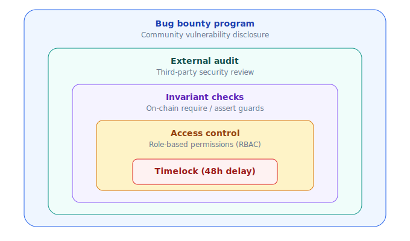
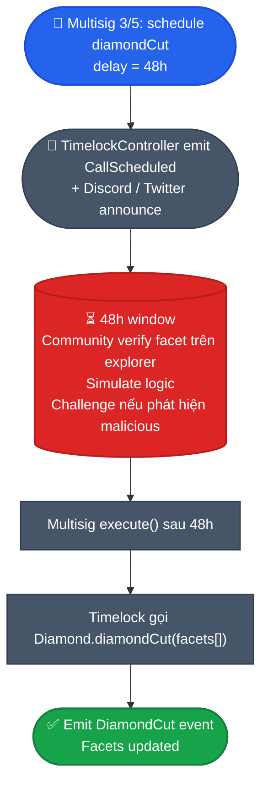
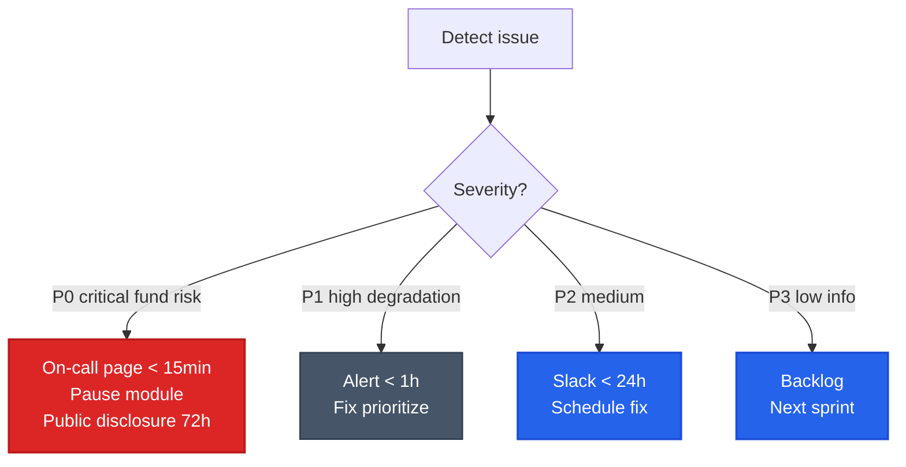

# Bảo mật & timelock

PrediX defense-in-depth. Không "magic" — nhiều lớp, mỗi lớp 1 việc đơn giản verify được.

## 5 lớp phòng thủ



## 7 invariants hard-enforce

| # | Invariant | Mô tả | Enforce |
|---|---|---|---|
| INV-1 | Collateral solvency | `YES.totalSupply == NO.totalSupply == market.totalCollateral` | Diamond mint/burn atomic |
| INV-2 | Exchange solvency | `Σ order.depositLocked == USDC.balanceOf(exchange) + Σ token.balanceOf(exchange)` | Exchange invariant test fuzz |
| INV-3 | Router non-custody | `balanceOf(router) == 0` sau mỗi public call | Router `FinalizeBalanceNonZero` revert |
| INV-4 | Redemption fee bound | `effectiveRedemptionFeeBps ≤ 1500` (15% cap) | MarketFacet require |
| INV-5 | Hook identity commit | `beforeSwap` require identity commit via EIP-1153 | Hook verify transient storage |
| INV-6 | Resolution monotonicity | `isResolved` set 1 lần, không revert | MarketFacet require |
| INV-7 | Outcome token supply | Chỉ Diamond mint/burn outcome token | OutcomeToken `onlyFactory` |

Invariant fuzz 10,000+ runs trong CI. Fail → block merge.

## Audit posture

### External audits

External audit từ industry-leading firms:

- **Spearbit** — comprehensive review
- **Trail of Bits** — security-focused
- **OpenZeppelin** — standard library expert
- **Zellic** — formal verification

Reports public ở: [Audit reports](https://docs.predix.app/audits) (link TBA sau audit complete).

### Internal review

Continuous internal review:

- Manual code review per PR.
- Static analysis (Slither, Mythril).
- Fuzz testing in CI.
- Differential testing vs reference implementation.

### Audit cadence

- **Pre-mainnet**: 2 round full audit từ ≥ 2 firm khác nhau.
- **Major upgrade**: 1 round audit + bug bounty intensive.
- **Annual review**: Refresh audit mỗi năm.

## Timelock — 48h delay

Mọi upgrade có blast radius đi qua timelock 48h.

### Diamond facet upgrade



`CUT_EXECUTOR_ROLE` = **chỉ TimelockController contract**. Không EOA nào bypass.

### Hook proxy upgrade

Tương tự Diamond nhưng contract riêng (ERC1967 proxy):

```solidity
proposeUpgrade(newImpl) → readyAt = now + timelockDuration
// timelockDuration ≥ 48h min, monotonic (chỉ tăng được)
// ...48h chờ...
executeUpgrade(newImpl, sig, readyAt)
  require(readyAt <= now)
  _implementation = newImpl
```

### Tại sao 48h

- Đủ cho community APAC + EU + US thấy announcement (vùng nào cũng có vài giờ thức kiểm tra).
- Window 24h thường bị miss vì chênh lệch múi giờ + cuối tuần.
- Trade-off: emergency fix chậm. Mitigate: bug bounty + audit pre-deploy + insurance fund.

### Không thể bypass

- **Không có emergency upgrade path** cho admin.
- **Cần rollback** → deploy contract mới + migrate (user action).
- `timelockDuration` monotonic → không giảm 48h → 1h để rush.

## Bug bounty

Range theo severity:

| Severity | Reward USDC | Ví dụ |
|---|---|---|
| **Critical** | $50k - $500k | Drain funds, break INV-1 solvency |
| **High** | $10k - $50k | Bypass timelock, retroactive fee |
| **Medium** | $1k - $10k | DoS, griefing |
| **Low** | $100 - $1k | Event mismatched, minor UI |

Payout từ treasury. Contact: [security@predix.app](mailto:security@predix.app).

### Safe harbor

Good-faith researcher có safe harbor — không bị kiện pháp lý nếu:

- Disclose private trước public.
- Không drain funds ngoài POC amount (< $1k).
- Không store / share user data.
- Respect 90-day responsible disclosure window.

### Out of scope

- DoS không gây mất tiền (UI lag, RPC overload).
- Theoretical attack không reproducible.
- Issue đã known + đang fix.
- Third-party dependency (e.g. Chainlink down) — flag tới party đó.

## Incident response

### Severity tiers



### P0 response flow

1. **Detect** — Prometheus alert / user report / bug bounty submission.
2. **Triage** — verify exploit within 30 min. Team Discord emergency channel.
3. **Contain** — Pause module (`PausableFacet.pause(MARKET)`) to stop bleeding.
4. **Fix** — patch code, audit fix internally.
5. **Deploy** — timelock 48h (không bypass) HOẶC config fix instant (oracle revoke).
6. **Postmortem** — public disclosure trong 72h, blog post, root cause analysis.

## Monitoring stack

| Tool | Coverage |
|---|---|
| **Prometheus** | Latency, error rate, indexer lag, circuit breaker state |
| **Datadog** | Threshold alerting on revert rate, contract state anomaly |
| **Forta / Tenderly** | On-chain watcher: diamondCut scheduled, hook upgrade, oracle revoke, unusual volume spike |
| **Custom alerts** | Router balance ≠ 0 (impossible but monitor), invariant violation |
| **Dune dashboard** | Public: TVL, volume, user count, pool depth per market |

## Non-negotiable rules

- **Không** admin emergency withdraw từ Exchange / Router / Pool.
- **Không** pausable cho withdraw paths (user luôn rút token mình).
- **Không** blacklist user protocol-level. Geo-block chỉ FE level theo compliance.
- **Không** upgrade tx path mà không timelock — mọi state-changing admin action đi qua 48h.

## Insurance fund (Phase 2 — TBA)

Top-up từ:
- 5% staker yield.
- 5% treasury budget.

Coverage:
- Partial reimbursement nếu contract exploit.
- Payout chỉ qua governance vote (vePRX supermajority).

Smart contract immutable, locked vault.

## Tham khảo industry

- Consensys Smart Contract Best Practices
- SCSVS — Smart Contract Security Verification Standard
- SWC Registry (Smart Contract Weakness Classification)
- Trail of Bits — Building Secure Contracts
- Secureum
- Code4rena, Sherlock contest writeups
