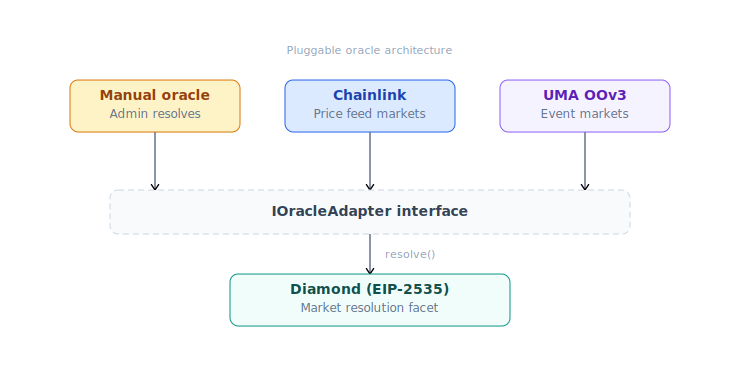
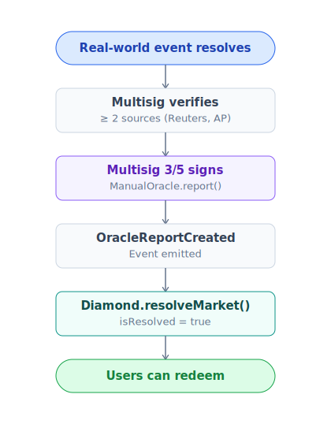
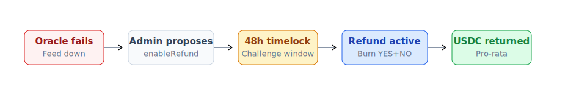

# Oracle

Oracle là layer report kết quả sự kiện on-chain. PrediX dùng pluggable architecture — nhiều loại oracle cùng tồn tại.

## Vấn đề cốt lõi

Smart contract không thể tự biết:
- "Argentina đã thắng FIFA WC chưa?"
- "BTC giá $100k đã vượt chưa?"
- "Bầu cử Mỹ 2028 ai thắng?"

Cần **nguồn ngoài** đưa data on-chain. Oracle sai = market resolve sai = user mất tiền.

## 4 phases, 4 loại oracle



## ChainlinkOracle

Tự động, permissionless.


**Use case**: Price-threshold market (BTC, ETH, asset prices, FX rates).

**Strict checks**:
- Round adjacency — đảm bảo dùng đúng round at-snapshot, không stale, không skip.
- L2 sequencer uptime — không resolve trong grace period sau outage (avoid bad data).
- Feed staleness threshold — reject nếu round quá cũ vs realtime.

## ManualOracle

Multisig 3/5 đọc kết quả từ nguồn off-chain, ký tx.

### Sources accept

| Loại event | Source acceptable |
|---|---|
| Sports | Official league API, Reuters, AP |
| Election | Election commission official, AP, Reuters |
| Crypto event | On-chain data, official project announcement |
| Weather | NOAA, regional met office |
| Award show | Official website |

### Flow



### Risk mitigation

Multisig members phân tán, mỗi signature có audit trail on-chain. Refund mode là escape hatch nếu oracle bị compromise. Long-term: phase out manual cho UMA + committee oracle.

### Revoke case

Admin có thể `revoke(marketId)` clear pending report khi:
- Report set sai do bug.
- Có dispute cần re-examine.

**Cảnh báo**: revoke **không revert** `isResolved`. Chỉ clear pending **trước** khi resolve. Sau resolve, không revoke được (immutable invariant INV-6).

## UMAOracle (Phase 2 — TBA)

Permissionless propose + 48h dispute window.


### Bond sizing

```
bond = max(min_bond, min(market_tvl × 0.5%, max_bond))
min_bond = $500 USDC
max_bond = $50,000 USDC
```

Bond scale với market size → disincentive spam, align incentive.

### Use case

Sự kiện cần decentralized resolution, không phụ thuộc multisig.

## Committee oracle (Phase 3 — TBA)

- **t-of-N threshold signature** (e.g. 5-of-9 validator).
- **Commit-reveal voting** prevent front-run.
- **Slashing** PRX nếu vote sai vs final consensus.
- **Stake PRX** để làm validator.
- **Cross-chain** support qua Wormhole / LayerZero.

### Use case

Cross-chain governance outcome, complex composite event.

## So sánh oracle types

| | Manual | Chainlink | UMA | Committee |
|---|---|---|---|---|
| Ai resolve | Multisig 3/5 | Anyone | Anyone propose, DVM dispute | t-of-N validator |
| Subjective event | ✅ | ❌ | ✅ | ✅ |
| Dispute mechanism | Off-chain social | Không (data is law) | On-chain 48h | On-chain commit-reveal |
| Latency | Tức thì sau ký | ~30s (1 round) | 48h default | Sau commit-reveal cycle |
| Decentralization | Thấp | Trung bình | Cao | Cao |
| Bond required | Không | Không | Có | Stake validator |

## Refund mode — last resort

Khi không oracle nào resolve được:



Detail: [Redeem & refund](../huong-dan/redeem-va-claim.md).

## Resolve sai — flow handle

| Phase | Mechanism |
|---|---|
| **Phase 1 Manual** | Multisig discuss, social consensus → enable refund mode nếu xác định sai |
| **Phase 2 UMA** | Dispute qua UMA, DVM final |
| **Mọi phase** | Không bao giờ revert `isResolved=true` (INV-6 hard) |

## Oracle approval list

Diamond giữ set oracle approved:

- `approveOracle(addr)` — admin add adapter mới (instant).
- `revokeOracle(addr)` — admin remove (instant) — chỉ ngừng dùng cho market **mới**.
- Market đã create với oracle đó **vẫn dùng được** oracle đó — tránh retroactive break.

## Oracle selection per market

| Loại event | Khuyến nghị |
|---|---|
| Price threshold (BTC > $100k) | ChainlinkOracle |
| Sport / election | ManualOracle (Phase 1) → UMAOracle (Phase 2+) |
| On-chain event (gov vote, TVL) | Custom adapter qua Diamond approve |
| Subjective (debate winner) | UMAOracle |
| Complex composite | Custom adapter hoặc manual + committee |

Chi tiết market creation: [Tạo market](../huong-dan/tao-market.md).
