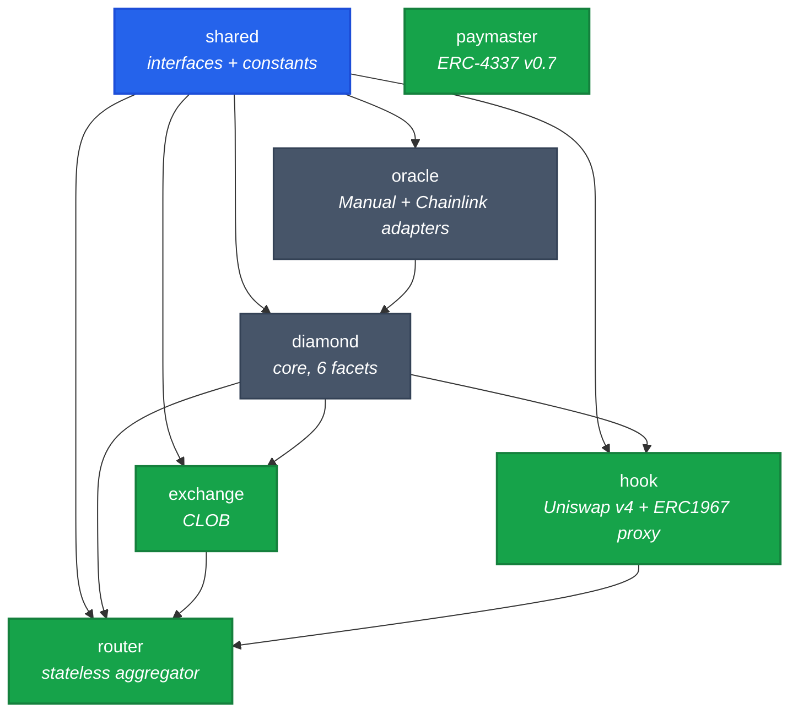
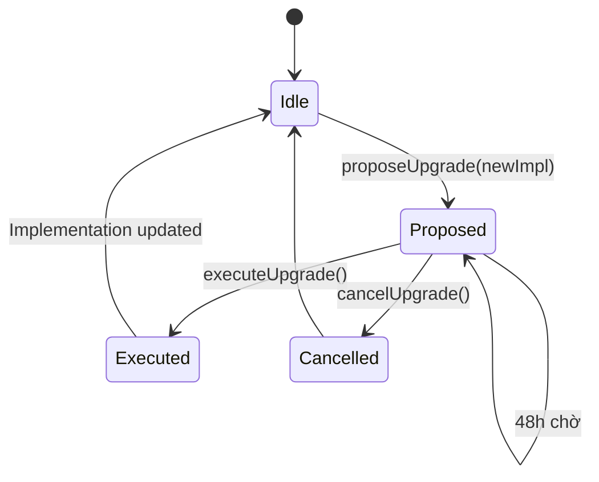
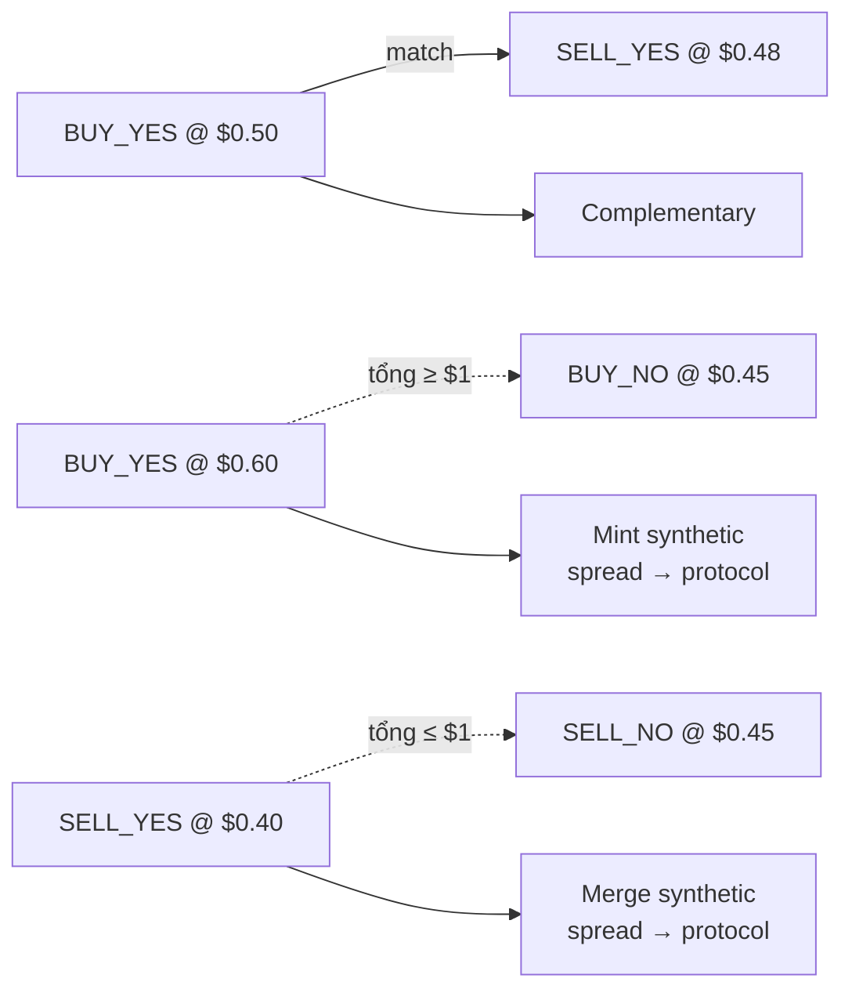

# Smart contracts

Solidity `0.8.30`, Foundry, EVM cancun (EIP-1153 transient storage). 7 package, monorepo.

## Dependency graph



Rule: cross-package import **chỉ** qua `@predix/shared/interfaces/`. Không import implementation của package khác.

## Diamond (EIP-2535)

Single proxy `PrediX Diamond` với 6 facet. Mỗi facet upgrade được riêng.

| Facet | Chức năng |
|---|---|
| **MarketFacet** | createMarket · split · merge · resolve · redeem · emergencyResolve · refundMode · sweep |
| **EventFacet** | createEvent · resolveEvent · groupSplit · groupMerge · refundMode event |
| **AccessControlFacet** | grantRole · revokeRole · 6 role: DEFAULT_ADMIN · OPERATOR · PAUSER · CUT_EXECUTOR · CREATOR · REGISTRAR |
| **PausableFacet** | pause(module) · unpause(module) — pause theo module: MARKET · DIAMOND |
| **DiamondCutFacet** | diamondCut — thêm/sửa/xoá facet, gated bởi `CUT_EXECUTOR_ROLE` qua TimelockController 48h |
| **DiamondLoupeFacet** | facets() · facetAddresses() · facetFunctionSelectors() — introspection |

**Storage**: Diamond storage pattern. Mỗi facet có struct `Layout` tại slot `keccak256("predix.storage.<module>")`. **Append-only**, không reorder/remove field.

## Hook (Uniswap v4)

**Contract**: `PrediXHookV2` (implementation) + `PrediXHookProxyV2` (ERC1967 proxy).

**Callbacks** set theo permissions flag trong hook address (salt-mined):

| Callback | Chức năng |
|---|---|
| `beforeInitialize` | Set permission flag + init pool state |
| `beforeAddLiquidity` | Chặn add LP nếu market resolved / refunded |
| `beforeRemoveLiquidity` | Track pool registration (hookPoolBinding) |
| `beforeSwap` | Apply dynamic fee + verify anti-sandwich identity (EIP-1153 transient storage) |
| `afterSwap` | No-op |
| `beforeDonate` | Chặn donate sau endTime (chống brute-force payout attack) |

**Key functions**:
- `registerMarketPool(marketId, poolKey, yesIsCurrency0)` — bind market ↔ v4 pool, verify canonical PoolKey (lpFee + tickSpacing match)
- `commitSwapIdentityFor(...)` — Router commit identity trước swap, Hook verify trong `beforeSwap`
- `proposeTrustedRouter` / `executeTrustedRouter` — 2-step rotate Router (48h timelock)

### Hook proxy upgrade — 48h monotonic timelock



- `proposeUpgrade(newImpl)` → `readyAt = now + timelockDuration` (min 48h).
- Chờ ≥ timelockDuration → `executeUpgrade(newImpl, sig, readyAt)`.
- `timelockDuration` chỉ **tăng được** (monotonic), không giảm xuống dưới 48h.

## Exchange (CLOB)

**Contract**: `PrediXExchange`.

### Order struct (packed)

```solidity
struct Order {
  address owner;       // 20 bytes
  uint40 timestamp;    // 5 bytes
  uint8 side;          // BUY_YES/SELL_YES/BUY_NO/SELL_NO
  bool cancelled;
  bytes32 marketId;
  uint32 price;        // fixed-point 6 decimals, range 10_000-990_000
  uint128 amount;
  uint128 filled;
  uint256 depositLocked;
}
```

### Entry points

- `placeOrder(order)` + auto-match loop
- `cancelOrder(orderId)` — owner only
- `fillMarketOrder(marketId, side, amountIn, maxFills)` — permissionless, `taker == msg.sender` gate

### 3 match types



- **Complementary**: BUY_YES ↔ SELL_YES cùng market.
- **Mint** (synthetic): BUY_YES + BUY_NO ≥ $1. Diamond mint cặp, đưa YES cho buyer YES, NO cho buyer NO.
- **Merge** (synthetic): SELL_YES + SELL_NO ≤ $1. Diamond gom + burn, trả USDC.

Shared math library `MatchMath` đảm bảo preview/execute 1-wei parity.

## Router (stateless aggregator)

**Contract**: `PrediXRouter`. Bất biến `balanceOf(router) == 0` sau mỗi public call.

### Entry points (exact-in)

```solidity
buyYes(marketId, usdcIn, minYesOut, recipient, maxFills, deadline)
sellYes(marketId, yesIn, minUsdcOut, ...)
buyNo(...)
sellNo(...)
```

### Waterfall

1. Pull USDC từ Permit2.
2. **CLOB leg**: `exchange.fillMarketOrder(...)` — try ăn limit orders.
   - CLOB revert → emit `ClobSkipped(reason)` event, fall back AMM full.
3. **AMM leg**: `hook.commitSwapIdentityFor(...)` → `poolManager.swap(...)` → `unlockCallback(...)` extract amount.
4. **Virtual-NO two-pass**: nếu pool thiếu depth → reduce size với 3% safety margin.
5. **Cleanup**: refund dust, assert router balance = 0 (revert `FinalizeBalanceNonZero` nếu sai).

## Oracle

**Contracts**: `ManualOracle` + `ChainlinkOracle`. Plugin architecture — thêm oracle mới = deploy adapter, `approveOracle(addr)`.

### ChainlinkOracle

- `register(marketId, feed, threshold, gte, snapshotAt)` — bind market với Chainlink feed.
- `resolve(marketId, roundIdHint, prevHint)`:
  - Validate `roundData.updatedAt >= snapshotAt`.
  - Validate `previousRound.updatedAt < snapshotAt` (adjacency).
  - L2 sequencer uptime check.
  - Outcome = `price >= threshold` (nếu `gte=true`).

### ManualOracle

- `report(marketId, outcome)` — REPORTER_ROLE (multisig).
- `revoke(marketId)` — DEFAULT_ADMIN, clear pending report (chỉ trước resolve).
- Audit trail: `OracleReportCreated` event.

## Paymaster (ERC-4337)

**Contract**: `PrediXPaymaster`. Sponsor gas qua EntryPoint v0.7.

- Owner = Gnosis Safe 2-of-3 (mainnet).
- Signer off-chain (BE) ký verify UserOp eligibility.
- Policy: sponsor cho user đã session SIWE + action whitelist (swap, split, merge, redeem, place/cancel order).

## Quality gates

- **Compile**: `forge build`, EVM cancun, `via_ir=true`, `optimizer_runs=200`, `bytecode_hash=none`.
- **Test**: `forge test` — unit + fuzz + invariant.
- **7 invariants critical** (chi tiết [Bảo mật](bao-mat.md)).
- **Format**: `forge fmt --check`.
- **Static analysis**: Slither 0 critical.

## Upgrade model

| Component | Mechanism | Delay |
|---|---|---|
| Diamond facets | `diamondCut` via `CUT_EXECUTOR_ROLE` (TimelockController) | 48h |
| Hook implementation | `propose/executeUpgrade` qua ERC1967 proxy | 48h monotonic |
| Oracle adapter | `approveOracle` instant (add), `revokeOracle` instant (remove cho market mới) | 0h |
| Exchange / Router | **Immutable**. Deploy mới, migrate off-chain | N/A |

Exchange và Router không có proxy. Thay đổi = redeploy + migrate (one-time event). Trade-off: simpler + immutable hơn proxy.
