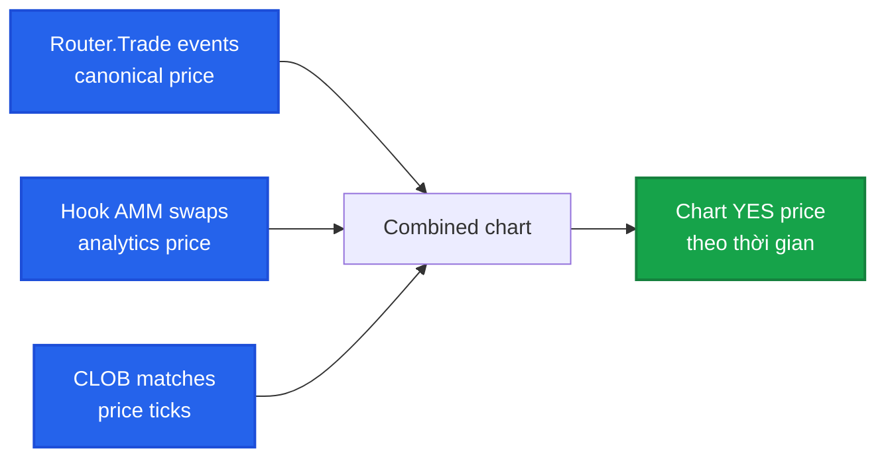

# Chart & timeframe

Mỗi market có chart giá YES theo thời gian. Đọc chart + đổi timeframe + chỉ báo.

## Chart cơ bản



Chart tổng hợp giá từ:
- **Router.Trade**: nguồn canonical, mỗi market order
- **Hook AMM swaps**: giá AMM tick-by-tick
- **CLOB matches**: giá tại mỗi limit fill

## Timeframe

| Timeframe | Use case |
|---|---|
| **1m** | Scalp, intraday |
| **5m** | Short-term momentum |
| **15m, 1h** | Day trade |
| **4h** | Swing |
| **1D** | Position trade, multi-day hold |
| **1W** | Long market (3+ tháng tới endTime) |

App default theo time-to-end:
- < 24h tới endTime → 5m
- 1-7 ngày → 15m hoặc 1h
- > 7 ngày → 1h hoặc 4h
- > 30 ngày → 1D

## OHLC candles

Mỗi candle hiện open / high / low / close trong period đó.

```
─┬─  high
 │
 ▌   close (xanh nếu close > open)
 │
 ▐   open
 │
 │
─┴─  low
```

Volume hiển thị bar phía dưới.

## Chỉ báo

Toggle trong settings chart (icon ⚙):

- **MA / EMA** — moving average 7, 25, 99 period.
- **VWAP** — volume-weighted average price.
- **Bollinger Bands** — volatility envelope.
- **RSI** — momentum 0-100.
- **Volume profile** — distribution volume theo giá.

## Compare 2 markets

Click **Compare** + chọn market khác:
- Overlay 2 đường giá YES trên cùng chart (normalized 0-1 scale vì đã là price).
- Useful: "Trump win" vs "Biden win" event 2024.

## Multi-outcome event chart

Trong event detail, chart hiện giá YES của **tất cả members** trên cùng timeline. Ví dụ event *"FIFA WC 2026 Winner"* qua 6 tháng:

| Tháng | 🇦🇷 Argentina | 🇧🇷 Brazil | 🇫🇷 France |
|---|---|---|---|
| Jan | $0.20 | $0.18 | $0.15 |
| Feb | $0.22 | $0.16 | $0.18 |
| Mar | $0.25 | $0.15 | $0.22 |
| Apr | $0.28 | $0.14 | $0.20 |
| May | $0.32 | $0.12 | $0.18 |
| Jun | $0.35 | $0.10 | $0.15 |

Trên app: line chart overlay tất cả members, click member trong legend để highlight hoặc hide. Useful theo dõi shift xác suất real-time.

## Order book depth chart

Tab **Depth** kế bên chart:
- Bid (BUY orders) bên trái, ask (SELL orders) bên phải.
- Cumulative volume — wall của liquidity.

Useful: spot **liquidity wall** (large limit orders) để biết chỗ giá có thể stuck.

## Recent trades

Tab **Trades**:
- Realtime list mỗi trade: side, size, price, timestamp.
- Filter theo size (whale-only).
- Click row → tx hash trên explorer.

## Trên mobile

Chart full-width, gestures:
- Pinch zoom in/out.
- Drag horizontal pan.
- Long-press → hover info.
- Double-tap → reset zoom.

## Data source cho developer

Chart data từ Indexer endpoint:

```
GET /api/markets/:id/candles?timeframe=1h&from=...&to=...
→ [
  { ts, open, high, low, close, volume },
  ...
]
```

Hoặc chỉ price snapshots:
```
GET /api/markets/:id/price-history?from=...&to=...
→ [{ ts, yesPrice, source }]
```

Chi tiết: [Indexer API](../developers/api-reference.md#indexer-endpoints).

## Tip đọc chart prediction market

- **Volume spike sau endTime**: Hoạt động bất thường — có thể là arb khi resolve approaching.
- **Giá pin ở $0.50**: Market chưa có conviction, info chưa rõ.
- **Sharp move**: Tin mới — kiểm tra news.
- **Giá ≈ $0.95-$0.99**: Gần resolve YES. Risk-reward thấp (chỉ ăn 5%, mất 95%).
- **Giá ≈ $0.01-$0.05**: Tail event — risk-reward cao nhưng xác suất thấp.

Đừng nhầm chart với cryptocurrency — prediction market price là **probability**, range cố định 0-1.
