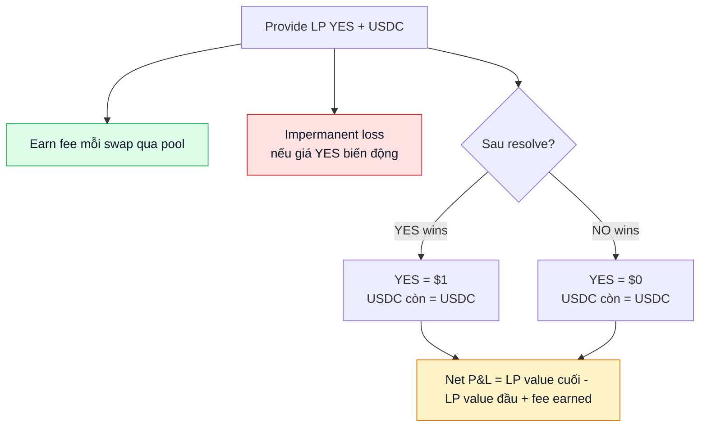
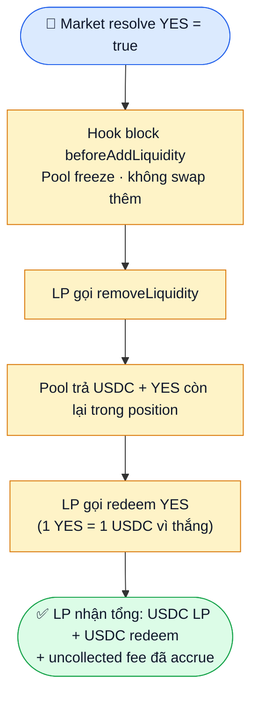

# Liquidity provider (LP)

Cung cấp liquidity vào AMM pool của một market. Earn fee từ mỗi swap qua pool đó.

## Tóm tắt

- Pool YES-USDC (và optional NO-USDC) là pool Uniswap v4 chuẩn.
- Bạn deposit cặp token vào range giá nhất định → nhận **LP NFT** (Uniswap v4 PositionManager).
- Mỗi swap qua pool, một phần fee (xem [Fee structure](../khai-niem/phi.md)) chia về cho bạn pro-rata theo share.
- Có thể remove liquidity bất cứ lúc nào (trừ sau khi market resolve, pool đóng).

## Risk vs reward



LP là **directional bet** — bạn lose nếu market resolve về phía bạn không expect. Đảm bảo hiểu IL + outcome risk trước khi LP.

## Bước — provide liquidity

1. Vào market detail. Tab **Liquidity**.
2. Chọn pool: **YES-USDC** hoặc **NO-USDC** (nếu market có cả 2).
3. Chọn range giá:
   - **Full range**: $0.01 - $0.99. An toàn nhất, fee earnings thấp hơn.
   - **Concentrated**: ví dụ $0.40 - $0.60. Earnings cao hơn, IL risk cao hơn nếu giá ra range.
4. Chọn amount USDC + amount YES (UI tự balance theo current price).
5. Nếu thiếu YES: app gợi ý **Split USDC → YES + NO** (mint cả 2 từ USDC), tự động set amount.
6. Preview: total deposit, expected APR (dựa volume historical), price range.
7. Click **Add Liquidity** → confirm.
8. Nhận LP NFT vào ví. Position xuất hiện ở **Liquidity** tab của portfolio.

## Bước — claim fee

Fee accrue tự động vào position:

1. Portfolio → **Liquidity** tab.
2. Position card hiện uncollected fee (USDC + YES).
3. Click **Collect** → claim về ví. Free phí protocol. Gas: smart account qua paymaster (sponsor nếu đủ điều kiện), EOA tự trả ETH.

Có thể compound: re-deposit fee vào pool để tăng position.

## Bước — remove liquidity

1. Portfolio → Liquidity → chọn position.
2. Click **Remove**.
3. Chọn % rút (25% / 50% / 100%).
4. Preview USDC + YES nhận về.
5. Confirm. Token về ví trong cùng tx, LP NFT burn (hoặc giảm liquidity nếu rút phần).

## Sau khi market resolve

Pool đóng — không trade được, không add liquidity được.



Bạn có thể:
- **Remove liquidity** lấy USDC + outcome token còn lại.
- **Redeem** outcome token thắng → 1 USDC mỗi token.
- Token thua = $0.

## Impermanent loss (IL) trong prediction market

Khác AMM thông thường (ETH/USDC), giá outcome token chỉ trong $0.01-$0.99. IL có pattern đặc biệt:

```
Pool YES-USDC tạo lúc YES = $0.50:
- Deposit: 100 USDC + 200 YES = total $200 (200 YES × $0.50 + 100 USDC)
- Giả sử giá YES → $0.80 (info mới khiến market believe sự kiện sẽ xảy ra)
- AMM rebalance: ít YES hơn, nhiều USDC hơn (constant product k)
- Sau khi rebalance: ví dụ 150 USDC + 125 YES
- Total = 150 + 125 × 0.80 = 150 + 100 = $250

Nếu hold thay vì LP:
- Giữ 100 USDC + 200 YES = 100 + 160 = $260

IL = $260 - $250 = $10 (3.85% vs hold)
```

IL bù bằng fee earned. Nếu volume đủ lớn → fee > IL → lời.

## Chiến lược LP

### Concentrated narrow

Đặt range hẹp ($0.40-$0.60) khi tin giá sẽ giao động trong range này. Earnings cao nhất khi giá ở giữa range. Risk: giá ra range = position toàn 1 token, không earn fee tới khi giá quay lại.

### Concentrated wide

Range $0.20-$0.80. An toàn hơn, earnings vừa.

### Full range

$0.01-$0.99. An toàn nhất, earnings thấp nhất. Phù hợp passive.

### Single-sided LP

Deposit chỉ USDC vào range giá YES > current. Khi giá tăng vào range, USDC convert thành YES. Tactic giống "scale buy".

## Boost từ gauge voting

LP có thể nhận **subsidy** từ treasury qua [gauge voting](../kinh-te/veprx-gauge.md):

1. vePRX holder vote pool nào nhận subsidy.
2. Treasury chia subsidy theo % vote.
3. Pool được vote nhiều → LP earn cả fee + PRX subsidy → APR cao hơn.

Theo dõi gauge ranking trong **Liquidity** → **Gauge** tab.

## Tax / accounting

LP fee thu bằng USDC + outcome token. Mỗi lần claim = một event income (cho mục đích thuế tuỳ jurisdiction). Export CSV trong portfolio.

## API integration

LP positions truy cập qua:
- Indexer: `GET /api/users/:address/lp-positions`
- BE: `GET /api/v2/users/:address/lp-positions`

Chi tiết: [Indexer API](../developers/indexer-api.md).
