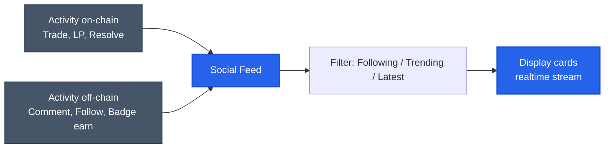
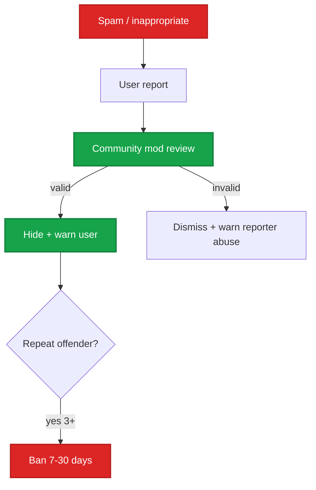

# Discussion & social feed

Trao đổi insight về market với community ngay trong app.

## Comments per market

Mỗi market có thread comment riêng (tab **Discussion** trên market detail).

```mermaid
flowchart TD
    Market[Market detail page] --> Comments[Discussion tab]
    Comments --> List[List comments<br/>sort: newest / top voted]
    Comments --> Post[Post comment]
    Comments --> Reply[Reply threading 2 levels]
    Comments --> React[Up/down vote]
    Comments --> Mention[@mention user]

    classDef int fill:#2563eb,stroke:#1d4ed8,color:#fff,stroke-width:2px
    class Comments int
```

### Đặc điểm

- **Threaded** 2 levels (comment + reply).
- **Voting** — up/down vote, top comment lên đầu.
- **Mention** `@username` notify user khác.
- **Markdown** support: `**bold**`, `*italic*`, code, link, quote.
- **Image embed** — paste URL image, app render inline.
- **TX share** — paste tx hash, app render link explorer + summary.

### Anti-spam

- **Min stake** 10 PRX (sau TGE) để post.
- **Cooldown** 30 giây giữa các comment.
- **Rate limit** 50 comments / day / user.
- **Report button** — flag inappropriate content.
- **Mod tools** (community moderator role): hide comment, ban user 24h.

### Trader badge trong comment

Username comment hiện badge:
- ✓ Verified (ENS / Lens / Twitter linked)
- 🏆 Top trader (top 100 leaderboard)
- 🎯 High accuracy (Brier < 0.15 với > 50 trades)
- 💎 PRX whale (stake > 10k PRX)

Giúp đánh giá độ tin cậy của comment.

## Social feed

Trang `/feed` — global activity stream.



### Filter

| Filter | Mô tả |
|---|---|
| **Following** | Activity từ user bạn follow |
| **Trending** | Comment + market có engagement cao 24h |
| **Latest** | Tất cả, mới nhất |
| **Markets** | Chỉ activity trade / LP, không social |
| **Discussion** | Chỉ comments, không tx |

### Card types

- **Trade card**: User X mua $Y YES market Z. Click → market detail.
- **LP card**: User X provide $Y liquidity vào pool Z.
- **Resolve card**: Market Z resolve YES, $Y total volume traded.
- **Comment card**: User X comment market Z: "...". Click → discussion thread.
- **Badge card**: User X earn badge "Prophet" (80% accuracy).

## Post (write-ups)

User có thể publish **post** dài (thread Twitter-style):

- Markdown support full.
- Tag market reference (auto-link).
- Embed chart, image.
- Long-form analysis (e.g. "Why I'm buying YES on BTC market").

Post xuất hiện ở:
- Profile của tác giả (tab **Posts**).
- Feed của followers.
- Market detail (nếu tag market).

### Tip jar (TBA Phase 2)

Reader có thể tip USDC / PRX cho author của post hữu ích. Tỷ lệ 95% to author, 5% protocol fee.

## Activity feed (per market)

Tab **Activity** trong market detail — stream realtime activity riêng cho market đó:

- Trade ticker (size, price, side).
- Order book changes (large limit orders).
- LP add/remove.
- Comments mới.

Useful: monitor market hot, spot whale moves.

## DM & private chat (TBA)

Phase 2: direct message giữa users. Sẽ có:
- E2E encryption (XMTP protocol).
- Group chat (DAO subgroup).

## Moderation

PrediX dùng **community moderation** model:



- **Mod recruitment**: vePRX holder + good standing apply.
- **Mod compensation**: PRX from treasury.
- **Appeal process**: ban user có thể appeal qua governance.

## Censorship resistance

Comment + post lưu **off-chain** (Mongo DB) cho UI nhanh. Hash của content lưu **on-chain** (sau Phase 2) — proof of existence + censorship resistance.

Nếu PrediX UI hide comment, content vẫn tồn tại on-chain hash + user có thể publish lên IPFS / Arweave riêng.

## Wallet-to-wallet messaging

Phase 2: Tích hợp **XMTP** — message giữa addresses. Decentralized, end-to-end encrypted.

Use case:
- Negotiate OTC trade.
- Coordinate liquidity provision.
- Discussion private trong working group.

## API

```
GET /api/v2/markets/:id/comments?sort=top|new&limit=50
POST /api/v2/markets/:id/comments  (auth)
GET /api/v2/users/:address/posts
POST /api/v2/posts  (auth)
GET /api/v2/feed?filter=following|trending|latest
GET /api/v2/markets/:id/activity?type=trade|lp|comment
```

Realtime via WebSocket: `wss://api.predix.app/v2/ws/feed`.

Chi tiết: [Backend API](../developers/api-reference.md#backend-endpoints-v2).
