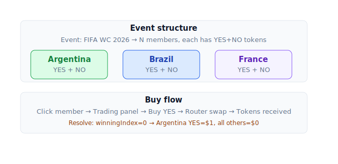

# Event đa outcome

Sự kiện có nhiều lựa chọn: *"Ai thắng FIFA WC 2026?"* — mỗi đội là 1 market con, chỉ 1 thắng.

## Cấu trúc

Event = container chứa N market con (gọi là **members**).

- Members chia sẻ **endTime** chung.
- **Mutually exclusive** — khi event resolve, đúng 1 member YES = true, còn lại YES = false.
- Có thể **groupSplit / groupMerge** — mint/burn cặp YES của tất cả members cùng lúc.



## Ví dụ

Event: *"FIFA WC 2026 Winner"* với 48 đội.

- Mỗi đội = 1 binary market: "Argentina thắng?", "Brazil thắng?", …
- Tổng giá YES của 48 đội ≈ $1 (xác suất cộng = 100%).

Khi event resolve (Argentina thắng):
- Argentina YES = $1, NO = $0.
- 47 đội còn lại: YES = $0, NO = $1.

## Giao dịch

### Buy YES 1 đội

Click member trong event UI → panel trading mở → **Buy YES Argentina** (như market thường) → Router swap USDC → YES qua CLOB + AMM → nhận YES Argentina.

### Buy NO (short 1 đội)

Bet đội đó **không** thắng. Payout = 1 USDC nếu đội đó thua/không vào final.

### groupSplit — special action

Action chỉ có ở event:

```
Deposit 1 USDC →
  Mint 1 YES Argentina + 1 YES Brazil + ... + 1 YES Netherlands (tất cả 48)
```

Atomic — 1 tx mint toàn bộ. Bet **"có đội nào đó thắng"** → chắc chắn đúng 1 token đổi $1 khi resolve.

**Use case**:
- Hedge chiến lược.
- Market-make nhiều đội cùng lúc.
- Provide liquidity cho whole event.

### groupMerge

Ngược lại: nếu bạn có đủ 1 YES của tất cả 48 members → burn gộp → nhận 1 USDC.

## Tại sao thiết kế vậy

Event tạo **constraint** on-chain: exactly 1 member resolve YES = true. Đảm bảo:

- Tổng payout YES = collateral deposited — không insolvent, không thắng "nhầm".
- Arbitrage cho phép giá YES members tổng về $1 đúng nghĩa xác suất.
- User trade 1 member riêng không cần biết tổng event — chỉ xem giá đội đó.

## Resolution

Oracle event resolve khác market đơn:

```
eventFacet.resolveEvent(eventId, winningIndex: 0)  // Argentina
```

- `winningIndex` ∈ [0, N-1] — chỉ đúng 1 member marked YES.
- Atomic: tất cả members resolve cùng block. Không có trường hợp 2 member cùng YES.

## Refund event

Event fail (giải đấu huỷ):

```
eventFacet.enableEventRefundMode(eventId)
```

- Tất cả members enter refund mode.
- User `groupMerge` (nếu có đủ YES của mọi member) → nhận USDC pro-rata.
- Hoặc refund từng member riêng (nếu chỉ có 1 vài).

## UI event

Trang [Events](https://app.predix.app/events):

- Grid hiển thị events với tổng volume + deadline.
- Click event → trang detail:
  - **Combined chart**: giá YES của tất cả members trên cùng timeline.
  - **Members table**: mỗi đội 1 row, giá YES, volume, button Buy.
  - **Right panel**: trading panel cho member bạn chọn.

URL sync: `/events/42?outcome=3` → pre-select member index 3.

## Limit / giới hạn

| | Value |
|---|---|
| Max members / event | 50 |
| Min members / event | 2 |
| Nested events | Không hỗ trợ |
| Weighted outcome (member 30% / member 70% payout) | Không — chỉ winner-takes-all |

## Khác multi-binary riêng biệt

Đừng nhầm event với nhiều binary market:

| Approach | Tổng YES ≈ $1 enforce? | Arbitrage tự động? |
|---|---|---|
| 2 binary market riêng (Argentina win? + Brazil win?) | ❌ Không | ❌ |
| **Event với Argentina + Brazil là members** | ✅ Có (cơ học on-chain) | ✅ Tự lan toả |

Dùng **event** khi có constraint mutually-exclusive thật. Dùng **binary riêng** khi sự kiện độc lập.

## Trading strategies cho event

### Single-favourite

Buy YES đội bạn nghĩ thắng. Đơn giản nhất, exposure 1 chiều.

### Spread bet

Buy YES nhiều đội bạn nghĩ có cơ hội. Nếu đúng 1 trong số đó thắng → win. Risk thấp hơn single-favourite, payout thấp hơn.

### Long shots

Buy YES đội ít người expect (giá thấp). Hiếm khi đúng nhưng payout cực lớn (10-100×).

### Dutch book / arbitrage

Nếu tổng giá YES tất cả members > $1 → groupSplit USDC, sell từng YES riêng → ăn spread. Hiếm thấy nhưng có dịp.
