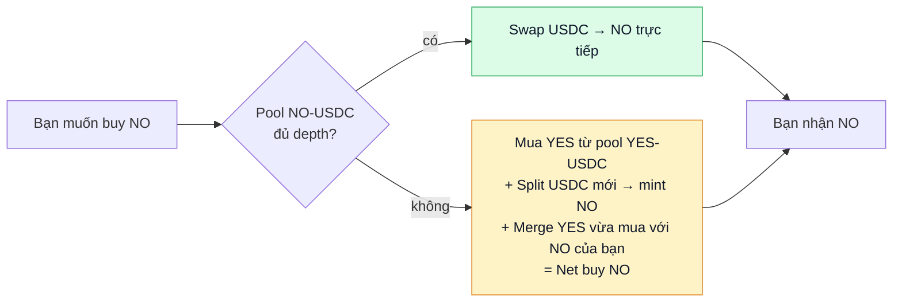

# Market order

Mua / bán ngay theo giá hiện tại. Router tự tìm path tốt nhất giữa CLOB và AMM.

## Khi nào dùng

- Vào vị thế **ngay**, chấp nhận giá thị trường.
- Trade nhỏ (< 1% liquidity), slippage chấp nhận được.
- Không có view chờ giá tốt hơn.

Muốn chờ giá → [Limit order](dat-lenh-limit.md).

## Bước — Buy YES

1. Vào market detail page. Panel phải, chọn tab **Buy**.
2. Chọn side **YES**.
3. Nhập amount USDC chi (ví dụ: 100).
4. Đặt **slippage tolerance** (default 0.5%, tăng lên 1-2% nếu market ít liquidity).
5. Preview hiển thị:
   - YES nhận được (estimate)
   - Average price
   - Slippage thực tế
   - Fee breakdown (CLOB / AMM, mỗi cái %)
   - Tỷ lệ split CLOB / AMM
6. Click **Buy** → ví confirm (Touch ID nếu passkey, popup MetaMask nếu EOA).
7. Chờ ~2 giây. Tx xuất hiện trong [Portfolio](portfolio.md) → History.

## Sell YES

Tương tự nhưng tab **Sell**:

1. Chọn YES, nhập amount muốn bán.
2. Preview USDC nhận về.
3. Confirm.

Router sẽ:
- Drain **bid orders** trên CLOB trước (người muốn mua YES).
- Swap AMM nếu CLOB không đủ.
- Trong một số case, swap qua pool NO + synthetic (mua NO bằng USDC mới → merge với YES → payout USDC).

## Buy / sell NO

Đối xứng YES. Router có thể dùng **virtual-NO trick** nếu pool NO-USDC thiếu liquidity:



Bạn không cần care — UI chỉ hiện "Buy NO" và amount cuối.

## Slippage

Slippage = chênh lệch giá preview vs giá thực tế khi tx execute.

- **Default 0.5%**: Phù hợp market liquid.
- **1-2%**: Tăng lên nếu market spread rộng.
- **> 5%**: Hiếm khi nên — Router cảnh báo.

Vượt slippage → tx **revert**, tiền không mất (chỉ tốn gas — smart account có thể được sponsor nếu đủ điều kiện, EOA tốn ETH).

## Fee bạn trả

Hiển thị breakdown trên preview:

```
AMM swap fee:    0.50 USDC  (0.5% vì market còn > 7 ngày)
CLOB taker fee:  0.00 USDC  (0% bootstrap window)
Gas:             ~$0.005    (smart account: sponsored nếu đủ điều kiện)
─────────────────────────
Tổng chi:        100.005 USDC (đã bao gồm fee + gas)
Nhận:            ~205 YES
```

> Smart account user đủ điều kiện sponsor program → "Gas: $0 (sponsored)" trên preview.
> EOA user: gas hiển thị bằng ETH (~$0.001-0.01), trả từ ETH balance.

Chi tiết fee structure: [Cấu trúc fee](../khai-niem/phi.md).

## Split / merge shortcut

Cùng panel, tab **Split** / **Merge**:

- **Split**: 100 USDC → 100 YES + 100 NO. Dùng khi muốn hold cả 2 để sell riêng (market making).
- **Merge**: 100 YES + 100 NO → 100 USDC. Dùng khi đang có cả 2 và muốn rút.

Free phí protocol. Gas: smart account trả qua paymaster (sponsor nếu đủ điều kiện), EOA tự trả ETH.

## Lỗi thường gặp

| Error | Lý do | Fix |
|---|---|---|
| "Slippage exceeded" | Giá chạy quá tolerance | Tăng slippage hoặc retry |
| "Insufficient liquidity" | CLOB + AMM không đủ depth | Giảm size hoặc dùng [limit order](dat-lenh-limit.md) |
| "Market paused" | Admin pause vì lý do bảo mật | Xem thông báo UI |
| "Past endTime" | Market đã đóng trading | Chờ resolve để redeem hoặc refund |
| "Insufficient USDC" | Ví thiếu USDC | [Bridge](../bat-dau/bridge.md) hoặc nạp thêm |
