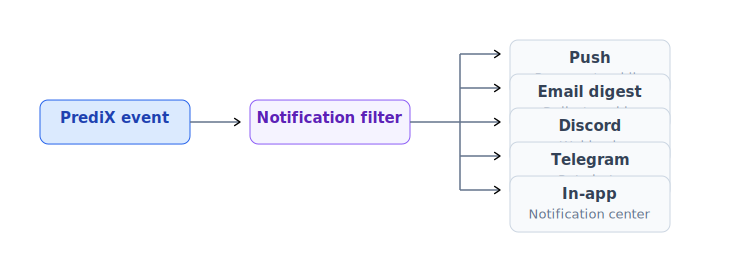
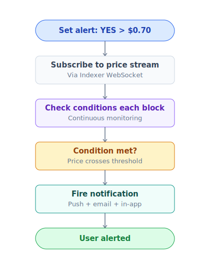

# Notifications & price alerts

Stay updated trên các market quan trọng + activity của portfolio.

## Channels



| Channel | Realtime | Setup | Best for |
|---|---|---|---|
| **In-app** | ✅ | Default ON | Mọi user |
| **Browser push** | ✅ | Allow permission | Active web user |
| **Mobile push** | ✅ | Install PWA / app | Mobile-first |
| **Email** | ✗ (digest) | Add email + verify | Passive monitoring |
| **Discord webhook** | ✅ | Paste URL | Power user, cộng đồng |
| **Telegram bot** | ✅ | `/connect` lệnh | Mobile alert chính |

## Notification types

### Trading

- **Order fill** — limit order khớp (full hoặc partial).
- **Order cancel** — do bạn cancel hoặc do market resolve.
- **Slippage exceeded** — tx fail vì slippage.
- **Position underwater** — vị thế > $50, unrealized loss > 20%.

### Market events

- **Resolve** — market bạn giữ token đã resolve.
- **Refund mode enabled** — market bạn giữ enter refund.
- **Pause** — market bạn giữ bị pause.
- **EndTime warning** — market bạn giữ < 24h tới endTime, < 1h, < 10 phút.

### LP

- **Fee accrued** — uncollected fee > $X.
- **Out of range** — concentrated LP position rời range giá.
- **Pool paused** — pool đóng do market resolve.

### Social

- **Follower mới**.
- **Trader bạn follow** mở vị thế lớn.
- **Comment / reply** trên market bạn comment.
- **Mention** trong discussion.

### Rewards

- **Badge earned**.
- **Streak milestone** (7/30/100 days).
- **Weekly PRX distribution** ready to claim.
- **Referral commission** received.

### Governance

- **vePRX proposal** mới (nếu bạn vote).
- **Voting deadline** sắp tới.
- **Gauge vote epoch** mới.

## Price alerts



### Setup

1. Vào market detail → click 🔔 icon.
2. Chọn condition:
   - **Price above** $X
   - **Price below** $X
   - **Price change** ≥ Y% trong window Z giờ
   - **Volume spike** ≥ X% so với 24h average
3. Chọn channel (push / email / Telegram).
4. Save.

### Quản lý alerts

`/settings/alerts` — list tất cả active alerts.
- Edit, pause, delete.
- Bulk action (delete all alerts của 1 market đã resolve).

### Limits

- Free tier: 50 active alerts.
- Stake 1k+ PRX: 200 alerts.
- Stake 10k+ PRX: unlimited.

## Notification preferences

`/settings/notifications`:

| Type | In-app | Push | Email | Discord | Telegram |
|---|---|---|---|---|---|
| Order fill | ✓ | ✓ | ✗ | ✓ | ✓ |
| Market resolve | ✓ | ✓ | ✓ | ✓ | ✓ |
| Price alert | ✓ | ✓ | ✗ | ✓ | ✓ |
| Daily digest | ✗ | ✗ | ✓ | ✗ | ✗ |
| Marketing | ✗ | ✗ | ✗ | ✗ | ✗ |

Tweak granular từng type. **Marketing OFF mặc định** — chỉ ON nếu bạn opt-in.

## Email digest

Daily digest (08:00 local time):
- Summary portfolio overnight (P&L change).
- Markets sắp endTime trong portfolio.
- Recent activity của trader bạn follow.
- Top 5 movers (price change trong 24h).
- Reward earned.

Weekly digest (Monday):
- Performance week.
- Calibration update.
- Suggested markets dựa interest.
- New features / governance.

Unsubscribe link mỗi email.

## Discord webhook

Setup:
1. Trong Discord server bạn admin → Settings → Integrations → Webhooks → New.
2. Copy URL.
3. Paste vào PrediX Settings → Discord webhook.
4. Test với button **Send test**.

Notification format:
```
🟢 Order filled
Market: BTC > $100k 2027
Side: BUY YES
Filled: 100 USDC @ $0.48
P&L: -
TX: uniscan.xyz/tx/0x...
```

## Telegram bot

1. Open Telegram → search `@predix_alert_bot`.
2. Start chat → `/connect <wallet_address>`.
3. App generate code → bạn paste vào bot.
4. Done.

Commands:
- `/portfolio` — quick P&L summary
- `/alerts` — list active alerts
- `/help` — full command list

## Privacy

- Email + phone optional. Address là primary identifier.
- Notifications encrypted in transit (TLS).
- Discord/Telegram channel chỉ webhook URL — không lưu auth token của bạn.
- Unsubscribe + delete data anytime.

## API integration

```
GET /api/v2/users/:address/notifications?unread=true
POST /api/v2/users/:address/notifications/:id/read
GET /api/v2/users/:address/alerts
POST /api/v2/users/:address/alerts
DELETE /api/v2/users/:address/alerts/:id
```

Realtime via WebSocket: `wss://api.predix.app/v2/ws/notifications` với auth header.

Chi tiết: [Backend API](../developers/api-reference.md#backend-endpoints-v2).
